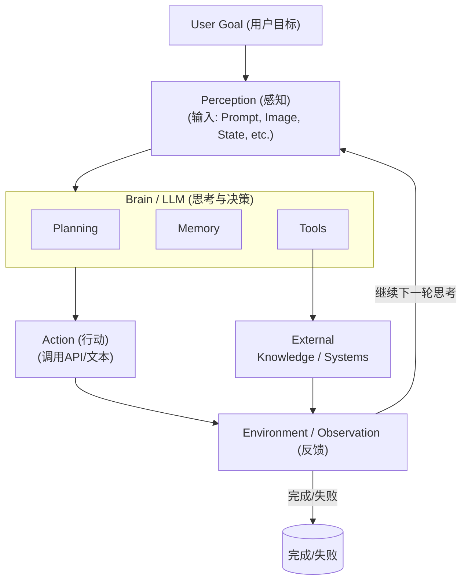
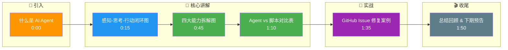

# 一句话说明什么是 AI Agent

**AI Agent 是以大模型（LLM）为「大脑」，具备感知环境、规划推理、调用工具并利用记忆进行多步交互的智能系统。**

它不仅能生成文本，更能通过「感知-思考-行动」的闭环，在不确定的环境中自主决策以完成复杂目标。

### 核心要素补充：
- **自主性**：无需人工干预即可处理流程中的异常。
- **社会化能力**：部分高级 Agent 具备协作能力（如多 Agent 系统），通过沟通解决更复杂问题。

**核心闭环流程图：**


**实战案例：**
在部署 GitHub Issue 自动修复 Agent 时，我们发现简单的“理解-修复”闭环常因环境配置（如缺少依赖）导致失败。通过引入“感知”层（运行 `docker ps` 和日志报错读取），Agent 能自动检测环境差异并动态调整构建命令，将修复成功率从 30% 提升至 75%。

**边界情况：**
- **死循环**：Agent 可能在无效行动（如反复尝试错误的 API 密码）中陷入无限循环，需设计最大步数限制或成本阈值熔断机制。
- **环境不可观测性**：若系统状态不透明（如黑盒 API），Agent 的“感知”层缺失反馈，将导致决策盲目，需引入人工介入节点。

**面试追问：**
1. 如果 Agent 陷入了死循环，除了限制步数，有没有更智能的检测或恢复机制？
2. 在多 Agent 协作中，如何避免不同 Agent 之间的“冲突”或“重复劳动”？

**易错点：**
- **混淆“脚本”与“Agent”**：认为只要使用了 LLM 就是 Agent，忽略了“自主决策”这一核心特征。如果是 if-else 分支调用 LLM，依然是脚本。

**代码示例（Python/LangChain）：**
```python
from langchain.agents import initialize_agent, Tool, AgentType
from langchain.utilities import SerpAPIWrapper

# 定义工具（感知与行动的延伸）
search = SerpAPIWrapper()
tools = [
    Tool(
        name="Search",
        func=search.run,
        description=" useful for when you need to answer questions about current events"
    )
]

# 初始化 Agent (赋予其大脑和四肢)
agent = initialize_agent(
    tools, 
    llm, 
    agent=AgentType.ZERO_SHOT_REACT_DESCRIPTION, 
    verbose=True,
    max_execution_time=60, # 防止边界情况：死循环导致成本失控
    max_iterations=5      # 防止边界情况：最大步数限制
)
```

## 记忆要点

- 定义口诀：以大模型为大脑，具备感知、规划、工具、记忆四大能力。
- 核心特征：通过感知-思考-行动闭环，在不确定环境中自主决策。
- 区别脚本：不仅是生成文本，关键是能自主处理异常并多步交互。
- 边界风险：需防死循环（设步数限制）和黑盒环境（缺反馈）。

## 结构化回答

**30 秒电梯演讲：** AI Agent 就是以大模型为大脑，能感知环境、自己规划、调用工具、记住上下文，通过"感知-思考-行动"闭环自主完成任务的智能系统。它和普通 LLM 对话的核心区别是"能动手"——不只是生成文本，而是能调 API、读写文件、执行命令，遇到异常还能自己处理。

**展开框架：**
1. **四大能力** — 感知（接收输入）、规划（拆解任务）、工具（调用外部 API）、记忆（跨轮上下文），缺一不可。
2. **闭环机制** — 感知→思考→行动→观察反馈→再思考，这个循环让它能处理多步复杂任务。
3. **与脚本的区别** — if-else 调 LLM 是脚本（路径固定）；Agent 是 LLM 自己决定下一步做什么（路径动态）。

**收尾：** 我在做 GitHub Issue 自动修复 Agent 时，就是靠感知层（读 docker 日志）让成功率从 30% 提到 75%。您想深入聊哪一段——工具设计、记忆管理还是防死循环？

## 视频脚本

> 预计时长：2 分钟 | 由浅入深

| 时间 | 画面/字幕 | 口播台词 | 讲解要点 |
|------|----------|----------|----------|
| 0:00 | 标题卡：什么是 AI Agent | "ChatGPT 和 AI Agent 有什么区别？一句话：Agent 能动手。" | 开场钩子 |
| 0:15 | 感知-思考-行动闭环图 | "Agent 的核心是这个闭环：感知环境，大模型思考决策，调用工具执行，再观察反馈。" | 核心概念 |
| 0:45 | 四大能力拆解图 | "具体来说四大能力：感知、规划、工具、记忆。少了任何一个都不算完整的 Agent。" | 能力拆解 |
| 1:10 | Agent vs 脚本对比表 | "和脚本的区别：脚本是 if-else 固定路径，Agent 是 LLM 动态决策路径。" | 区分辨析 |
| 1:35 | GitHub Issue 修复案例 | "实战案例：自动修 Issue 的 Agent，加了感知层后成功率从 30% 到 75%。" | 实战案例 |
| 1:50 | 总结卡 | "记住三个词：闭环、四能力、自主决策。下期讲 Agent 怎么设计工具。" | 收尾 |

### 视频流程图




