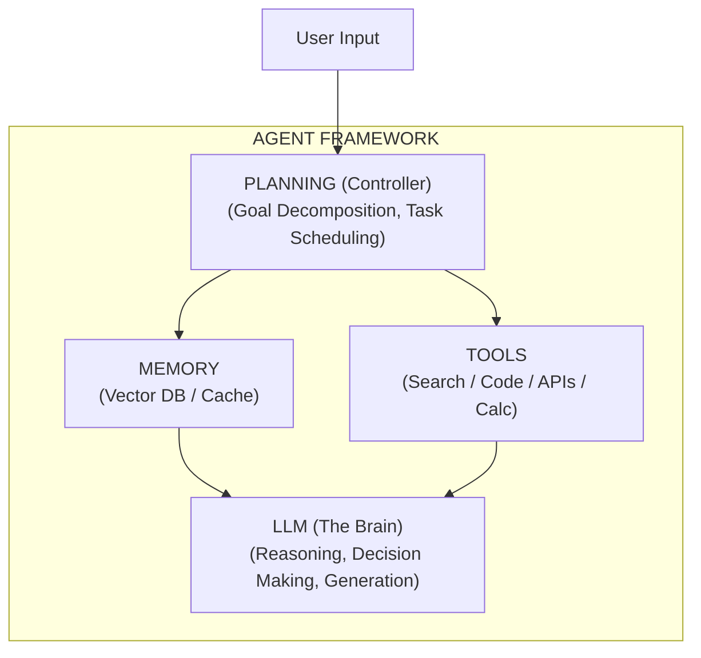

# 为什么说 Agent = LLM + Planning + Memory + Tools?缺一块会怎样

LLM 仅仅是「大脑」或推理引擎，而完整的 Agent 需要四肢、记忆和策略。这四者构成有机整体，缺一不可：

**1. LLM (Core / 大脑)**
*   **作用**：负责理解意图、逻辑推理、指令生成。
*   **缺失后果**：系统失去通用认知能力，退化为传统的基于规则的脚本。

**2. Planning (规划 / 策略)**
*   **作用**：将大目标拆解为子任务，如 CoT（思维链）、ReAct 模式。处理任务依赖关系和执行顺序。
*   **缺失后果**：面对复杂任务无法拆解，容易陷入「一步错步步错」，只会做单次指令响应，无法处理长程任务。

**3. Memory (记忆 / 上下文)**
*   **作用**：短期记忆（缓存上下文）、长期记忆（向量数据库 RAG）。记录历史交互、关键事实和中间结果。
*   **缺失后果**：无法从历史中学习，多轮对话中会「失忆」，无法处理需要跨步骤累积信息的任务。

**4. Tools (工具 / 执行)**
*   **作用**：扩展能力边界，如联网搜索、代码解释器、ERP 系统接口。
*   **缺失后果**：LLM 被困在训练数据的时间截止点前，无法获取实时信息，无法对物理世界产生实际影响（只能「空谈」）。

**系统架构图：**


**实战案例：**
在开发“数据分析 Agent”初期，我们仅配备了 LLM 和 SQL 执行工具。由于缺乏“Memory”，当用户修正查询条件（如“把昨天的数据换成上周同期的”）时，Agent 忘记了之前生成的 SQL 结构，导致反复全量重写，效率极低。引入 Memory 存储中间 Schema 后，复用率提升 60%。

**边界情况：**
- **工具幻觉**：LLM 可能调用不存在的工具或传递格式错误的参数，需在 Tool 层增加强校验和 Fallback 机制。
- **规划冲突**：当 Tools 返回结果与 Planning 预期严重不符（如预期返回 JSON 却返回 HTML），若无 Re-plan 机制，Agent 会直接崩溃。

**面试追问：**
1. 如果 LLM 的规划能力较弱，总是规划出错误的步骤，除了更换更强的模型，在工程架构上有什么优化手段？（提示：引入子任务分解、Human-in-the-loop）
2. Memory 的读写频率很高，如何解决向量化存储的延迟问题和索引更新的一致性问题？

**易错点：**
- **过度依赖 LLM 原生能力**：认为 LLM 自身带有的 context window 就是 Memory，忽略了长场景下的结构化存储和检索优化。

**代码示例（LangChain 概念对比）：**
```python
# 仅具备 LLM + Tools (缺乏 Memory 和 Planning 的简单封装)
llm_with_tools = llm.bind(functions=[tool_schema])
result = llm_with_tools.invoke("查询天气")

# 完整的 Agent (具备 Planning 和 Memory)
from langchain.agents import AgentExecutor, create_openai_tools_agent
from langchain.tools import Tool
from langchain.memory import ConversationBufferMemory

# 这里的 Memory 会自动注入到 Prompt 中
memory = ConversationBufferMemory(memory_key="chat_history", return_messages=True)
agent_executor = AgentExecutor(
    agent=create_openai_tools_agent(llm, tools, prompt),
    tools=tools,
    memory=memory,  # 补全 Memory 模块
    verbose=True,
    handle_parsing_errors=True, # 处理边界情况：工具调用解析错误
    max_iterations=10 # 补全 Planning 的边界控制
)
```


## 记忆要点

- LLM是大脑：负责推理，缺它退化为规则脚本。
- Planning拆解任务：缺它无法处理长程依赖，一步错步步错。
- Memory记录历史：缺它会失忆，无法跨步骤累积信息。
- Tools扩展边界：缺它被困在训练数据内，无法影响物理世界。
- 架构总结：四者有机整体，缺一则无法形成完整智能体。

## 结构化回答

**30 秒电梯演讲：** Agent 等于 LLM 加上规划、记忆、工具三大模块。LLM 是大脑负责推理，Planning 把大任务拆成小步，Memory 让它记住上下文，Tools 让它能真正调 API、读写数据。少了任何一块都不算完整的智能体——没规划会一步错步步错，没记忆会失忆，没工具就只能空谈。

**展开框架：**
1. **LLM 是大脑** — 负责理解意图和推理决策，缺它整个系统退化为 if-else 脚本。
2. **Planning 拆解任务** — 把长程目标分解成子任务并排序，缺它处理不了多步依赖。
3. **Memory + Tools 是手手脚脚** — Memory 维持跨轮上下文（向量化存储），Tools 扩展到实时数据和物理世界。

**收尾：** 我做数据分析 Agent 时就踩过坑——没加 Memory，用户改个查询条件就得全量重写 SQL，加上后复用率涨了 60%。您想深入聊哪块，规划算法还是记忆架构？

## 视频脚本

> 预计时长：2 分钟 | 由浅入深

| 时间 | 画面/字幕 | 口播台词 | 讲解要点 |
|------|----------|----------|----------|
| 0:00 | 标题卡：Agent = LLM + P + M + T | "都说 Agent 等于 LLM 加三个东西，少一个会怎样？" | 开场钩子 |
| 0:15 | 四模块架构图 | "LLM 是大脑，Planning 拆任务，Memory 记历史，Tools 连外部。四块缺一不可。" | 核心概念 |
| 0:45 | 缺 Planning 的错误演示 | "没 Planning，遇到复杂任务就一步错步步错，做不了长程依赖。" | 模块价值 |
| 1:10 | 缺 Memory 的反复重写动画 | "没 Memory 就失忆，用户改个条件你得从头再来，效率极低。" | 模块价值 |
| 1:35 | 数据分析 Agent 案例图 | "实战：加上 Memory 存中间 Schema，SQL 复用率提升 60%。" | 实战案例 |
| 1:50 | 总结卡：四要素缺一不可 | "记住口诀：大脑、规划、记忆、工具。下期讲 Planning 怎么做。" | 收尾 |

