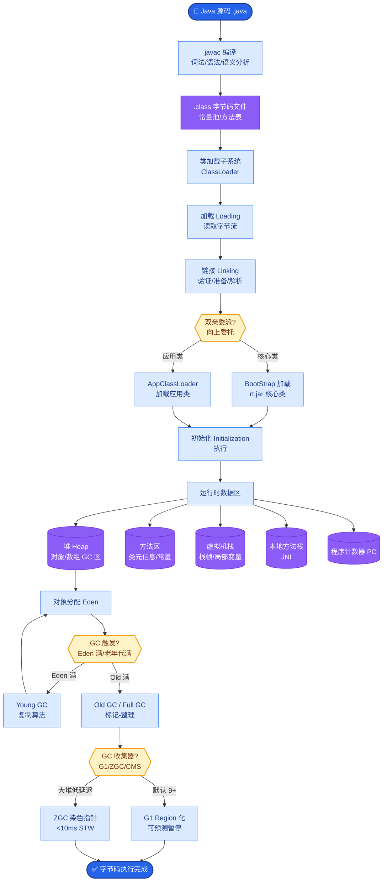

# ChatBot 加上插件是不是就变成 Agent 了

仅仅给 ChatBot 加上插件，**不一定**能成为 Agent，关键取决于 **「谁来控制插件的调用逻辑」**。

**判断核心：是否存在「推理-决策-反馈」的自主闭环。**

1. **带插件的 ChatBot (Rule-based / Hard-coded)**
   *   **机制**：通过关键词匹配、意图识别分类器路由到插件。调用逻辑由代码硬编码。
   *   **本质**：一个增强版的问答系统，而非 Agent。
   *   **示例**：用户说「查天气」 -> 规则命中 -> 调用天气 API -> 返回结果。中间没有多步推理。

2. **AI Agent (LLM-driven)**
   *   **机制**：LLM 根据当前任务上下文，自主决定「是否需要工具」、「调用哪个工具」、「参数是什么」，并根据工具返回结果决定下一步是调用另一个工具还是生成最终回答。
   *   **本质**：具有自主行动能力的智能体。
   *   **示例**：用户问「明天适合穿什么？」 -> Agent 思考(需要天气) -> 调用天气 API (发现下雨) -> Agent 思考(建议带伞) -> 调用日历 API (查看是否有户外安排) -> 综合生成建议。

**逻辑流对比图：**
```text
  ChatBot + Plugin (Static Routing):      Agent (Dynamic Loop):

  Input ──▶ [Intent Matcher] ──▶ Call API      Input ──▶ [LLM Brain] ──▶ Thought
            (Hard Rules)         │                              │
                                 ▼                              ▼
                             Output                     [Action: Call Tool]
                                                            │
                                                            ▼
                                                      ┌──────────┐
                                                      │   Tool   │
                                                      └─────┬────┘
                                                            │ (Observation)
                                                            ▼
                                                      [LLM Brain] ──▶ (More thoughts?
                                                            │           or Final Answer?)
                                                            ▼
                                                        Output
```

**实战案例：**
早期我们开发了一个“订机票”的 Chatbot，规则写死为：识别“城市”-> 调用搜索接口。但如果用户说“我要订比去上海便宜的机票”，规则引擎因为无法解析“比...便宜”的逻辑而失败，只能回复“我不理解”。升级为 Agent 后，LLM 先调用查上海票价，再以此为参数搜索更低票价，成功处理了这种相对逻辑。

**边界情况：**
- **参数组合爆炸**：如果插件参数极其复杂（如几十个可选参数的查询接口），Agent 可能需要多次交互才能凑齐参数，而 ChatBot 可以通过 Form 表单一次性强制用户填完。
- **API 安全风险**：Agent 具备调用任意工具的能力（包括写操作），若 Prompt 注入攻击成功，可能导致严重的数据破坏，必须设置严格的权限校验。

**面试追问：**
1. 从工程架构上看，传统 ChatBot 的意图识别槽位填充，是否可以被 Agent 完全替代？有什么场景下传统架构依然有优势？
2. 如何防止 Agent 恶意或错误地调用“删除”或“扣款”类的高危插件？

**易错点：**
- **形式主义误区**：认为只要使用了 Function Calling API 就是 Agent。如果在 Function Calling 后端依然是写死的 if-else 逻辑，本质上依然是 ChatBot。

**代码示例（Function Calling 关键差异）：**
```python
# ChatBot模式: 代码显式判断逻辑
if "天气" in user_input:
    # 硬编码调用
    result = weather_api.get(city="北京")
    return f"北京天气是{result}"

# Agent模式: LLM 决定逻辑
messages = [{"role": "user", "content": user_input}]

# 1. LLM 决定是否调用工具（自主性）
response = client.chat.completions.create(
    model="gpt-4",
    messages=messages,
    tools=[weather_tool_schema], # 告诉 LLM 有什么可用
    tool_choice="auto" # 让 LLM 自己选
)

response_message = response.choices[0].message

# 2. 处理工具调用（闭环）
if response_message.tool_calls:
    # 执行工具
    function_args = json.loads(response_message.tool_calls[0].function.arguments)
    tool_result = weather_api.get(**function_args)
    
    # 3. 将结果传回 LLM 进行下一步决策（反馈）
    messages.append(response_message)
    messages.append({"role": "tool", "tool_call_id": response_message.tool_calls[0].id, "content": str(tool_result)})
    
    # LLM 可能会根据结果再次调用其他工具，或者直接回答
    final_response = client.chat.completions.create(model="gpt-4", messages=messages)
```


## 核心流程图



## 记忆要点

- 判断核心：是否存在自主的推理-决策-反馈闭环。
- ChatBot+插件：逻辑由代码硬编码，只是增强版问答系统。
- Agent：由LLM自主决定何时调用、调用哪个及参数。
- 误区警示：用了Function Calling不等于Agent，后端仍是if-else则不是。
- 能力差异：Agent能处理多步推理和相对逻辑，ChatBot不能。

## 结构化回答

**30 秒电梯演讲：** 不一定，关键看谁来决定调插件。如果调用逻辑是代码写死的 if-else 关键词匹配，那就是增强版 ChatBot；如果由 LLM 自主推理决定何时调、调哪个、参数填什么，并根据返回结果继续决策，那才是 Agent。核心标志是有没有"推理-决策-反馈"的自主闭环。

**展开框架：**
1. **ChatBot + 插件** — 规则路由到 API，中间没有多步推理，本质是增强版问答系统。
2. **Agent** — LLM 根据上下文自主决策工具调用，能处理"比去上海便宜"这种相对逻辑。
3. **误区警示** — 用了 Function Calling 不等于 Agent，后端还是 if-else 就不算。

**收尾：** 我做过订机票的 Bot，规则版本处理不了"比上海便宜"这种话，升级成 Agent 后 LLM 先查上海票价再搜更低票价就搞定了。您想深入聊哪块，工具选型还是 Prompt 注入防护？

## 视频脚本

> 预计时长：2 分钟 | 由浅入深

| 时间 | 画面/字幕 | 口播台词 | 讲解要点 |
|------|----------|----------|----------|
| 0:00 | 标题卡：ChatBot+插件=Agent？ | "ChatGPT 装一堆插件就是 Agent 了吗？不一定。" | 开场钩子 |
| 0:15 | 静态路由 vs 动态闭环图 | "关键看谁决定调插件：代码写死是 ChatBot，LLM 自主决策才是 Agent。" | 核心判断 |
| 0:45 | if-else 关键词匹配代码截图 | "ChatBot 靠关键词路由到 API，中间没有推理过程。" | ChatBot 本质 |
| 1:10 | Agent 多步推理流程动画 | "Agent 会思考：需要天气→调 API→发现下雨→建议带伞→查日历。" | Agent 优势 |
| 1:35 | 订机票相对逻辑案例 | "实战：'比上海便宜的机票'，规则版直接懵，Agent 能拆成两步查询。" | 实战案例 |
| 1:50 | 误区警示卡 | "记住：Function Calling 不等于 Agent，后端是 if-else 就不算。" | 收尾 |

