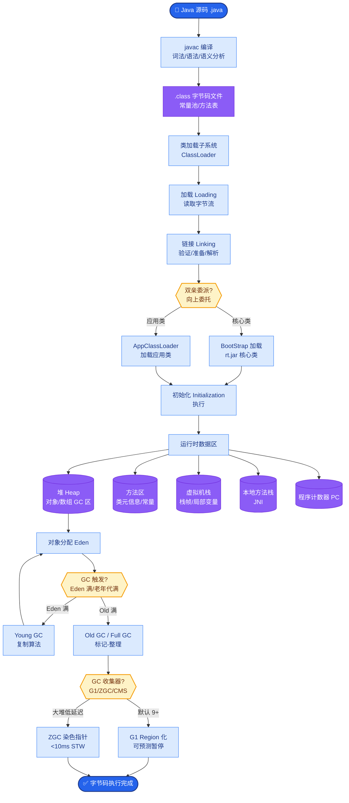

# 反应式 Agent 有什么优缺点

**优点：** 
1. **响应速度快**：无需复杂的规划流程，直接感知到行动，延迟最低。
2. **可解释性强（原理细节）**：决策链路短，通常遵循 `IF-THEN` 规则或直接映射，便于调试和追踪每一时刻的决策逻辑。
3. **易于测试（边界条件）**：输入输出映射明确，单元测试覆盖率高，不依赖外部复杂状态。

**缺点：** 
1. **长程依赖与推理弱**：缺乏全局规划能力，难以处理需要多步逻辑推导的任务（如需要回溯或先铺垫再行动的场景）。
2. **对未见输入鲁棒性差**：严重依赖历史训练数据或规则库，遇到训练分布外（OOD）的输入极易失效。
3. **局部最优陷阱**：容易陷入局部最优解而忽略全局利益（如为了解决眼前问题引入了更大的技术债务）。

**架构示意图：**
```text
┌─────────────┐
│  Environment │
└──────▲──────┘
       │ (State)
       │
┌──────┴──────┐
│  Condition  │ ────┐
│  / Rules    │     │ (匹配/推理)
└──────┬───────┘     │
       │            │
       ▼            ▼
┌─────────────────────┐
│   Reactive Agent    │
│  (Action Selector)  │
└──────┬───────────────┘
       │ (Action)
       ▼
┌─────────────────────┐
│   Actuators/Tools   │
└─────────────────────┘
```

### 边界情况补充
- **规则冲突**：当多个 `IF-THEN` 规则同时被触发时，若无优先级定义，会导致行为冲突或竞态条件。需引入规则优先级或冲突解决策略。
- **感知噪声**：在输入数据存在噪声或模糊语义时，基于精确匹配的反应式 Agent 会直接失效。需在感知层加入模糊逻辑或语义预处理。
- **资源耗尽**：在高并发场景下，简单的反应式逻辑可能因未进行流控或资源预估，瞬间耗尽 API 配额或数据库连接。

### 实战补充

**实战案例**：在构建智能客服的「意图识别与路由」模块时，使用 Reactive Agent（基于规则或分类模型）处理高频且意图明确的问题（如「查物流」、「退款」），P95 延迟控制在 200ms 以内。但如果用户咨询的是复杂的「断供如何处理」，这种简单路由无法解决，必须交给 deliberative Agent 进行多步推理。起初全部由 LLM 处理导致成本过高，混合架构后节省了 70% 的 Token 成本。

**代码示例**：
```python
def reactive_agent_router(user_input):
    # 简单的 Reactive 规则库
    triggers = {
        "price": get_pricing_info,     # 直接函数映射
        "refund": handle_refund_policy,
        "human": transfer_to_support
    }
    
    # 关键词匹配（感知）
    for keyword, action in triggers.items():
        if keyword in user_input.lower():
            return action(user_input) # 立即执行
            
    # 兜底：如果无法匹配，交给 deliberative Agent
    return deliberative_agent.run(user_input)
```

## 面试追问
1. 如何维护一个包含上千条规则的 Reactive Agent 系统，避免规则之间的逻辑冲突成为维护噩梦？
2. 如果实时性要求极高（如高频交易），连 LLM 的推理延迟都无法接受，除了硬编码规则，还有什么更轻量的方案？

## 易错点
1. **误用场景**：试图用 Reactive Agent 处理复杂的、需要上下文记忆的任务（如「帮我查下上周说过的那个方案」），导致规则库指数级膨胀且无法覆盖所有情况。
2. **忽略反馈**：认为 Reactive Agent 就是静态规则，忽略了可以根据工具执行结果动态调整规则参数（如自动调节阈值），导致系统适应性差。


## 核心流程图



## 记忆要点

- 优点：响应快（直接映射）、可解释强（链路短）、易测试。
- 缺点：无全局规划、长程推理弱、未见数据易失效。
- 架构本质：基于IF-THEN规则或直接映射，无记忆。
- 适用场景：高频且意图明确的任务（如路由、简单查询）。
- 混合策略：高频用Reactive降本，复杂任务交Deliberative。

## 结构化回答

**30 秒电梯演讲：** 反应式 Agent 就像膝跳反射——响应特别快、可解释性强、好测试，因为它就是 IF-THEN 规则或直接映射，没有记忆也没有规划。但缺点也明显：处理不了多步推理，遇到没见过的输入就懵。实战中一般用混合架构，高频简单的交给反应式降成本，复杂的再扔给思考式 Agent。

**展开框架：**
1. **三大优点** — 响应快（直接感知到行动）、可解释（链路短好调试）、易测试（输入输出映射明确）。
2. **三大缺点** — 无全局规划、长程推理弱、对训练分布外输入鲁棒性差。
3. **混合架构是正解** — 高频意图明确的走反应式省 Token，复杂多步的交 Deliberative Agent。

**收尾：** 我做智能客服路由就用这套——查物流、退款这种高频的用反应式 P95 控制在 200ms，混合架构省了 70% 的 Token 成本。您想深入聊哪块，规则冲突处理还是混合路由策略？

## 视频脚本

> 预计时长：2 分钟 | 由浅入深

| 时间 | 画面/字幕 | 口播台词 | 讲解要点 |
|------|----------|----------|----------|
| 0:00 | 标题卡：反应式 Agent 优缺点 | "反应式 Agent 像膝跳反射，快是快，但没脑子。" | 开场钩子 |
| 0:15 | IF-THEN 规则映射图 | "本质就是条件到动作的直接映射，没有记忆，没有规划。" | 架构本质 |
| 0:45 | 三优点三缺点对比表 | "优点：快、可解释、好测试；缺点：没规划、推理弱、遇新输入就懵。" | 优缺点对比 |
| 1:10 | 混合架构流程图 | "正解是混合：高频走反应式，复杂任务交思考式 Agent。" | 混合策略 |
| 1:35 | 客服路由案例数据 | "实战：查物流走反应式 P95 200ms，整体省 70% Token。" | 实战案例 |
| 1:50 | 混合口诀卡 | "记住：高频用反应式，复杂交思考式。下期讲分层架构。" | 收尾 |

