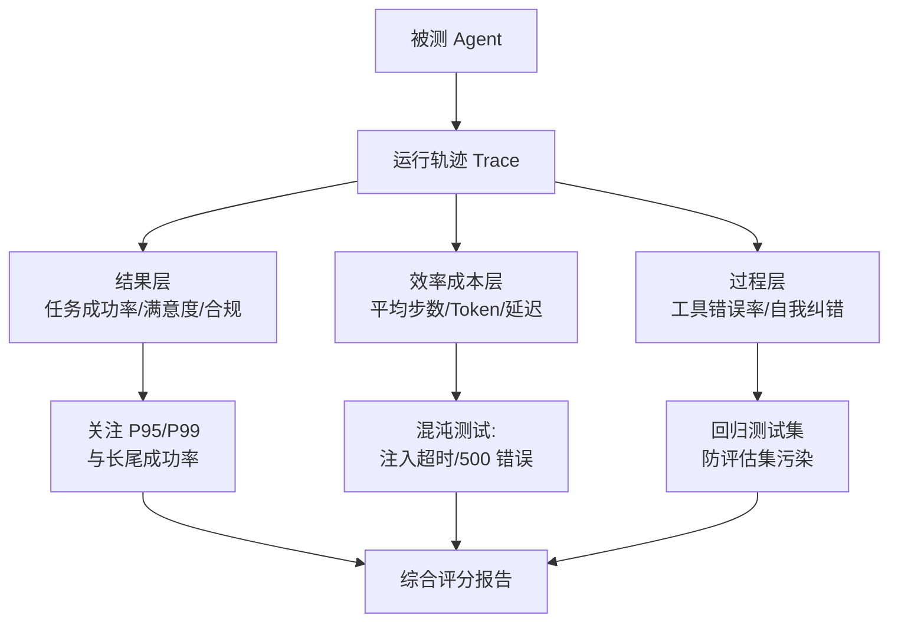
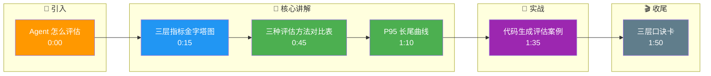

# 怎么评估一个 Agent 的好坏

**分层评估体系：**

**1. 结果层：**
*   **任务成功率**：核心指标，不仅看最终输出，需校验关键步骤是否完成。
*   **用户满意度**：人工打分或模型辅助打分。
*   **安全/合规性**：是否产生有害内容或违规操作。

**2. 效率与成本层：**
*   **平均步数**：完成任务所需的平均 Tool Call 次数，步数越少效率越高。
*   **Token 消耗与成本**：总 Input/Output Token 数及对应的 API 费用。
*   **端到端延迟**：从用户输入到最终响应的时间。

**3. 过程层：**
*   **工具错误率**：工具调用参数错误或选择错误的频率。
*   **自我纠错能力**：发生错误后恢复成功的比例。

**评估基准与方法：**
*   **静态数据集**：如 HumanEval 变体，用于离线评估推理能力。
*   **仿真环境**：如 ALFWorld 或自建 Mock 环境，用于测试交互能力。
*   **线上 A/B 测试**：对比不同 Prompt 或 模型版本的真实业务表现。

### 边界情况补充
- **长尾效应**：平均指标可能掩盖极端情况。需关注 P95/P99 延迟和最差成功率，因为 Agent 失败一次带来的信任损失可能远超十次普通成功。
- **环境依赖性**：同一 Agent 在 Mock 环境表现完美，但在真实 API（有网络抖动、限流）下可能崩溃。评估需包含「混沌测试」，模拟 API 超时、返回 500 等异常。
- **评估集污染**：若评估数据集包含在训练集中，会导致「过拟合假象」。需严格区分训练集、验证集和测试集，并定期更新测试集以防止 Agent 记忆答案而非推理。

### 实战补充

**实战案例**：在评估代码生成 Agent 时，单纯看「代码能否运行」是不够的（通过率虚高）。我们引入了「功能性回归测试集」，在运行代码后，自动注入 5 种边缘输入，若 Agent 生成的代码在边缘输入下崩溃，则判为失败。这一指标让 Agent 的真正可用性评分从 85% 下降到了 40%，暴露了严重的鲁棒性问题。

**代码示例**（模拟评估流程）：
```python
def evaluate_agent(agent, test_cases):
    metrics = {"success": 0, "total_tokens": 0, "steps": 0}
    
    for case in test_cases:
        trace = agent.run(case.input)
        
        # 1. 结果层校验
        if trace.final_output == case.expected_output:
            metrics["success"] += 1
            
        # 2. 效率层统计
        metrics["total_tokens"] += trace.total_tokens
        metrics["steps"] += len(trace.action_history)
        
    return {
        "accuracy": metrics["success"] / len(test_cases),
        "avg_cost": metrics["total_tokens"] / len(test_cases),
        "avg_efficiency": metrics["steps"] / len(test_cases)
    }
```

**评估方法对比**

| 评估维度 | 静态数据集 | 仿真环境 | 线上 A/B 测试 |
| :--- | :--- | :--- | :--- |
| **成本** | 极低 | 中 | 高（需承担用户风险） |
| **反馈速度** | 秒级 | 分钟级 | 天/周级 |
| **真实性** | 差（基于历史） | 中（模拟环境） | 极高（真实流量） |
| **考察重点** | 推理逻辑、格式 | 工具调用、容错 | 用户满意度、转化率 |
| **局限性** | 无法评估真实交互 | Mock 可能不够逼真 | 难以复现特定 Bug |

## 面试追问
1. 当 LLM-as-a-Judge（用模型打分）与人工评估结果出现系统性偏差时，你倾向于信哪个？如何校准 Judge 模型？
2. 在生产环境中，如果发现新上线的 Agent 版本成功率提升了 1%，但平均成本增加了 20%，如何定义这个 Trade-off 是否值得？

## 易错点
1. **过度关注单步准确性**：评估每个工具调用的参数是否正确，却忽略了整个任务链条是否真的解决了用户问题。子目标最优不等于全局最优。
2. **忽视安全性评估**：在离线评估中只做功能性测试，忽略了 Agent 可能生成的“越狱”内容或泄露隐私的 Prompt 注入攻击。需单独设立红队测试环节。

## 核心流程图



## 记忆要点

- 结果层：任务成功率、用户满意度、安全合规性。
- 效率层：平均步数、Token成本、端到端延迟。
- 过程层：工具错误率、自我纠错恢复比例。
- 评估方法：静态数据集测逻辑、仿真环境测交互、线上AB测真实感。
- 避坑指南：关注P95长尾表现，防止过拟合评估集，必须做红队安全测试。

## 结构化回答

**30 秒电梯演讲：** 评估 Agent 不能只看一个数，得三层一起看。结果层看任务成功率和用户满意度，效率层看平均步数、Token 成本和延迟，过程层看工具错误率和自我纠错能力。方法上静态数据集测逻辑、仿真环境测交互、线上 AB 测真实感，三层叠加。千万别只看平均值，一定要关注 P95 长尾。

**展开框架：**
1. **三层指标体系** — 结果（成功率/满意度/安全）、效率（步数/Token/延迟）、过程（工具错误率/纠错恢复比）。
2. **三种评估方法** — 静态集成本低反馈快但失真，仿真环境测交互，线上 AB 最真实但贵。
3. **避坑关键** — 看 P95 长尾、防评估集污染、必须做红队安全测试。

**收尾：** 我评代码生成 Agent 时就踩过坑——光看"能不能跑"通过率 85%，加了边缘输入回归测试直接掉到 40%，暴露了鲁棒性问题。您想深入聊哪块，评估集设计还是 LLM-as-a-Judge 校准？

## 视频脚本

> 预计时长：2 分钟 | 由浅入深

| 时间 | 画面/字幕 | 口播台词 | 讲解要点 |
|------|----------|----------|----------|
| 0:00 | 标题卡：Agent 怎么评估 | "评估 Agent 不能只看一个准确率，得三层一起看。" | 开场钩子 |
| 0:15 | 三层指标金字塔图 | "结果层看成功率，效率层看步数和成本，过程层看工具错误率。" | 指标体系 |
| 0:45 | 三种评估方法对比表 | "静态集测逻辑、仿真测交互、线上 AB 测真实感，各有利弊。" | 评估方法 |
| 1:10 | P95 长尾曲线 | "别只看平均值，Agent 失败一次的信任损失远超十次成功。" | 避坑要点 |
| 1:35 | 代码生成评估案例 | "实战：加边缘输入测试后，真实可用性从 85% 掉到 40%。" | 实战案例 |
| 1:50 | 三层口诀卡 | "记住：结果、效率、过程三层，加红队安全测试。下期讲评测集。" | 收尾 |

### 视频流程图




