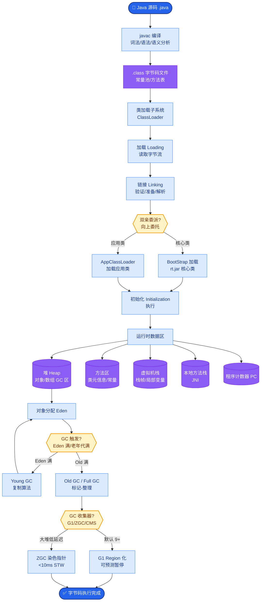

# 请用你自己的话定义 LLM Agent,并说明与单次调用的差异.

**定义：**
LLM Agent 是以大语言模型（LLM）为**推理核心**，具备**感知、规划、记忆与工具使用**能力的智能体。它能够在多轮对话中自主地与外部环境（包括文件系统、API、数据库等）进行交互，通过反馈循环来动态调整策略，以完成复杂、高层次的目.

**与单次调用的核心差异：**

| 维度 | 单次 LLM 调用 | LLM Agent |
| :--- | :--- | :--- |
| **交互模式** | 开环，单向生成 | 闭环，多轮交互 |
| **信息流** | Static Context (静态上下文) | Dynamic State (动态状态更新) |
| **能力边界** | 受限于训练知识和 Prompt 窗口 | 可通过工具突破知识时效和算力限制 |
| **决策机制** | 概率性一次性生成 | 试错、观察、修正的迭代过程 |
| **执行载体** | 仅 CPU/GPU 推理 | 涉及 I/O、网络请求、数据库操作 |
| **容错性** | 无自纠能力，依赖重试 | 可基于错误反馈自我修复 |

**运行流程图：**
```text
    ┌─────────┐
    │  User   │
    └────┬────┘
         ▼
┌─────────────────────────────┐
│       Agent Core (LLM)       │◄─────┐ (History/Memory)
│  (Perceive -> Plan -> Act)   │      │
└──────┬───────────────────────┘      │
       │ Action (Function Call)       │
       ▼                              │
┌─────────────────┐                  │
│  Environment /  │                  │
│    Tools / API  │                  │
└──────┬──────────┘                  │
       │ Observation                │
       └─────────────────────────────┘
```

**实战案例：**
在开发数据分析 Agent 时，单次调用 LLM 只能根据用户输入的静态 SQL 片段提供建议（容易出错）；而 Agent 能够自主连接元数据接口获取最新的表结构，尝试执行 SQL，根据报错信息自动修正语法，直到查询成功。

**边界情况：**
在长周期任务中，Agent 必须处理**上下文窗口溢出**的问题。单次调用不需要考虑状态持久化，而 Agent 需要在多轮交互中压缩历史记忆、遗忘无关信息，甚至将长期记忆写入向量数据库，否则随着对话进行，早期关键信息会被截断导致行为异常。

**关键代码示例：**
```python
# 伪代码：Agent 循环交互骨架
memory = []
while True:
    response = llm.generate(prompt=build_prompt(memory))
    action = parse_action(response)
    if action.type == 'finish':
        break
    result = tools.execute(action.name, action.args)
    memory.append({'role': 'action', 'content': str(result)})
```

**## 面试追问**
1.  Agent 的记忆机制如果实现不当，会导致什么具体问题？（答：信息丢失导致上下文不连贯，或者噪音信息累积干扰模型判断，甚至产生“记忆混淆”）。
2.  如何量化评估一个 Agent 的性能比单纯的单次 Prompt 更好？（答：构建端到端的数据集，不仅比对最终答案的正确率，还要统计任务完成率、工具调用次数和 Token 消耗成本）。

**## 易错点**
1.  **混淆“多轮对话”与“Agent”**：仅仅保留上下文历史的多轮聊天不一定是 Agent（如 ChatGPT 对话模式）。核心区别在于是否有**自主的行动能力**和**与环境的交互闭环**。
2.  **忽视成本陷阱**：认为 Agent 无限优于单次调用。实际上 Agent 涉及多次 LLM 推理和工具调用，成本和延迟显著增加，不适合简单问答场景。

**## 常见考点**
1.  **追问**：Agent 的“记忆”和 Prompt 的“上下文”有什么区别？（答：记忆是持久化存储的、经过筛选的长期信息；上下文是当前推理的临时工作区）。
2.  **追问**：什么样的任务适合用 Agent，而不是简单的 Prompt？（答：涉及外部数据获取、需要多步逻辑验证、或需要精确计算的任务）。


## 核心流程图



## 记忆要点

- 定义：以 LLM 为核心，具备感知、规划、记忆、工具使用能力的智能体。
- 核心差异：单次调用是开环静态生成，Agent 是闭环动态交互，能基于反馈修正。
- Agent 通过工具突破知识时效和算力限制，涉及 I/O 与数据库操作。
- 易错点：多轮对话不等于 Agent，核心区别在于自主行动和环境交互闭环。

## 结构化回答

**30 秒电梯演讲：** 我的定义是：LLM Agent 是以大模型为推理核心，具备感知、规划、记忆、工具使用四大能力的智能体。和单次调用最大的区别是——单次调用是开环静态生成，给个结果就完事；Agent 是闭环动态交互，能基于环境反馈自己修正策略。另外多轮对话不等于 Agent，关键看有没有自主行动和环境交互的闭环。

**展开框架：**
1. **四大能力定义** — 感知（接收输入）、规划（多步推理）、记忆（维持状态）、工具（调 API/数据库），缺一不成。
2. **开环 vs 闭环** — 单次调用无自纠能力只能重试；Agent 能试错、观察、修正，涉及真实 I/O。
3. **能力边界突破** — 单次受限于训练知识窗口；Agent 通过工具突破时效和算力限制。

**收尾：** 我做数据分析 Agent 深有体会——单次 LLM 只能猜 SQL，Agent 能连元数据接口拿最新表结构、试执行、根据报错自动改语法。您想深入聊哪块，记忆机制还是成本权衡？

## 视频脚本

> 预计时长：2 分钟 | 由浅入深

| 时间 | 画面/字幕 | 口播台词 | 讲解要点 |
|------|----------|----------|----------|
| 0:00 | 标题卡：自己定义 LLM Agent | "用一句话定义 Agent，并说出和单次调用的本质差异。" | 开场钩子 |
| 0:15 | 四大能力雷达图 | "感知、规划、记忆、工具，四大能力构成完整 Agent。" | 核心定义 |
| 0:45 | 开环 vs 闭环对比表 | "单次调用是开环静态生成，Agent 是闭环动态交互能自纠。" | 核心差异 |
| 1:10 | 多轮对话 vs Agent 辨析图 | "误区：多轮对话不等于 Agent，关键看有没有环境交互闭环。" | 易错辨析 |
| 1:35 | 数据分析 Agent 演示 | "实战：Agent 连元数据库、试执行 SQL、根据报错自动改语法。" | 实战案例 |
| 1:50 | 定义口诀卡 | "记住：四大能力加闭环交互，才是真 Agent。下期讲记忆。" | 收尾 |

