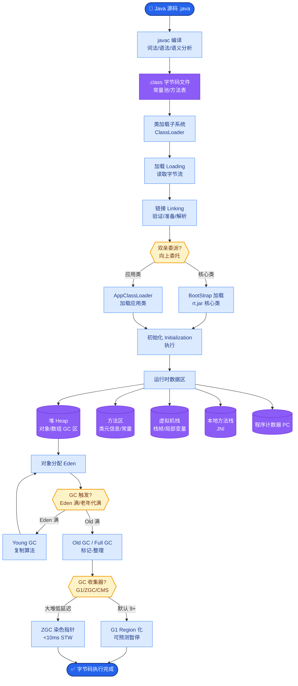
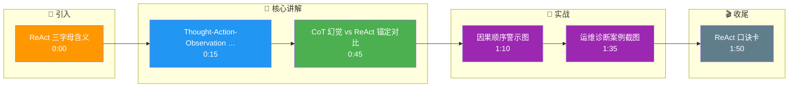

# ReAct 框架里三个字母代表什么?解决什么问题

**ReAct 代表：Reasoning（推理） + Acting（行动）**

**解决的核心问题：**
传统的 LLM 生成存在“幻觉”和“与事实脱节”的问题。单纯让模型“思考”容易产生错误逻辑，单纯让模型“行动”则缺乏依据。ReAct 通过将推理过程显式化，并与工具执行结果相结合，解决了以下问题：
1.  **事实锚定**：通过工具获取的最新信息修正模型的内部知识。
2.  **路径透明**：用户可以追踪模型的思考链条，提升可解释性。
3.  **动态调整**：根据 Action 的反馈来修正下一步的 Thought。

**工作流程图：**
```text
Start (Query)
   │
   ▼
┌──────────────┐
│  Thought 1   │ (我要查X，所以我需要调用工具A)
└──────┬───────┘
       │
       ▼
┌──────────────┐
│   Action 1   │ ──> Tool_A(arguments)
└──────┬───────┘       │
       │               │
       │               ▼
       │         ┌──────────┐
       └─────────│Observation│ (得到结果 Y)
                 └─────┬────┘
                       │
                       ▼
                 ┌──────────────┐
                 │  Thought 2   │ (根据结果Y，我发现...)
                 └──────┬───────┘
                        │
                  ... (Repeat) ...
                        │
                        ▼
                   Final Answer
```

**实战案例：**
在运维诊断 Agent 中，面对“服务报错 500”的询问，单纯的 CoT 可能会编造原因（幻觉）。ReAct 模式下，Agent 先产生 Thought “可能是日志有错误信息”，调用日志查询工具，根据 Observation “发现 Connection Timeout”，再产生 Thought “检查数据库连接数”，最终定位到连接池耗尽，而非虚假的代码 Bug。

**边界情况：**
**无限思考与工具失效**。当工具返回空结果或非预期格式（如 API 变动导致 JSON 解析失败）时，ReAct 框架中的 Thought 环节如果缺乏异常处理逻辑，可能会导致模型不断重复尝试解释错误，或者陷入“Thought -> Action -> Error -> Thought”的死循环，消耗大量 Token 而无法终止。

**关键代码示例：**
```python
# 伪代码：ReAct Prompt 模板构造
react_prompt = """
Question: {input}
Thought: {agent_scratchpad}
"""
# 模型输出示例：
# Thought: I need to check the stock price.
# Action: Stock_Search[ticker: AAPL]
# Observation: The price is $150.
# Thought: Now I can answer.
# Final Answer: The price is $150.
```

**## 面试追问**
1.  在 ReAct 模式中，如果 Thought 部分非常冗长，会对后续的 Action 产生什么影响？（答：模型可能会因为上下文窗口限制而截断了 Action 指令，或者因为注意力分散导致 Action 参数生成错误）。
2.  如何解决 ReAct 在多跳问答中的“迷失方向”问题？（答：引入全局规划器或在 Prompt 中显式维护“当前目标/子任务状态”，防止模型在中间步骤遗忘原始意图）。

**## 易错点**
1.  **Thought 与 Action 的因果倒置**：编写 Prompt 时，必须强调 Action 是基于 Thought 产生的，而不是先生成 Action 再去补 Reasoning。因果倒置会削弱推理的有效性。
2.  **忽略 Observation 的格式化**：直接将巨大的原始 Tool Output 塞入 Observation 会导致 Prompt 爆炸或关键信息被淹没。必须对 Observation 进行摘要或提取。

**## 常见考点**
1.  **追问**：ReAct 和 Chain-of-Thought (CoT) 的区别是什么？（答：CoT 仅在纯文本空间推理；ReAct 引入了与环境的交互，推理过程被观察结果打断和修正）。
2.  **追问**：如果 Tool 返回了错误信息，ReAct 框架该如何处理？（答：在 Thought 阶段感知错误，重试或切换工具）。

## 核心流程图



## 记忆要点

- ReAct 代表 Reasoning（推理）与 Acting（行动）交替进行。
- 解决幻觉与事实脱节问题，通过工具反馈修正推理路径，实现事实锚定。
- 流程：Thought（思考）-> Action（行动）-> Observation（观察）-> 循环。
- 易错点：因果不可倒置，必须先思考后行动，且 Observation 需格式化摘要。

## 结构化回答

**30 秒电梯演讲：** ReAct 就是 Reasoning 加 Acting 两个词的拼法，核心是让模型一边推理一边行动。它解决的是 LLM 闭门造车产生幻觉的问题——通过工具的真实反馈来锚定推理路径。流程就是 Thought 思考、Action 行动、Observation 观察三步循环，直到得出最终答案。关键点是必须先思考后行动，因果不能倒置。

**展开框架：**
1. **名字拆解** — Reasoning 推理加 Acting 行动，两者交替进行，用真实反馈修正思路。
2. **解决幻觉** — 单纯 CoT 容易编造，ReAct 靠工具返回的事实把推理锚定到现实。
3. **三步循环** — Thought 想清楚要干啥，Action 调工具，Observation 格式化摘要后再喂回下一轮 Thought。

**收尾：** 我做运维诊断 Agent 时深有体会——服务报 500，纯 CoT 会编造代码 Bug，ReAct 模式下查日志发现 Connection Timeout，最终定位到连接池耗尽。您想深入聊哪块，Observation 压缩还是多跳迷失问题？

## 视频脚本

> 预计时长：2 分钟 | 由浅入深

| 时间 | 画面/字幕 | 口播台词 | 讲解要点 |
|------|----------|----------|----------|
| 0:00 | 标题卡：ReAct 三字母含义 | "ReAct 是 Reasoning 加 Acting，让模型边想边干。" | 开场钩子 |
| 0:15 | Thought-Action-Observation 循环图 | "三步循环：思考要干啥，调工具执行，观察结果再修正思路。" | 核心流程 |
| 0:45 | CoT 幻觉 vs ReAct 锚定对比 | "纯 CoT 会编造原因，ReAct 靠工具返回的事实锚定推理。" | 解决问题 |
| 1:10 | 因果顺序警示图 | "易错：必须先 Thought 后 Action，因果倒置会削弱推理有效性。" | 易错点 |
| 1:35 | 运维诊断案例截图 | "实战：报 500 时 ReAct 查日志定位到连接池耗尽，而非编造 Bug。" | 实战案例 |
| 1:50 | ReAct 口诀卡 | "记住：推理加行动交替，事实锚定防幻觉。下期讲 Plan-and-Execute。" | 收尾 |

### 视频流程图




