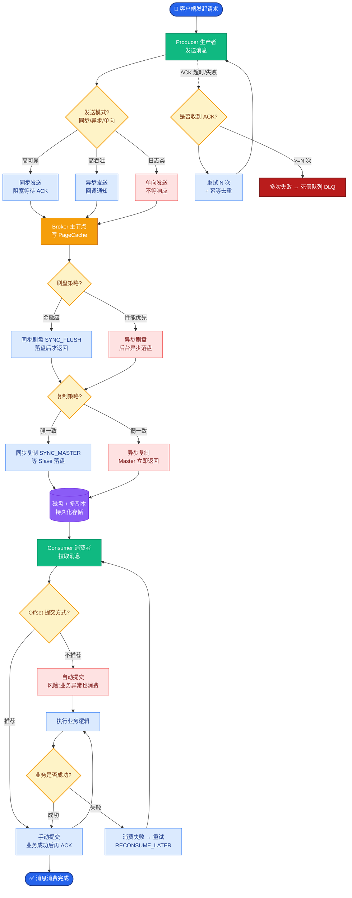

# 你会如何设计 Agent 的停止条件

**设计停止条件（组合策略）：**
为了防止 Agent 无限循环或资源耗尽，必须设计多层级的停止机制。

**1. 成功终止条件（软终止）：**
*   **模型显式声明**：模型生成特定的 Token（如 `<finish>`、`Final Answer:`）。
*   **任务清单校验**：系统维护一个任务列表，当所有子项状态均为 `Done` 时终止。
*   **外部信号**：工具返回明确的成功标志（如代码测试通过 `PASS`、数据库写入成功 Affected Rows > 0）。

**2. 失败/强制终止条件（硬终止）：**
*   **步数上限**：限制最大 `Thought-Action-Observation` 循环次数（如 10 步）。
*   **预算上限**：限制 Token 消耗总量或 API 调用费用。
*   **时间超时**：设置全局执行时间墙（如 60s）。
*   **重复/无进展检测**：检测最近 N 步的 Action 或 Output 是否高度相似（字符串相似度 > 阈值）。

**状态流转图：**
```text
      Start
        │
        ▼
┌───────────────┐
│ Check Limits  │ ──(Exceeds Budget/Steps)──> Force Stop (Fail)
│ (Hard Limits) │
└───────┬───────┘
        │ (Pass)
        ▼
┌───────────────┐
│ Check Success │ ──(Finish Signal/All Done)─> Graceful Stop (Success)
│ (Soft Goal)   │
└───────┬───────┘
        │ (Not Yet)
        ▼
   Next Action
```

**实战案例：**
某代码调试 Agent 曾陷入死循环：尝试修复 Bug -> 运行测试失败 -> 再次尝试相同修复 -> 运行失败。我们在 Loop 中加入哈希检测机制，一旦发现连续 3 次 Action 的参数哈希值完全一致，立即强制终止并提示用户“Agent 陷入重复尝试，请调整指令”。

**边界情况：**
**伪重复与同义反复**。简单的字符串匹配无法捕捉 Agent 在“原地打转”。例如，Agent 可能在第一轮调用 `add(a, b)`，第二轮调用 `sum([a, b])`，虽然代码字符串不同，但逻辑意图完全一致。需要引入语义相似度或执行结果的哈希比对，才能识别这种高级的死循环。

**关键代码示例：**
```python
# 伪代码：硬限制与重复检测
max_steps = 10
history = []

for step in range(max_steps):
    action = agent.decide()
    # 重复检测
    if len(history) >= 2 and action == history[-1] == history[-2]:
        raise StopIteration("Detected repetitive loop")
    history.append(action)
    # 执行...
```

**## 面试追问**
1.  如果因为步数上限被迫停止，如何让用户平滑接手？（答：输出最后一步的 State 和中间生成的 Memory，将任务状态快照交给用户或另一个 Agent 进行恢复）。
2.  在分布式 Agent 系统中，如何设计全局的超时控制？（答：使用 Redis 或 ZooKeeper 维护分布式锁和 TTL，或者在消息队列层面设置消息过期时间）。

**## 易错点**
1.  **只关注步数，忽视无意义循环**：仅仅限制步数并不能防止 Agent 在最后几步进行无意义的操作（如反复调用同一个只读接口）。必须结合“状态变化检测”来判定是否有进展。
2.  **将模型输出作为唯一信任源**：如果模型因为幻觉输出了 `<finish>` Token，但工具实际上并未返回成功结果，系统需要校验外部状态（如查询数据库确认写入成功）才能真正终止，避免“假阳性”停止。

**## 常见考点**
1.  **追问**：如何判断 Agent 进入了死循环？（答：比较连续几步的 Action 或 Thought 的 Embedding 相似度）。
2.  **追问**：达到步数上限但任务未完成怎么办？（答：触发兜底机制，返回当前进度快照并询问用户是否继续，或总结失败原因）。


## 核心流程图



## 记忆要点

- 停止条件分软终止（显式声明/任务完成）和硬终止（步数/预算/超时）。
- 必须检测无进展循环，通过 Action 哈希或语义相似度识别死循环。
- 边界情况：防止模型幻觉输出 Finish Token 但实际未成功，需校验外部状态。
- 策略：设置最大步数熔断，结合重复检测与人工兜底机制。

## 结构化回答

**30 秒电梯演讲：** 停止条件得软硬结合。软终止是模型显式声明完成或任务清单全部 Done；硬终止是步数、预算、时间三个上限熔断。光有这些还不够，必须加无进展检测——用 Action 哈希或语义相似度识别死循环。最坑的边界情况是模型幻觉输出 Finish Token 但其实没成功，所以终止前一定要校验外部真实状态。

**展开框架：**
1. **软终止** — 模型输出 finish token、任务清单全 Done、工具返回明确成功信号。
2. **硬终止兜底** — 最大步数、Token 预算、时间墙三重熔断，防止资源耗尽。
3. **无进展检测** — 字符串哈希只能抓低级死循环，高级的要靠语义相似度或执行结果哈希。

**收尾：** 我做代码调试 Agent 时就遇到过——修 Bug、测试失败、再修同样的 Bug，加了"连续 3 次 Action 哈希一致就熔断"才解决。您想深入聊哪块，分布式超时还是状态快照恢复？

## 视频脚本

> 预计时长：2 分钟 | 由浅入深

| 时间 | 画面/字幕 | 口播台词 | 讲解要点 |
|------|----------|----------|----------|
| 0:00 | 标题卡：Agent 停止条件 | "Agent 怎么知道自己该停了？软硬条件缺一不可。" | 开场钩子 |
| 0:15 | 软终止硬终止分类图 | "软终止是任务完成或模型声明，硬终止是步数、预算、时间三重熔断。" | 条件分类 |
| 0:45 | 死循环检测动画 | "光限步数不够，必须用 Action 哈希或语义相似度检测无进展循环。" | 无进展检测 |
| 1:10 | 伪 Finish Token 警示图 | "坑：模型幻觉输出 Finish 但实际没成功，终止前要校验外部状态。" | 边界情况 |
| 1:35 | 代码调试死循环案例 | "实战：连续 3 次相同 Action 哈希就熔断，提示用户调整指令。" | 实战案例 |
| 1:50 | 停止条件口诀卡 | "记住：软硬结合加无进展检测。下期讲 Agent 最大风险。" | 收尾 |

