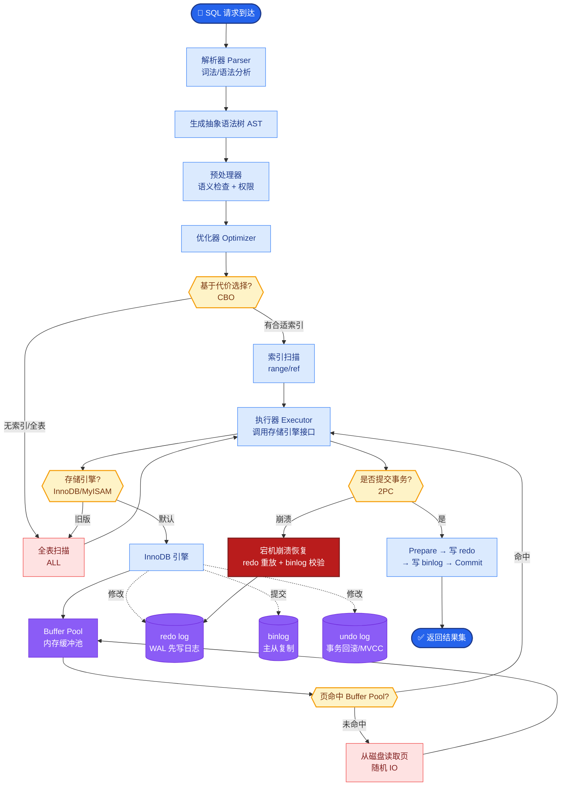

# Memory 用向量库就够了吗

## 答案
**答案：不够。向量库只是存储与检索的基础设施，而非全功能的记忆系统。**

**为什么向量库不够用？**
1.  **语义模糊 vs 精确匹配**：向量检索擅长模糊语义（如“苹果”匹配“水果”），但在处理 ID、特定数值、精确日期时效果很差，甚至可能检索到错误的信息。
2.  **缺乏结构化推理**：向量检索难以处理实体间的关系（如“A是B的老板”这种结构化图谱关系）。
3.  **时序性弱**：向量通常把信息打散，难以严格保持“先发生什么，后发生什么”的时间线逻辑。

**边界情况**：
*   **多租户数据隔离**：在进行向量检索时，若未在 Metadata 中强制绑定 `tenant_id` 或 `user_id`，极易发生 A 用户检索到 B 用户隐私数据的越权事故。
*   **空embedding处理**：当输入内容极短或仅为特殊符号时，生成的向量可能接近零向量，导致检索结果随机分布或全部相似，需对输入进行有效性校验。
*   **高频更新延迟**：向量库索引构建（如 HNSW）通常是异步的，刚写入的数据可能无法立即被检索到，对于需要强一致性的“短期记忆”场景（如对话中刚确认的参数），向量库不适用。

**实战案例**：在电商客服场景中，用户问“订单 #12345 发货了吗”，若纯用向量检索，可能会匹配到其他发货的订单片段而非该特定订单ID的状态，导致答非所问，必须引入 KV 数据库进行精确 ID 过滤。

**增强的 Memory 架构设计（混合架构）：**

```text
                User Query
                    │
       ┌────────────┼────────────┐
       ▼            ▼            ▼
┌───────────┐ ┌───────────┐ ┌───────────┐
│ Vector DB │ │  KV/SQL   │ │  Knowledge│
│ (语义检索) │ │(精确/元数据)│ │   Graph   │
└─────┬─────┘ └─────┬─────┘ └─────┬─────┘
      │            │            │
      └────────────┼────────────┘
                   ▼
           ┌───────────────┐
           │ Memory Ranker │ (重排序/去重)
           └───────┬───────┘
                   ▼
           Context for LLM
```

**组件分工**：
*   **向量数据库**：存储长期对话摘要、文档块，处理“基于语义的回忆”。
*   **键值/结构化存储**：存储用户偏好、具体参数、Token 计数等需要精确匹配的数据。
*   **知识图谱**：存储实体及其关系，处理复杂的关联推理。

**代码示例（混合检索伪代码）：**
```python
# Python: 混合检索逻辑
def search_memory(query, user_id):
    # 1. 向量检索：找语义相关（需过滤 user_id 防止越权）
    vec_results = vector_db.search(query, filter={"user_id": user_id}, top_k=5)
    # 2. 精确过滤：找特定ID或元数据
    exact_results = sql_db.query(f"SELECT * FROM logs WHERE user_id={user_id} AND order_id IS NOT NULL")
    # 3. 融合去重 (Reciprocal Rank Fusion)
    final_context = merge_and_rerank(vec_results, exact_results)
    return final_context
```

**对比表格：Memory 存储选型**

| 维度 | 向量数据库 | KV/SQL 数据库 | 知识图谱 |
| :--- | :--- | :--- | :--- |
| **核心能力** | 语义相似度、模糊匹配 | 精确查找、范围查询、元数据过滤 | 关系推理、实体链接、路径查找 |
| **典型场景** | RAG 文档检索、对话摘要匹配 | 查用户状态、订单详情、系统配置 | 查公司股权结构、人物关联、因果推理 |
| **局限性** | 无法处理精确数值或ID（如UUID匹配） | 无法理解同义词或未见过的新词 | 构建成本高，维护关系数据更新复杂 |

## 易错点
1.  **盲目迷信向量检索的召回率**：认为向量检索能解决所有查找问题，忽视了在特定领域（如代码、ID）中，关键词搜索的准确率往往高于语义搜索。
2.  **忽视检索结果的去重**：混合检索时，同一份文档可能同时被向量索引和关键词索引命中，导致重复喂给 LLM，浪费 Token 并可能导致噪声放大。

## 面试追问
1.  如何解决向量库检索的“迷失中间”现象？（答：调整分块策略，或将摘要向量化，不仅索引原文）。
2.  什么是“滑动窗口”记忆管理？（答：保持最近的 N 轮对话在上下文中，更早的压缩存入 Vector DB）。
3.  如果向量库和数据库中的信息不一致（例如数据库已更新，向量索引未更新），如何处理？（答：采用双写策略或最终一致性模型，并在检索时优先读取 DB 的最新状态作为“事实来源”，Vector DB 仅作辅助参考）。


## 核心流程图



## 记忆要点

- 向量库不够，需混合架构：向量存语义，KV/SQL 存精确数据，图谱存关系。
- 向量检索擅长模糊语义但弱于精确 ID 匹配，且存在时序性和多租户隔离风险。
- 实战：订单 ID 查询必须用 KV 精确匹配，纯向量检索会答非所问。
- 易错点：忽视检索结果去重，导致同一文档重复喂给 LLM 浪费 Token。

## 结构化回答

**30 秒电梯演讲：** 不够。向量库只是存储检索的基础设施，擅长模糊语义匹配，但精确 ID、数值、日期它就拉胯了，结构化关系和时序逻辑也处理不了。真正能用的记忆系统得是混合架构——向量库存语义、KV/SQL 存精确数据、知识图谱存关系，再加一个重排序去重的 Memory Ranker 统一喂给 LLM。

**展开框架：**
1. **向量库三大短板** — 精确匹配弱（订单号查不准）、缺结构化推理（处理不了上下级关系）、时序性差。
2. **混合架构分工** — 向量管语义、KV/SQL 管精确数据、图谱管关系推理，各司其职。
3. **工程边界** — 多租户必须绑 user_id 防越权，混合检索必须去重防 Token 浪费。

**收尾：** 我做电商客服踩过——用户问"订单 12345 发货没"，纯向量匹配到别的订单片段答非所问，加 KV 精确过滤才解决。您想深入聊哪块，混合检索的 RRF 融合还是多租户隔离？

## 视频脚本

> 预计时长：2 分钟 | 由浅入深

| 时间 | 画面/字幕 | 口播台词 | 讲解要点 |
|------|----------|----------|----------|
| 0:00 | 标题卡：向量库够不够 | "Memory 只用向量库？远远不够。" | 开场钩子 |
| 0:15 | 向量库三大短板图 | "精确 ID 查不准、处理不了关系推理、时序性弱，三大短板。" | 核心问题 |
| 0:45 | 混合架构分工图 | "向量存语义、KV/SQL 存精确、图谱存关系，加 Memory Ranker 统一喂给 LLM。" | 解决方案 |
| 1:10 | 多租户越权警示 | "坑：向量检索不绑 user_id，A 用户能搜到 B 用户隐私。" | 边界情况 |
| 1:35 | 电商订单案例截图 | "实战：订单号查询必须加 KV 精确过滤，纯向量会答非所问。" | 实战案例 |
| 1:50 | 混合架构口诀卡 | "记住：语义用向量、精确用 KV、关系用图谱。下期讲知识图谱。" | 收尾 |

