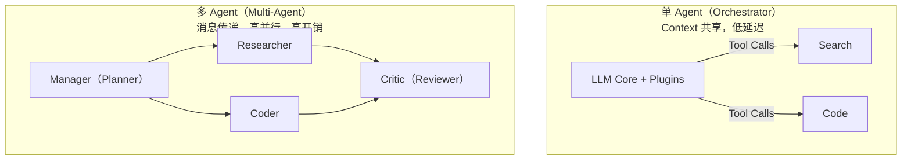

# 多 Agent 协作和单 Agent 多工具怎么选

## 答案
**选型核心逻辑**：单 Agent 多工具适合任务边界清晰、逻辑线性的场景，优势在于实现简单、链路延迟低、上下文连贯性强；多 Agent 适合复杂任务，通过角色分工（如编码、测试、Review）、并行探索及对抗审查（如「批评者 Agent」）提升质量，但会带来协调成本、上下文拼接膨胀及一致性问题。选型需权衡任务分解难度、团队组织边界、延迟敏感度与 Token 成本。

**边界情况**：
*   **死循环与资源耗尽**：多 Agent 协作中，若两个 Agent 意见相左且无终止条件（如 A 修改代码，B 指出问题，A 再修改回原样），极易陷入无限循环，必须设置最大步数或超时熔断机制。
*   **上下文溢出**：多 Agent 交互产生的中间历史日志会指数级增长，若不进行及时摘要压缩，会迅速超过模型 Context Window 导致任务失败。
*   **单点故障**：在单 Agent 模式下，若某个工具调用失败，Agent 可自主重试；而在多 Agent 模式下，若关键的“分发者”或“管理者” Agent 产生幻觉或崩溃，整个任务流将直接中断。

**实战案例**：在自动化代码审查场景中，单 Agent 往往会“放过”自己生成的 Bug，而采用“生成 Agent + 审查 Agent”的多 Agent 模式，审查 Agent 会专门寻找安全漏洞，Bug 检出率提升约 40%。

**架构对比图：**



**代码示例（伪代码对比）：**
```python
# 单 Agent：顺序执行
def single_agent(task):
    plan = llm.generate(f"Make a plan for: {task}")
    for step in plan:
        result = tools[step.tool].call(step.args)
    return result

# 多 Agent：分发与协作
def multi_agent(task):
    manager = Agent("Manager")
    sub_tasks = manager.delegate(task) # 分解任务
    # 并行执行
    results = run_parallel([Agent("Worker").do(t) for t in sub_tasks])
    # 审查
    final = Agent("Critic").review(results)
    return final
```

**对比表格：架构模式对比**

| 维度 | 单 Agent 多工具 | 多 Agent 协作 |
| :--- | :--- | :--- |
| **上下文连贯性** | 高（思维链在同一 Context） | 中低（需跨 Agent 传递状态，易信息丢失） |
| **延迟与成本** | 低（单次 LLM 调用链路） | 高（多轮对话、多次推理、通信开销） |
| **容错性** | 差（一步错步步错） | 好（可通过 Critic Agent 纠错或重试） |
| **适用场景** | 简单任务、快速响应 | 复杂任务、需多视角协作 |

## 易错点
1.  **过度设计**：对于简单的“查询+回答”任务强行使用多 Agent 框架，导致延迟增加且成本飙升，而效果并未提升。
2.  **缺乏共识机制**：多个 Agent 之间没有统一的“真理来源”或投票机制，导致在主观问题上陷入无休止的争论。

## 面试追问
1.  在多 Agent 协作中，如何保证不同 Agent 之间的上下文信息传递不失真？（答：使用标准化的消息协议，只传递关键摘要而非全量历史，或引入共享记忆层）。
2.  当多 Agent 系统陷入死循环时，有哪些机制可以打破僵局？（答：设置最大迭代次数、引入人类裁判、或者设计一个具有最高优先级的“仲裁者”Agent）。
3.  如何评估多 Agent 系统的性能瓶颈是在模型推理还是 Agent 间的通信调度？（答：通过埋点监控各步耗时，分析 Agent 闲置时间，以及观察 Token 消耗中推理占比与通信协议描述占比）。


## 记忆要点

- 单 Agent 适合线性任务，低延迟高连贯；多 Agent 适合复杂任务，分工协作容错好。
- 多 Agent 通过角色分工（如编码、审查）提升质量，但协调成本高且上下文易溢出。
- 选型权衡：任务复杂度、延迟敏感度与 Token 成本，避免简单任务过度设计。
- 风险：多 Agent 可能陷入意见对立的死循环，需设置最大步数熔断。

## 结构化回答

**30 秒电梯演讲：** 看任务复杂度。单 Agent 多工具适合边界清晰、逻辑线性的任务，链路延迟低、上下文连贯；多 Agent 适合复杂任务，靠角色分工（编码、测试、审查）和并行探索提升质量，但协调成本高、上下文容易溢出。千万别过度设计——简单查询硬上多 Agent 只会又慢又贵。

**展开框架：**
1. **单 Agent 优势** — 一个 Context 里思维链连贯，延迟低成本低，适合快速响应的线性任务。
2. **多 Agent 价值** — 角色分工加对抗审查（如 Critic Agent）能纠错，复杂任务质量更高。
3. **选型三要素** — 任务复杂度、延迟敏感度、Token 成本，多 Agent 必须设熔断防意见死循环。

**收尾：** 我做自动化代码审查时就把单 Agent 改成生成加审查双 Agent——单 Agent 总放过自己的 Bug，加 Critic 后检出率涨了 40%。您想深入聊哪块，Agent 间通信协议还是死循环仲裁？

## 视频脚本

> 预计时长：2 分钟 | 由浅入深

| 时间 | 画面/字幕 | 口播台词 | 讲解要点 |
|------|----------|----------|----------|
| 0:00 | 标题卡：单 vs 多 Agent | "任务该用单 Agent 还是多 Agent？看复杂度。" | 开场钩子 |
| 0:15 | 架构对比图 | "单 Agent 共享上下文低延迟，多 Agent 消息传递高并行高开销。" | 架构对比 |
| 0:45 | 过度设计警示案例 | "坑：简单查询硬上多 Agent，又慢又贵还没效果提升。" | 易错点 |
| 1:10 | 多 Agent 角色分工图 | "多 Agent 靠角色分工：编码、测试、审查，加 Critic 能纠错。" | 多 Agent 价值 |
| 1:35 | 代码审查案例数据 | "实战：生成加审查双 Agent，Bug 检出率提升 40%。" | 实战案例 |
| 1:50 | 选型口诀卡 | "记住：线性用单、复杂用多，必须设熔断。下期讲多 Agent 通信。" | 收尾 |

