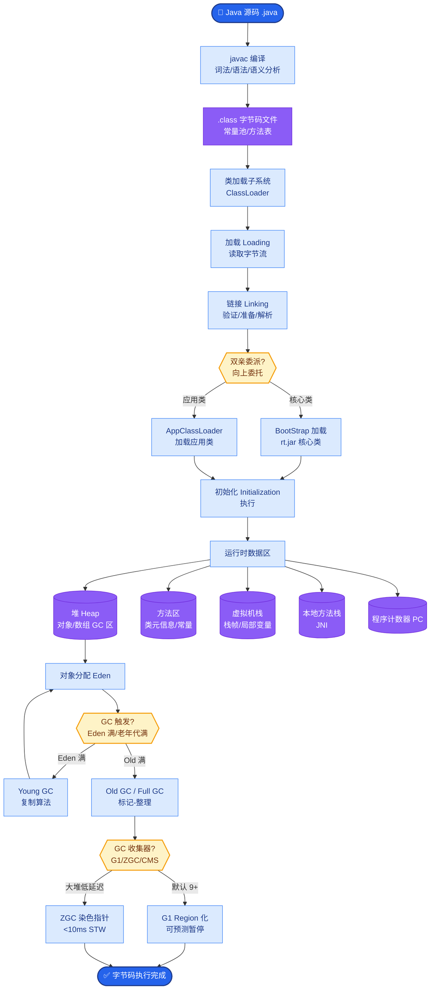
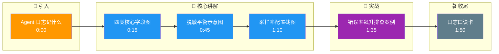

# Agent 日志应记录什么

## 答案
**核心日志字段**：
1.  **输入输出**：用户输入（需严格脱敏，去 PII）、模型原始输出（非 Stream 最终版）、解析后的结构化工具调用（JSON 确认）。
2.  **执行链路**：工具调用的返回摘要（过滤掉大量非关键文本）、每步耗时与 Token 消耗（用于成本分析）。
3.  **元数据**：追踪 ID（Trace ID，贯穿全链路）、模型版本号、Prompt 版本号、Agent 配置快照。
4.  **系统状态**：错误堆栈、重试次数、最终状态码。

**边界情况**：
*   **流式输出日志的完整性**：在记录流式返回（SSE）时，如果中途断连，可能只记录了部分 Token，需确保日志记录的是完整累积后的最终回复或分片标记清晰，否则分析时会出现截断的乱码。
*   **二进制/多媒体内容**：Agent 处理图片或文件时，直接将 Base64 存入日志会导致存储爆炸和检索困难，应仅记录文件 Hash、URL 或处理摘要。
*   **高并发下的顺序性**：在分布式环境中，若依赖本地时间戳而非 Trace ID 和 Lamport 时钟或逻辑时钟，难以精确还原跨服务调用的先后顺序。

**实战案例**：某 AI 客服系统通过日志发现，每天下午 2 点左右错误率飙升。通过关联 Trace ID 和 LLM 输入日志，发现该时段 Prompt 中注入的“实时库存”接口返回超时，导致模型胡乱编造库存状态，倒逼后端优化接口性能。

**补充细节**：
*   **脱敏策略**：日志落盘前必须经过正则或 NER 模型识别并替换敏感信息（如手机号、邮箱、API Key），且保留映射哈希以便需要时还原。
*   **采样率**：对于高并发场景，全量日志成本过高，可对成功的“简单查询”进行低采样率记录，对“失败”或“复杂任务”全量记录。

**日志数据流示意图**：

```text
User Input ──► [PII Filter] ──► Sanitized Input
                                   │
                                   ▼
                      ┌─────────────────────────┐
                      │   Agent Execution       │
                      │  (Thought/Action/Obs)   │
                      └───────────┬─────────────┘
                                  │
           ┌──────────────────────┼──────────────────────┐
           ▼                      ▼                      ▼
    LLM Request Log       Tool Call Log       System Event
(Tokens/Version)       (Params/Result)     (Error/Latency)
           │                      │                      │
           └──────────────────────┼──────────────────────┘
                                  ▼
                        [Central Log Store]
                        (Indexed by Trace ID)
```

**代码示例（带 Trace ID 的结构化日志）：**
```python
import uuid, json, re

def log_agent_step(trace_id, step_type, content):
    # 1. 脱敏处理
    sanitized_content = re.sub(r'\d{11}', '[PHONE_REDACTED]', content)
    
    log_entry = {
        "trace_id": trace_id,
        "timestamp": utc_now(),
        "step": step_type, # e.g., 'llm_generation', 'tool_call'
        "content": sanitized_content,
        "tokens": count_tokens(content)
    }
    # 2. 写入结构化存储 (如 JSONL 或 Elastic)
    write_to_log_store(json.dumps(log_entry))
```

## 易错点
1.  **遗漏非结构化数据**：只记录了 LLM 的文本输入输出，却忽略了模型的 Temperature、Top_P 等超参数配置，导致无法复现当时的生成效果。
2.  **过度脱敏导致 Debug 困难**：将关键实体（如订单号）也全部脱敏为 `[ID]`，导致日志无法关联具体业务问题进行排查。

## 面试追问
1.  如何在海量日志中快速定位 Agent 幻觉导致的错误？（答：通过 Trace ID 关联，检索 Tool Result 为空或 Error 的步骤，反向分析 LLM 的输入 Prompt）。
2.  如何评估日志系统的成本与收益？（答：计算存储成本+计算成本 vs 发现 Bug 挽回的损失，并采用冷热数据分离策略）。
3.  当 Trace ID 链路在微服务调用中断时（例如下游服务不支持透传），如何进行日志关联？（答：在网关层或 Agent 层维护一个上下文映射表，将内部子任务的 ID 关联回父 Trace ID）。

## 核心流程图



## 记忆要点

- 核心字段：脱敏输入输出、工具调用摘要、Trace ID、模型版本、系统状态码。
- 必须记录执行链路（耗时/Token）和元数据，以便复现问题和成本分析。
- 边界情况：流式输出需确保日志完整性，二进制内容仅存 Hash 或 URL。
- 易错点：过度脱敏导致无法 Debug，需保留关键实体（如订单号）的映射哈希。

## 结构化回答

**30 秒电梯演讲：** Agent 日志就像飞机黑匣子，得记录从输入到输出的完整链路。核心四类字段：脱敏后的输入输出、工具调用摘要、Trace ID 贯穿全链路、还有模型版本和系统状态码这些元数据。执行链路的耗时和 Token 消耗必须记，方便复现问题和做成本分析。脱敏要留个心眼——关键实体比如订单号要保留映射哈希，不然 Debug 都没法关联业务。

**展开框架：**
1. **四类核心字段** — 输入输出（脱敏）、执行链路（工具摘要、耗时、Token）、元数据（Trace ID、模型版本）、系统状态（错误堆栈、状态码）。
2. **脱敏要平衡** — PII 必须过滤，但订单号这种关键实体保留映射哈希，避免过度脱敏没法 Debug。
3. **采样与存储** — 成功简单查询低采样，失败复杂任务全量记；二进制只存 Hash 或 URL 防存储爆炸。

**收尾：** 我做客服系统时靠日志发现下午两点错误率飙升，关联 Trace ID 才发现是实时库存接口超时导致模型瞎编，倒逼后端优化。您想深入聊哪块，Trace ID 透传还是脱敏策略？

## 视频脚本

> 预计时长：2 分钟 | 由浅入深

| 时间 | 画面/字幕 | 口播台词 | 讲解要点 |
|------|----------|----------|----------|
| 0:00 | 标题卡：Agent 日志记什么 | "Agent 日志像飞机黑匣子，从输入到输出全链路都得记。" | 开场钩子 |
| 0:15 | 四类核心字段图 | "输入输出、执行链路、元数据、系统状态，四类一个不能少。" | 核心字段 |
| 0:45 | 脱敏平衡示意图 | "PII 要过滤，但订单号这种关键实体要留映射哈希，不然没法 Debug。" | 脱敏策略 |
| 1:10 | 采样率配置截图 | "成功简单查询低采样，失败复杂任务全量记，控成本。" | 采样策略 |
| 1:35 | 错误率飙升排查案例 | "实战：靠 Trace ID 定位到库存接口超时导致模型瞎编。" | 实战案例 |
| 1:50 | 日志口诀卡 | "记住：四类字段加 Trace ID，脱敏留哈希。下期讲可观测性。" | 收尾 |

### 视频流程图




