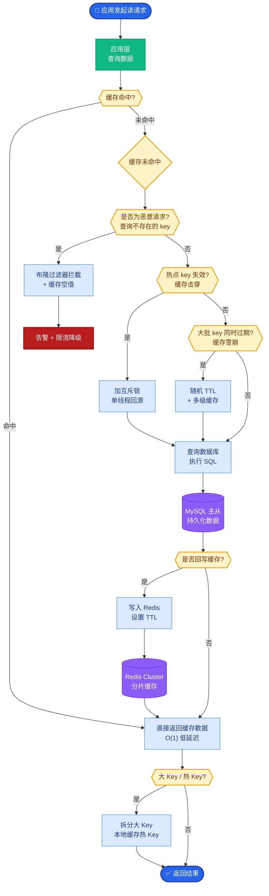
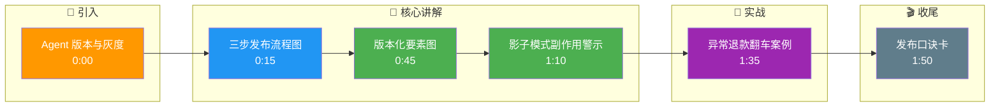

# Agent 如何做版本管理与灰度

**核心策略**：
1. **版本化**：Prompt 模板、工具定义、JSON Schema 必须纳入版本管理（如 Git），每个运行实例绑定版本号。
2. **影子模式**：新版本与旧版并行运行，新版本只记录建议和产出，不实际执行外部操作，用于对比效果。
3. **灰度发布**：基于用户 ID 或百分比金丝雀发布，逐步放量。
4. **指标监控**：对比成功率、Token 成本、延迟、违规率。
5. **回滚**：配置中心支持一键回退到上一个稳定版本。

**灰度发布流程图**：

```text
      ┌──────────────┐
      │  代码/Prompt │
      │   修改提测   │
      └──────┬───────┘
             │
             ▼
      ┌──────────────┐
      │ 影子模式运行 │◄─── 流量: 100% (实际流量复制一份)
      │ (不执行操作) │     对比 Log, 评估安全性与准确性
      └──────┬───────┘
             │
             ▼
      ┌──────────────┐
      │  小流量灰度  │◄─── 流量: 1% -> 5% -> 20%
      │ (实际执行)   │     监控核心指标 (无则回滚)
      └──────┬───────┘
             │
             ▼
      ┌──────────────┐
      │  全量上线    │
      └──────────────┘
```

**补充细节**：
- **A/B 测试陷阱**：单纯对比“输出文本好坏”很难，应对比“任务完成率”或“用户采纳率”。
- **配置热更新**：避免重启服务，通过远程配置中心（如 Redis/Consul）动态下发 Prompt 版本，便于快速纠错。

### 实战案例
在一次客服 Agent 升级中，新版本 Prompt 导致对退款政策的解释变得极其激进（承诺不该退的款）。由于缺乏影子模式的风险评估和熔断机制，导致上线 10 分钟内产生数百笔异常退款请求，最终只能通过数据库回滚交易止损。

### 代码示例 (Python - 简易路由逻辑)
```python
def get_agent_config(user_id):
    version = redis_client.get(f"ab_test:{user_id}")
    if version == "v2":
        return AgentConfig(prompt_id="p_v2", model="gpt-4")
    else:
        return AgentConfig(prompt_id="p_v1", model="gpt-3.5")

# 影子模式记录
if is_shadow_mode:
    log_decision(user_id, "v2_decision", result)
    return real_agent_result # 返回旧版结果
```

### 对比表格

| 策略 | 影子模式 | 灰度发布 | 蓝绿部署 |
| :--- | :--- | :--- | :--- |
| **流量处理** | 复制流量，新旧都跑但不发布新版结果 | 切割部分真实流量给新版 | 两套环境全量切换 |
| **用户影响** | 无（无副作用前提下） | 部分用户受新版影响 | 切换瞬间全量影响 |
| **主要风险** | 副作用污染真实数据（如发邮件） | 新版 Bug 影响部分用户 | 回滚较慢，基础设施成本高 |
| **适用阶段** | 测试初期，验证逻辑正确性 | 上线中期，验证稳定性与指标 | 最终发布或大规模回滚 |

## 常见考点
1. **影子模式如何处理副作用？**（答：影子模式不应写入真实数据库或发送真实邮件，需在 Mock 环境或通过标记隔离上下文执行）
2. **灰度过程中发现新版本 Prompt 有幻觉，如何快速止损？**（答：配置中心一键切换版本号，或者在网关层做流量拦截）
3. **如何管理不同版本之间的工具 Schema 变更？**（答：保持向后兼容，或使用 Adapter 模式适配旧调用格式）

## 核心流程图



## 记忆要点

- 流程：影子模式（无副作用）→ 小流量灰度 → 全量发布，配置中心热更新。
- 核心：Prompt、工具 Schema 纳入版本管理，支持一键回滚。
- 对比：影子模式复制流量不生效，灰度切割真实流量，蓝绿是环境切换。
- 风险：影子模式需 Mock 外部写操作，防止污染真实数据。
- 监控：对比任务完成率和 Token 成本，而非单纯对比输出文本。

## 结构化回答

**30 秒电梯演讲：** Agent 版本管理得把 Prompt、工具 Schema 都纳入 Git 版本控制，每个实例绑定版本号。发布流程是三步走：先影子模式复制流量只记录不生效，再小流量灰度切割真实流量逐步放量，最后全量上线。监控别光看输出文本，要对比任务完成率、Token 成本、延迟。配置中心必须支持一键回滚，出问题秒切。

**展开框架：**
1. **版本化管理** — Prompt、工具 Schema、JSON Schema 全进 Git，实例绑版本号，支持热更新。
2. **三步发布** — 影子模式验证逻辑、灰度切量验证稳定性、全量上线，逐步放量。
3. **监控与回滚** — 看任务完成率和 Token 成本而非文本对比，影子模式必须 Mock 写操作防污染。

**收尾：** 我踩过大坑——客服 Agent 升级 Prompt 让退款解释变激进，没灰度直接上，10 分钟数百笔异常退款，最后靠数据库回滚止损。您想深入聊哪块，影子模式副作用隔离还是 A/B 指标设计？

## 视频脚本

> 预计时长：2 分钟 | 由浅入深

| 时间 | 画面/字幕 | 口播台词 | 讲解要点 |
|------|----------|----------|----------|
| 0:00 | 标题卡：Agent 版本与灰度 | "Agent 升级 Prompt 出错怎么办？靠版本管理和灰度。" | 开场钩子 |
| 0:15 | 三步发布流程图 | "影子模式只记录不生效，灰度切真实流量，最后全量上线。" | 发布流程 |
| 0:45 | 版本化要素图 | "Prompt、工具 Schema、JSON Schema 都进 Git，实例绑版本号。" | 版本管理 |
| 1:10 | 影子模式副作用警示 | "坑：影子模式必须 Mock 写操作，不然会污染真实数据发错邮件。" | 风险点 |
| 1:35 | 异常退款翻车案例 | "实战：没灰度直接上，10 分钟数百笔异常退款，靠 DB 回滚止损。" | 实战案例 |
| 1:50 | 发布口诀卡 | "记住：影子、灰度、全量三步走，配置中心一键回滚。" | 收尾 |

### 视频流程图




