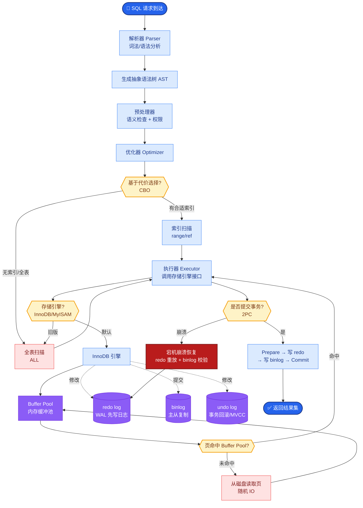

# 举一个「不是 Agent 但常被误认为 Agent」的例子.

**核心区分**：Agent 的核心特征是“基于观察的自主循环决策”。
- **非 Agent 例子**：固定三步的 RAG 流水线（Query 改写 → 检索 → 生成）。这是线性流水线，每步都是预定好的，没有根据检索结果动态决定“是否需要换个词重搜”的循环。
- **接近 Agent 的例子**：在 RAG 中加入“如果检索结果相关性低，则自动重新检索或调用搜索引擎”的逻辑，这就引入了循环决策，开始接近 Agent。

**架构对比图**：

```text
┌─────────────────────┐       ┌─────────────────────┐
│   Pipeline (链式)    │       │     Agent (循环)     │
├─────────────────────┤       ├─────────────────────┤
│ 1. Query Rewrite    │       │ 1. Thought          │
│ 2. Retrieval        │       │ 2. Action (Search)  │
│ 3. Generation       │       │ 3. Observation      │
│                     │       │ 4. Thought (判断)   │◄──┐
│ [无反馈，线性到底]   │       │ 5. Action (New/End) │───┘
└─────────────────────┘       └─────────────────────┘
```

**补充细节**：
- **LangChain Chain**：本质是 Prompt Template 的串联，输入输出预定义。
- **Agent**：输出是 Action（通常为 JSON 结构体），由 Loop 环境解析 Action 并执行，再将结果作为下一轮输入。

### 实战案例
早期 LangChain 的 `SequentialChain` 常被误认为 Agent。在构建“文档摘要”系统时，开发人员发现只要把“分割文档 -> 摘要每段 -> 合并摘要”这三个步骤写死在 Chain 里，无论中间某段摘要质量多差，系统都会强行合并，无法像 Agent 那样自主识别“这段摘要没看懂，我要重读原文”。

### 代码示例 (Python - 伪代码对比)
```python
# Pipeline (非 Agent): 固定步骤
def process_pipeline(text):
    chunks = split_text(text)
    summaries = [summarize(c) for c in chunks]
    return combine(summaries)

# Agent: 循环决策
def agent_loop(task):
    while not task.done:
        thought = llm.think(task.state)
        action = parse_action(thought) # 可能是 read, summarize, finish
        result = tools.execute(action)
        task.update(result) # 决定下一步做什么
```

### 对比表格

| 特性 | Pipeline (工作流/链式) | Agent (智能体) |
| :--- | :--- | :--- |
| **控制流** | 预定义的静态 DAG 或线性序列 | 动态生成的运行时路径 |
| **决策主体** | 开发者（编码时决定） | LLM（运行时决定） |
| **适应性** | 差（遇到预期外错误即崩溃） | 强（可根据错误自我修正） |
| **确定性** | 高（相同输入必然相同输出） | 低（存在随机性和探索性） |
| **典型应用** | ETL 脚本、固定格式问答 | 复杂任务规划、自动客服 |

## 常见考点
1. **简单的“多轮对话”算是 Agent 吗？**（答：不算，如果对话只是维持上下文，没有根据外部工具反馈改变行为路径，只是 Passive Responder）
2. **ReAct 模式是 Chain 还是 Agent？**（答：是 Agent 的典型实现模式，包含 Reasoning（思考）和 Acting（行动）的循环）
3. **为什么有时候把 Pipeline 叫做“硬编码 Agent”？**（答：因为 Pipeline 把决策路径写死了，而 Agent 的路径是动态生成的）


## 核心流程图



## 记忆要点

- 定义：Agent 核心是基于观察的自主循环决策，Pipeline 是预定义的线性序列。
- 例子：固定三步的 RAG（改写→检索→生成）是 Pipeline，无动态反馈循环。
- 对比：Pipeline 决策权在开发者（编码时定），Agent 决策权在 LLM（运行时定）。
- 误区：多轮对话若无工具调用和路径改变，只是 Passive Responder，非 Agent。
- 本质：Pipeline 是静态 DAG，Agent 是动态运行时路径。

## 结构化回答

**30 秒电梯演讲：** 最典型的例子是固定三步的 RAG 流水线——Query 改写、检索、生成。每一步都是预先写死的，中间没有"检索结果不好就换个词重搜"的反馈循环，所以它只是 Pipeline 不是 Agent。判断标准很简单：决策权在开发者手里就是 Pipeline，决策权在 LLM 手里、能基于观察动态调整路径的才是 Agent。

**展开框架：**
1. **非 Agent 的典型例子** — 固定三步 RAG，线性到底无反馈，本质是静态 DAG。
2. **接近 Agent 的边界** — RAG 加上"相关性低就重搜"的循环逻辑，就开始接近 Agent。
3. **判断三要素** — 有没有基于观察的循环、决策权在 LLM 还是代码、能不能动态改路径。

**收尾：** 我做文档摘要时踩过——把分割、摘要、合并写死成 Chain，某段摘要再烂也强行合并，改成 Agent 后能自主识别"这段没看懂要重读"。您想深入聊哪块，Chain 到 Agent 的改造还是多轮对话辨析？

## 视频脚本

> 预计时长：2 分钟 | 由浅入深

| 时间 | 画面/字幕 | 口播台词 | 讲解要点 |
|------|----------|----------|----------|
| 0:00 | 标题卡：不是 Agent 的例子 | "RAG 流水线常被误认为 Agent，到底差在哪？" | 开场钩子 |
| 0:15 | Pipeline vs Agent 对比图 | "Pipeline 是预定义线性序列，Agent 是基于观察的动态循环决策。" | 核心区别 |
| 0:45 | 固定三步 RAG 流程图 | "改写、检索、生成三步写死，没有'结果不好就重搜'的循环。" | 典型例子 |
| 1:10 | 决策权归属示意 | "判断标准：决策权在开发者是 Pipeline，在 LLM 是 Agent。" | 判断标准 |
| 1:35 | 文档摘要 Chain 案例 | "实战：写死的 Chain 不管摘要多烂都强行合并，改 Agent 才能重读。" | 实战案例 |
| 1:50 | 判断口诀卡 | "记住：有循环、LLM 决策、能改路径才是真 Agent。下期讲 ReAct。" | 收尾 |

