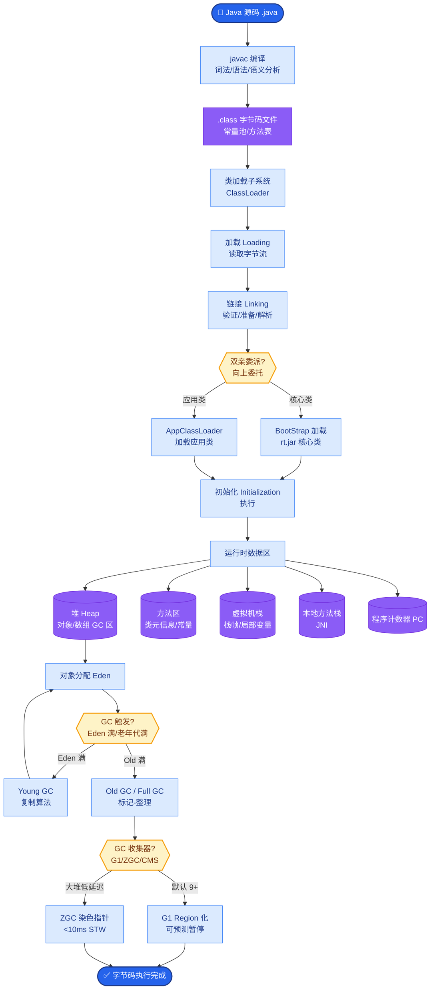

# 如何测试 Agent

**单元测试工具、模拟环境、回归集（固定任务与期望轨迹范围）、对抗用例（注入、越权）、线上金丝雀；避免只测最终答案而忽略过程正确性。**

### 补充细节
1.  **分层测试策略**：
    *   **原子工具测试**：Mock LLM 输出，确保特定 Action 能调用正确的 API 并处理异常（如超时、权限拒绝）。
    *   **链路/轨迹测试**：不校验最终答案，而是校验 `Thought -> Action -> Observation` 的轨迹是否符合逻辑（如：查询航班是否先调用了搜索工具）。
    *   **端到端评估**：使用“更强的模型”（如 GPT-4）作为 Judge，基于自定义打分标准对结果评分。
2.  **对抗性测试**：Prompt 注入（诱导忽略指令）、恶意工具输出（模拟 API 返回 JSON 解析错误）、越权操作测试。
3.  **数据集构建**：使用 Golden Dataset（金标准数据集），包含输入、期望的中间步骤和期望输出；使用合成数据生成工具覆盖边缘情况。

### 实战案例
在电商客服 Agent 上线前，曾遇到第三方商品库偶发 502 错误导致 Agent 直接崩溃挂起。后来引入了**混沌工程测试**，在 Mock Server 中随机注入 500/502 错误和畸形 JSON，强制 Agent 必须包含降级逻辑（如重试或转人工），最终将线上容错率提升至 99.9%。

### 代码示例 (Python - Pytest Mock)
```python
def test_tool_failure_handling():
    # 模拟 LLM 决定调用 search_flight，但工具返回异常
    with patch('agent.search_flight_api') as mock_api:
        mock_api.side_effect = TimeoutError("API timeout")
        
        response = agent.run("帮我查明天北京的航班")
        
        # 验证 Agent 没有崩溃，而是输出了友好的降级回复
        assert "抱歉" in response or "稍后重试" in response
        # 验证确实尝试调用了工具
        mock_api.assert_called_once()
```

### 流程图
```text
   ┌───────────────────────────────────────────────────────┐
   │                    Agent Test Cycle                    │
   └─────────────────────┬─────────────────────────────────┘
                         │
         ┌───────────────┼───────────────┐
         ▼               ▼               ▼
   ┌───────────┐   ┌───────────┐   ┌───────────┐
   │ Unit Test │   │Integration│   │   Adversa │
   │ (Tools)   │   │ (Chains)  │   │   rial    │
   └─────┬─────┘   └─────┬─────┘   └─────┬─────┘
         │               │               │
         └───────────────┼───────────────┘
                         ▼
              ┌──────────────────────┐
              │  E2E / Golden Set    │
              │  (Semantic Judge)    │
              └──────────┬───────────┘
                         │
                    ┌────▼─────┐
                    │ Report & │
                    │ Metrics  │
```

### 边界情况
1.  **上下文窗口溢出**：测试长对话场景下，Agent 是否正确处理了上下文截断或进行了历史摘要，避免“遗忘”之前的指令。
2.  **死循环检测**：在环境模拟中检测 Agent 是否陷入了推理-行动的无限循环（如重复调用同一个参数错误的工具），需设置最大步数限制。
3.  **空输入/脏输入**：测试用户输入为空字符串、纯乱码或极长无意义文本时，Agent 的鲁棒性。
4.  **工具输出过大**：当工具返回的内容（如长文档内容）超过了 LLM 的处理能力时，Agent 是否有切片或摘要机制。

## 面试追问
1.  如果 Agent 的每次运行成本很高（例如调用了昂贵的付费 API），如何在保证覆盖率的前提下降低回归测试的成本？
2.  如何评估 Agent 生成内容的“安全性”或“合规性”？仅靠关键词过滤够吗？
3.  在自动化测试中，如何解决 LLM 输出的“非确定性”导致测试用例时好时坏的问题？

## 易错点
1.  **过度依赖端到端测试**：试图仅通过“给输入看输出”来测试复杂 Agent，忽略了中间过程的逻辑校验，导致难以定位具体的失败原因（是工具挂了、Prompt 写错了还是逻辑错了）。
2.  **混淆 Mock 对象**：在测试时只 Mock 了 LLM 的返回，却忘记了 Mock 工具的返回，导致测试意外调用了真实的外部 API，产生费用或副作用。


## 核心流程图



## 记忆要点

- 分层：原子工具测（Mock LLM）→ 链路轨迹测（校验逻辑）→ 端到端评估（强模型打分）。
- 重点：不只测最终答案，更要校验 Thought→Action→Observation 轨迹逻辑。
- 对抗：注入 Prompt 越狱、模拟 API 502 错误，测试容错与降级能力。
- 边界：测试长对话下的上下文截断、死循环检测及脏输入鲁棒性。
- 数据：构建 Golden Dataset，覆盖输入、期望步骤和输出。

## 结构化回答

**30 秒电梯演讲：** 测 Agent 不能只看最终答案对不对，得测过程稳不稳。我的策略是三层：原子工具测试 Mock 掉 LLM 单测每个 Action 的异常处理，链路轨迹测试校验 Thought-Action-Observation 逻辑对不对，端到端用强模型当 Judge 打分。还要做对抗测试——注入 Prompt 越狱、模拟 API 502，逼 Agent 必须有降级逻辑。Golden Dataset 是基础。

**展开框架：**
1. **三层测试** — 原子工具测（Mock LLM）、链路轨迹测（校验逻辑）、端到端评估（强模型 Judge）。
2. **过程重于结果** — 校验 Thought 到 Action 到 Observation 轨迹，而非只看最终输出。
3. **对抗与边界** — 注入越狱、模拟 502、测长对话截断、死循环检测、脏输入鲁棒性。

**收尾：** 我做电商客服 Agent 上线前靠混沌测试——Mock Server 随机注入 500/502 和畸形 JSON，逼出降级逻辑后线上容错率到 99.9%。您想深入聊哪块，Golden Dataset 构建还是 LLM 非确定性测试？

## 视频脚本

> 预计时长：3 分钟 | 由浅入深

| 时间 | 画面/字幕 | 口播台词 | 讲解要点 |
|------|----------|----------|----------|
| 0:00 | 标题卡：怎么测试 Agent | "测 Agent 不能只看答案对不对，过程稳不稳更重要。" | 开场钩子 |
| 0:20 | 三层测试金字塔 | "原子工具 Mock LLM、链路轨迹校验逻辑、端到端强模型打分。" | 分层策略 |
| 0:55 | 轨迹校验示意图 | "重点校验 Thought-Action-Observation 逻辑，不只看最终输出。" | 过程测试 |
| 1:30 | 对抗测试用例表 | "注入 Prompt 越狱、模拟 API 502，逼 Agent 必须有降级逻辑。" | 对抗测试 |
| 2:05 | 混沌工程案例截图 | "实战：Mock 随机注入错误，线上容错率提升到 99.9%。" | 实战案例 |
| 2:35 | 测试口诀卡 | "记住：三层测试加对抗，Golden Dataset 是基础。下期讲评估指标。" | 收尾 |

