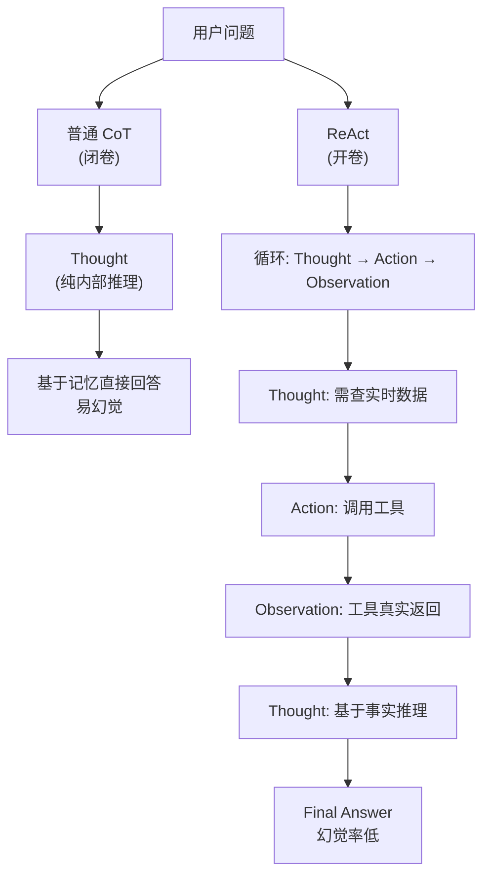

# ReAct 和「普通 CoT 提示」有什么本质区别

普通 CoT 只在模型内部展开推理链，不强制与外部环境交互；ReAct 把推理与可执行行动绑定，每一步行动后都有真实 Observation 反馈，从而用工具结果约束生成，降低闭卷幻觉。

### 实战案例
在开发金融研报生成 Agent 时，使用普通 CoT 经常因为模型记忆偏差导致股票代码写错（如把腾讯 0700.HK 写成 0701.HK）。改用 ReAct 机制后，强制模型在推理前必须调用“实时行情查询”工具，用 Observation 更新上下文，彻底根除了代码幻觉问题。

### 代码示例 (Prompt 结构对比)
```text
# 普通 CoT (纯推理)
Q: 腾讯当前股价是多少？
A: 思考：根据我的知识库，腾讯当前股价大约是 320港元。

# ReAct (推理+行动)
Q: 腾讯当前股价是多少？
A: 思考：用户询问实时股价，我需要查询财经工具。
Action: StockPrice[symbol=0700.HK]
Observation: 320.5 HKD
思考：根据工具返回，当前股价是 320.5。
```

### 对比表格
| 特性 | 普通 CoT (Chain of Thought) | ReAct (Reasoning + Acting) |
| :--- | :--- | :--- |
| **交互方式** | 闭卷，仅依赖 Prompt 内部信息 | 开卷，与外部环境/API 双向交互 |
| **纠错能力** | 仅靠 Prompt 指令修正，弱 | 依赖 Observation 实时修正，强 |
| **适用场景** | 数学推理、逻辑归纳、文本总结 | 调度工具、实时查询、任务执行 |
| **幻觉风险** | 较高（知识截断或记忆偏差） | 较低（由外部真实数据约束） |

### 边界情况
1.  **工具无效反馈**：当 Observation 返回“无结果”或空数据时，ReAct Agent 可能会陷入反复尝试错误参数的死循环，需特殊处理。
2.  **多步推理中断**：如果 Action 执行超时或返回 500 错误，普通的 ReAct 流程可能会中断，需要设计异常处理机制来让模型重新思考而不是直接报错。

## 面试追问
1.  如果 ReAct 循环次数超过了模型的上下文窗口上限，该如何优化或截断历史轨迹？
2.  ReAct 的“Action”如果并行执行（例如同时查天气和股票），如何设计 Prompt 结构让模型能够处理并发的 Observations？
3.  ReAct 模式下，如果外部工具返回的信息是错误的（幻觉来源转移），模型该如何验证？

## 易错点
1.  **思维链冗余**：在 ReAct 中，Thought 部分如果过于啰嗦，会消耗大量 Token 并且可能导致模型“自言自语”而不执行 Action，需要控制 Thought 的简洁性。
2.  **格式失效**：模型没有严格按照 `Thought: ... Action: ...` 的格式输出，导致解析器崩溃。这在基座模型能力较弱或指令不明确时经常发生。

## 技术原理

ReAct 的核心是把 LLM 的生成空间从"自由文本"约束成结构化轨迹，让每一步推理都能被解析器识别并触发真实工具调用。其底层依赖三个关键机制：

- **格式约束**：通过 Prompt 强制模型按 `Thought: ... Action: tool[args] ... Observation: ...` 的固定模式输出，解析器用正则或 AST 抽取 Action 字段，映射到后端工具注册表。这正是 Function Calling 出现前最主流的"Prompt 即协议"做法。
- **Observation 回写**：工具执行结果作为新的 `Observation` 拼回上下文，下一轮 LLM 推理基于真实数据而非记忆，从而把"闭卷"变"开卷"。这一步是降低幻觉的根本，相当于用外部事实对生成分布做了硬约束。
- **循环终止**：解析器识别到 `Final Answer:` 或达到最大迭代次数才退出，否则继续 Thought → Action → Observation 的循环。最大迭代次数是防止死循环的熔断器。

相比之下，普通 CoT 只是把推理过程显式化，整个生成仍是单次前向传播，没有任何外部信号介入，所以模型一旦记忆有偏差就会一路错到底。

## 代码示例

最小可运行的 ReAct 循环骨架，体现 Thought → Action → Observation 的迭代与熔断：

```python
import re
MAX_STEPS = 6  # 熔断：防止工具返回空时死循环

def react_loop(query, tools, llm):
    history = f"Question: {query}\n"
    for step in range(MAX_STEPS):
        out = llm(history + "\nThought:")  # 强制格式约束
        history += out
        m = re.search(r"Action:\s*(\w+)\[(.*?)\]", out)
        if not m:
            if "Final Answer:" in out:
                return out.split("Final Answer:")[1].strip()
            continue  # 格式异常，重新生成
        name, args = m.group(1), m.group(2)
        if name not in tools:
            obs = "[工具不存在，仅可用: %s]" % ",".join(tools)  # 空结果兜底
        else:
            obs = tools[name](args) or "[无结果，请更换参数]"
        history += f"\nObservation: {obs}\n"
    return "Error: 达到最大迭代次数，请人工介入"
```

## 注意事项

1. **Thought 简洁化**：Thought 部分过长会消耗大量 Token 并引发模型"自言自语"而不执行 Action，建议在 Prompt 中限制 Thought 字数或要求"一句话概括"。
2. **空 Observation 兜底**：工具返回空结果或异常时，不要原样回灌，应包装成明确的 `Observation: [无结果，请更换参数或换工具]`，否则模型容易反复用相同参数重试陷入死循环。
3. **格式稳定性**：基座模型能力弱或指令不明确时，常出现 `Thought:` 与 `Action:` 混在一行的情况。生产环境务必加格式校验，解析失败时回退到 Function Calling 或重新生成。
4. **上下文膨胀**：长循环会快速堆积历史轨迹，需配合历史轨迹摘要或滑窗截断，否则会撑爆上下文窗口并推高成本。


## 核心流程图




## 记忆要点

- 本质：CoT 是闭卷纯推理，ReAct 是推理与外部行动交互的循环。
- 区别：ReAct 每步行动后有真实 Observation 反馈，用工具结果约束生成。
- 优势：ReAct 降低幻觉，适合实时查询和工具调度；CoT 适合数学逻辑。
- 结构：ReAct = Thought → Action → Observation → 循环。
- 风险：工具返回空结果时，ReAct 可能陷入死循环，需特殊处理。

## 结构化回答

**30 秒电梯演讲：** 本质区别是 CoT 闭卷纯推理，ReAct 是开卷边推理边行动。CoT 只在模型脑子里想，靠记忆容易幻觉；ReAct 每一步 Thought 之后调工具拿真实 Observation 反馈，用外部结果约束生成，幻觉大幅降低。结构就是 Thought 到 Action 到 Observation 的循环。CoT 适合数学逻辑，ReAct 适合实时查询和工具调度。

**展开框架：**
1. **闭卷 vs 开卷** — CoT 只用 Prompt 内部信息，ReAct 与外部 API 双向交互。
2. **Observation 约束** — 每步行动后有真实反馈，纠错能力强，知识截断问题被根治。
3. **风险与适用** — ReAct 怕工具返回空结果陷入死循环；CoT 适合纯逻辑，ReAct 适合实时任务。

**收尾：** 我做金融研报 Agent 时深有体会——CoT 老把腾讯代码 0700 写成 0701，改 ReAct 强制先查实时行情再写，彻底根治代码幻觉。您想深入聊哪块，并发 Observation 处理还是历史轨迹截断？

## 视频脚本

> 预计时长：2 分钟 | 由浅入深

| 时间 | 画面/字幕 | 口播台词 | 讲解要点 |
|------|----------|----------|----------|
| 0:00 | 标题卡：ReAct vs CoT | "CoT 是闭卷考试，ReAct 是开卷加实操，差别在哪？" | 开场钩子 |
| 0:15 | 两种模式对比图 | "CoT 纯脑子想，ReAct 每步调工具拿真实反馈约束生成。" | 核心区别 |
| 0:45 | Thought-Action-Observation 循环图 | "ReAct 结构：思考、行动、观察三步循环，直到出答案。" | 结构拆解 |
| 1:10 | 股票代码幻觉案例 | "坑：CoT 把腾讯 0700 记成 0701，ReAct 强制查行情后根治。" | 实战案例 |
| 1:35 | 适用场景对比表 | "CoT 适合数学逻辑，ReAct 适合实时查询和工具调度。" | 选型指南 |
| 1:50 | 本质口诀卡 | "记住：闭卷纯推理 vs 开卷加行动。下期讲 Plan-and-Execute。" | 收尾 |

