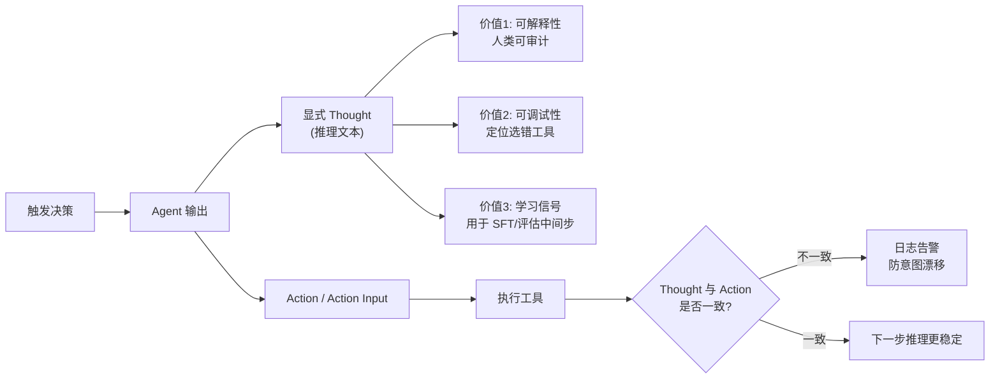

# ReAct 为什么要显式写出 Thought

显式 Thought 有三类价值：可解释性（便于人类审计）、可调试性（定位哪一步选错工具）、学习信号（可做监督微调或评估中间步骤质量）。在工程上，Thought 也帮助模型在下一步更稳定地选择 Action。

### 实战案例
在调试一个数据分析 Agent 时，发现它在处理 CSV 时一直报错。通过检查显式 Thought 字段，发现模型虽然输出了 `Action: Python`，但 Thought 中却还在纠结如何处理缺失值，导致传入 Python 代码解释器的参数格式错误。如果没有显式 Thought，很难定位是模型意图错误还是工具执行错误。

### 代码示例 (LangChain 风格伪代码)
```python
# Agent 输出解析逻辑
class AgentOutput:
    thought: str  # 显式推理过程
    action: str   # 工具名称
    action_input: str # 工具参数

if agent_output.action == "Calculator":
    # 利用 Thought 校验意图，防止误操作
    if "arithmetic" not in agent_output.thought.lower():
        logger.warning(f"意图不匹配: Thought 描述非算术运算却调用了计算器")
```

### 对比表格 (显式 vs 隐式 Thought)
| 维度 | 显式 Thought (ReAct) | 隐式 Thought (Internal Monologue) |
| :--- | :--- | :--- |
| **用户可见性** | 用户可以看到推理过程，建立信任 | 用户只看到结果，体验更像“魔法” |
| **Token 消耗** | 高（计入上下文和输出） | 低（仅消耗内部计算，不输出） |
| **调试验错** | 极易（直接看日志） | 困难（需查看内部状态或 Trace） |
| **适用场景** | 企业级应用、需要审计、复杂链路 | C端聊天机器人、极度成本敏感场景 |

### 边界情况
1.  **思维泄露**：在 C 端应用中，显式 Thought 可能包含敏感的内部逻辑或提示词信息，如果直接展示给用户，会造成安全风险或困扰，需要做脱敏处理。
2.  **一致性偏离**：模型有时会出现 Thought 说一套（思考 A），Action 做一套（执行 B）的情况，显式 Thought 并不总是能完美预测 Action。

## 面试追问
1.  既然显式 Thought 消耗 Token 且增加延迟，在哪些具体的实时性要求高的场景下，你会选择隐藏 Thought（仅后台记录）或者完全去掉显式 Thought？
2.  如何利用显式 Thought 数据来优化 Agent 的后续行为？是否可以用于做基于过程的奖励模型（PRM）训练？
3.  当模型生成的 Thought 语言与用户不一致（如用户用中文，Thought 用英文）时，会对最终 Action 的准确性产生影响吗？如何规范？

## 易错点
1.  **过度解读 Thought**：认为显式 Thought 一定是模型的真实内心独白。实际上，Thought 往往也是模型为了迎合 Prompt 要求生成的“表演性”文本，未必完全反映内部逻辑。
2.  **忽略上下文污染**：显式 Thought 会随着对话轮次增加挤占上下文窗口，如果不去重或不清理，早期的无效 Thought 会干扰后续的推理。

## 技术原理

显式 Thought 的价值不只是"看起来更透明"，它改变了 Agent 系统的可控性与可优化性。从原理上看有三层作用：

- **解析层约束**：把模型输出从无结构文本切分为 `(Thought, Action, ActionInput)` 三元组，解析器只关心 Action 字段，Thought 作为附带日志。这种解耦让工具调用的稳定性不再依赖整段生成的语义，而是依赖结构化字段的对齐程度。
- **过程监督信号**：显式 Thought 提供了"中间步骤"的标注，可用于训练过程奖励模型（PRM）。OpenAI 的"Let's verify step by step"正是利用这类中间信号，对每一步推理打分，比只看最终结果的结果奖励模型（ORM）更能定位错误发生在哪一步。
- **上下文自洽**：Thought 写入上下文后，模型下一步生成会条件化在它之上，相当于"自我承诺"，能显著提升 Action 选择的稳定性。这也是为什么 ReAct 比"只输出 Action"的纯 Function Calling 在复杂任务上更稳。

代价是 Token 消耗和延迟：显式 Thought 计入输出 Token 且会挤占上下文窗口，长对话中早期的 Thought 若不清理会污染后续推理。因此 C 端聊天常把 Thought 后台记录但不展示，企业级则强制显式留痕便于审计。

## 代码示例

利用 Thought 做 Action 一致性校验，防"说一套做一套"：

```python
def parse_agent_output(text):
    # 用正则把模型输出切成 (Thought, Action, ActionInput)
    thought = re.search(r"Thought:\s*(.+)", text)
    action = re.search(r"Action:\s*(\w+)", text)
    return {
        "thought": thought.group(1).strip() if thought else "",
        "action": action.group(1).strip() if action else None,
    }

def check_consistency(parsed, tool_keywords):
    """Thought-Action 一致性校验：差异过大触发重新生成"""
    if not parsed["action"]:
        return False, "缺少 Action"
    t, a = parsed["thought"].lower(), parsed["action"].lower()
    # 如 Thought 谈"翻译"却调"calculator"，判定不一致
    related = tool_keywords.get(a, [])
    if related and not any(k in t for k in related):
        return False, f"Thought 与 Action 不匹配: {a}"
    return True, "ok"
```

## 注意事项

1. **脱敏处理**：C 端展示 Thought 前必须过滤内部 Prompt、密钥、用户隐私等敏感片段，否则会造成思维泄露（Thought Leakage）。
2. **防一致性偏离**：模型可能出现 Thought 说 A、Action 做 B 的情况，工程上可用 Thought-Action 一致性校验器做兜底，差异过大时触发重新生成。
3. **定期清理**：长对话中历史 Thought 要按重要性或时间做摘要/截断，避免上下文窗口被无效 Thought 占满。
4. **别全信"表演性 Thought"**：Thought 本质也是模型生成物，可能为迎合 Prompt 而编造合理化解释，调试时不能把它等同于模型真实内部逻辑。


## 核心流程图




## 记忆要点

- 价值：显式 Thought 提供可解释性、可调试性及学习信号。
- 作用：帮助模型稳定选择 Action，便于人类审计哪一步选错工具。
- 对比：显式消耗 Token 且可见，隐式（Internal Monologue）成本低但难调试。
- 应用：企业级应用需显式记录，C 端聊天可隐藏或后台记录。
- 注意：Thought 有时是"表演性"文本，需防范思维泄露和上下文污染。

## 结构化回答

**30 秒电梯演讲：** 显式写 Thought 有三大价值——可解释性（人类能审计）、可调试性（定位哪步选错工具）、学习信号（能做过程奖励模型训练）。工程上它还能帮模型在下一步更稳定地选 Action。代价是消耗 Token，所以 C 端聊天可以隐藏或后台记录，企业级必须显式留痕。要注意 Thought 有时是"表演性"文本，别全信，还得防思维泄露。

**展开框架：**
1. **三大价值** — 可解释、可调试、可学习，打开黑盒让决策过程可审计。
2. **显式 vs 隐式权衡** — 显式消耗 Token 但好调试，隐式省钱但难排查，按场景选。
3. **两大风险** — Thought 可能是表演性文本不反映真实逻辑，还可能挤占上下文窗口污染后续推理。

**收尾：** 我调试数据分析 Agent 时就靠 Thought 定位过 Bug——Action 写了 Python，Thought 却还在纠结缺失值处理，参数格式直接错。您想深入聊哪块，过程奖励模型训练还是 Thought 脱敏？

## 视频脚本

> 预计时长：3 分钟 | 由浅入深

| 时间 | 画面/字幕 | 口播台词 | 讲解要点 |
|------|----------|----------|----------|
| 0:00 | 标题卡：ReAct 为啥写 Thought | "显式写 Thought 不是浪费 Token，是打开黑盒的钥匙。" | 开场钩子 |
| 0:20 | 三大价值图 | "可解释、可调试、可学习，还能帮模型稳定选 Action。" | 核心价值 |
| 0:55 | 显式 vs 隐式对比表 | "显式贵但好调试，隐式省但难排查，企业级必须显式留痕。" | 权衡对比 |
| 1:30 | 表演性 Thought 警示 | "坑：Thought 可能是表演性文本，未必反映真实内部逻辑。" | 风险提示 |
| 2:05 | CSV Agent 调试案例 | "实战：靠 Thought 发现 Action 选 Python 但还在纠结缺失值，参数格式错。" | 实战案例 |
| 2:35 | 价值口诀卡 | "记住：可解释、可调试、可学习，注意表演性和上下文污染。" | 收尾 |

