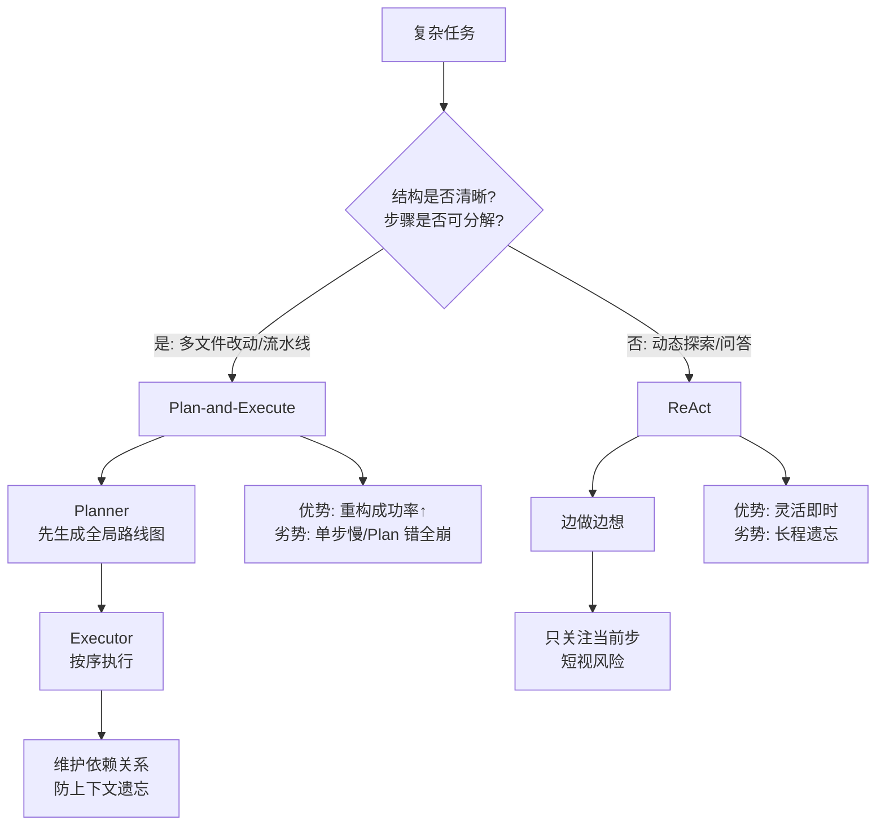

# Plan-and-Execute 相比 ReAct 什么时候更占优

当任务步骤多、结构清晰、需要全局分解（如多文件代码改动、数据分析流水线、复杂调研提纲）时，Planner 先给出路线图能减少「短视」；ReAct 更擅长动态工具交互、逐步探索。

### 实战案例
在开发“遗留系统重构 Agent”时，ReAct 模式经常导致模型修改了文件 A 后，忘记了文件 B 里的关联引用（因为上下文被 A 的修改历史占满）。切换到 Plan-and-Execute 后，模型先生成了包含所有文件的修改依赖图，虽然单步慢，但最终重构的成功率从 40% 提升到了 85%。

### 代码示例 (Plan 状态流转)
```python
# Plan 步骤：生成全局列表
plan_steps = [
    "1. 读取 /src/auth.py",
    "2. 修改 login 函数逻辑",
    "3. 读取 /src/db.py",
    "4. 更新 schema 定义"
]

# Execute 步骤：按顺序执行并核销
for step in plan_steps:
    result = agent.run(step)
    plan_steps.remove(step) # 状态更新：移除已完成项
    if result.failed:
        # 仅当执行失败时才触发局部重规划
        agent.replan(current_state=plan_steps) 
```

### 对比表格
| 维度 | ReAct (React & Act) | Plan-and-Execute (Planner + Executor) |
| :--- | :--- | :--- |
| **规划模式** | 边做边想 | 先想后做 |
| **纠错成本** | 低（走错一步直接回头） | 高（全盘规划可能因前期错误导致后续崩塌） |
| **上下文负载** | 低（只关注当前步） | 高（需维护全局 Plan 列表在 Context 中） |
| **最佳场景** | 简单任务、探索未知、问答 | 长程任务、多模态协作、代码生成 |

### 边界情况
1.  **计划过早过时**：在执行 Plan 的早期步骤时，外部环境发生了变化（如 API 接口变动），导致后续预先规划好的步骤完全失效，需要频繁重规划。
2.  **任务无法拆解**：对于高度依赖上一步执行结果才能决定下一步走向的“探索性”任务（如排查未知 Bug），预先制定 Plan 往往是无效的。

## 面试追问
1.  如果 Plan 生成的步骤本身有逻辑错误（例如依赖顺序错了），Executor 模型是该盲目执行还是具备质疑 Plan 的能力？如何设计这种交互？
2.  在 Plan-and-Solve 或 Plan-and-Execute 框架中，Planner 和 Executor 是否必须使用同一个模型？如果使用不同能力的模型（如用 GPT-4 规划，GPT-3.5 执行），会有什么问题？
3.  如何量化评估一个 Plan 的质量？是看最终任务的成功率，还是有中间指标（如步骤的可执行性）？

## 易错点
1.  **计划粒度失衡**：Plan 粒度太细会导致执行极其僵化且 Token 消耗大；粒度太粗则起不到指导作用，容易退化为 ReAct 模式。
2.  **忽视状态同步**：Executor 在执行过程中改变了环境状态，但 Planner 并不知情，导致后续步骤基于旧状态执行。必须设计好 State 的传递机制。


## 核心流程图



## 核心知识点图


## 记忆要点

- 场景：Plan-and-Execute 适合多步骤、结构清晰、需全局分解的长程任务。
- 优势：先规划后执行，减少 ReAct 的"短视"问题，支持并行。
- 劣势：纠错成本高，环境变化易导致全盘计划失效。
- 对比：ReAct 边做边想，适合探索未知；Plan-and-Execute 先想后做。
- 关键：需设计 State 传递机制，确保 Executor 状态同步给 Planner。

## 结构化回答

**30 秒电梯演讲：** 当任务步骤多、结构清晰、需要全局分解时，Plan-and-Execute 比 ReAct 占优。比如多文件代码改动、数据分析流水线，Planner 先出路线图能避免 ReAct 的"短视"——改了文件 A 忘了文件 B 的引用。ReAct 边做边想适合探索未知环境。代价是 Plan-and-Execute 纠错成本高，环境一变全盘计划容易失效，必须设计好 State 同步机制。

**展开框架：**
1. **占优场景** — 长程、多步骤、结构清晰的任务，先规划能抓全局依赖，避免局部最优。
2. **对比 ReAct** — ReAct 边做边想适合探索，Plan-and-Execute 先想后做适合编排，支持并行。
3. **两大坑** — 计划粒度失衡（太细僵化、太粗退化成 ReAct），状态不同步导致后续步骤基于旧状态。

**收尾：** 我做遗留系统重构时就靠这套——ReAct 改了 A 忘了 B 的引用，改 Plan-and-Execute 先生成修改依赖图，成功率从 40% 涨到 85%。您想深入聊哪块，Plan 粒度设计还是 State 同步机制？

## 视频脚本

> 预计时长：2 分钟 | 由浅入深

| 时间 | 画面/字幕 | 口播台词 | 讲解要点 |
|------|----------|----------|----------|
| 0:00 | 标题卡：Plan-Execute 啥时占优 | "长程结构化任务，Plan-and-Execute 比 ReAct 强在哪？" | 开场钩子 |
| 0:15 | 两种模式对比图 | "ReAct 边做边想适合探索，Plan-and-Execute 先想后做适合编排。" | 模式对比 |
| 0:45 | 短视问题示意图 | "ReAct 改了文件 A 忘了 B 的引用，因为上下文被 A 占满。" | ReAct 短视 |
| 1:10 | 重构依赖图截图 | "Plan-and-Execute 先生成所有文件的修改依赖图，全局在握。" | 占优场景 |
| 1:35 | 系统重构案例数据 | "实战：重构成功率从 40% 提升到 85%。" | 实战案例 |
| 1:50 | 选型口诀卡 | "记住：长程结构化用 Plan，探索未知用 ReAct。下期讲反思。" | 收尾 |

