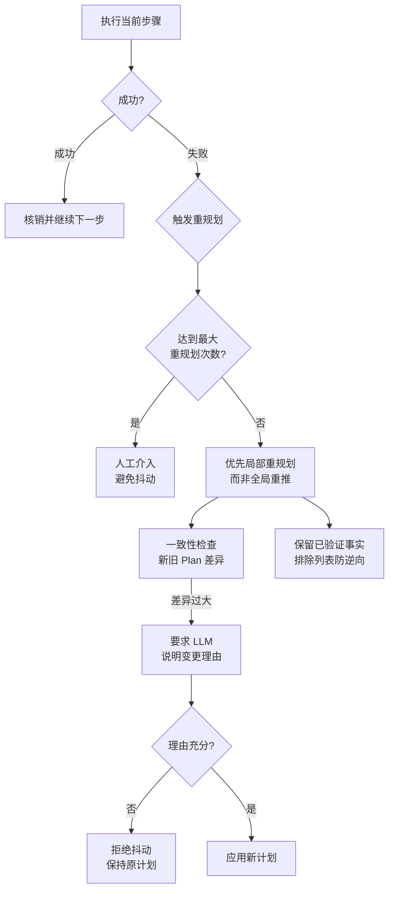

# Re-planning 会不会导致「计划抖动」?怎么缓解

会。频繁重规划可能让执行轨迹不稳定。缓解方式包括：限制重规划次数、局部重规划优先、在 state 中保留已验证事实、对计划变更加一致性检查（新旧计划差异说明）。

### 实战案例
在构建“旅行规划 Agent”时，遇到“无限循环”陷阱：模型查询到 A 酒店满房，重规划选 B 酒店；然后又觉得行程太紧，重规划回 A 酒店。通过在 Prompt 中增加“已排除选项列表”，强制模型在重规划时不得逆向选择之前失败的方案，成功收敛了规划结果。

### 代码示例 (Python - 带状态的防抖逻辑)
```python
def safe_replan(state, max_replans=3):
    if state['replan_count'] >= max_replans:
        return "Error: 达到最大重规划次数，请人工介入"
    
    # 一致性检查：如果新旧计划差异过大，要求 LLM 说明理由
    new_plan = planner_agent.predict(state)
    diff_score = levenshtein_distance(state['current_plan'], new_plan)
    
    if diff_score > 0.8: # 剧烈变动
        justification = validator_agent.validate(state['current_plan'], new_plan)
        if not justification:
            return state['current_plan'] # 拒绝抖动，保持原计划
            
    return new_plan
```

### 对比表格
| 策略 | 触发条件 | 优点 | 缺点 |
| :--- | :--- | :--- | :--- |
| **全局重规划** | 任务目标改变或严重失败 | 思路清晰，切断旧路径依赖 | 计算成本高，可能丢弃已完成的有效工作 |
| **局部重规划** | 单步工具调用失败 | 灵活，保留上下文 | 可能陷入局部死胡同 |
| **固化不重规划** | 时间/Token 敏感场景 | 极致效率 | 容错性为零，一次失败全盘皆输 |

### 边界情况
1.  **环境动态性强**：在实时性要求极高的场景（如高频交易或自动驾驶模拟），外部环境毫秒级变化，重规划本身产生的 Latency 可能导致执行结果永远落后于现状。
2.  **不可逆操作**：如果 Plan 中包含“删除文件”、“发送邮件”等不可逆操作，重规划不能简单地撤销这些操作，否则会导致数据损坏或重复发送。

## 面试追问
1.  除了限制次数，如何通过算法或 Prompt Engineering 的手段，让 Agent 具备“坚持完成当前计划”的定力，而不是遇到一点小挫折就重规划？
2.  在多 Agent 协作系统中，如果多个 Agent 同时请求重规划，且计划之间存在冲突，应该由谁来仲裁？
3.  如何判断一次“失败”是值得重规划的，还是应该直接放弃任务的？（即失败归因与止损策略）

## 易错点
1.  **重规划导致历史丢失**：在某些简单实现中，重规划时直接清空了之前的上下文，导致 Agent “遗忘”了已经探明的重要信息，陷入了重复试错。
2.  **过度依赖重规划**：认为重规划能解决所有执行错误，实际上如果初始规划能力太差或 Prompt 设计有缺陷，重规划只是在不同的错误路径之间跳跃（即“计划抖动”）。

## 技术原理

"计划抖动"本质是重规划没有引入"惯性"与"记忆"，导致每次环境变化都触发全盘推翻。从控制论角度看，这是典型的欠阻尼系统：响应快但震荡不止。稳定的规划系统需要在三个层面引入阻尼：

- **状态持久化**：每次重规划必须保留"已验证事实"（如已排除的选项、已成功执行的动作），否则 Agent 会在不同的失败路径间反复跳跃。这就是 `已排除选项列表` 的原理——把历史作为约束写入 State，让规划器在受限空间内搜索。
- **变更分级**：不是所有失败都值得重规划。应区分"局部失败"（单步工具报错，局部重规划即可）和"目标失败"（整体方向错，才全局重规划）。分级机制避免了"一次小错全盘重来"的高成本震荡。
- **一致性校验**：新旧计划差异过大时，要求模型显式输出"为什么变更"的理由（justification），由校验器判断是否合理。这相当于在重规划前加了一道闸门，过滤掉无意义的抖动。

更深一层，过度重规划往往是初始规划能力不足的代偿——如果 Planner 本身质量高，对重规划的依赖就会下降。所以根治抖动的终极手段是提升 Planner 质量，而非无限堆叠重规划防护。

## 代码示例

带"已排除选项列表"和重规划上限的防抖逻辑骨架：

```python
def safe_replan(state, max_replans=3):
    if state["replan_count"] >= max_replans:
        return None  # 熔断：交人工介入
    state["replan_count"] += 1
    new_plan = planner.predict(state)
    # 一致性校验：差异过大需模型说明理由
    if levenshtein(state["current_plan"], new_plan) > 0.8:
        if not validator.justify(state["current_plan"], new_plan):
            return state["current_plan"]  # 拒绝抖动
    # 把本次失败的选项加入已排除列表，防止逆向选择
    for opt in state.get("failed_options", []):
        if opt in new_plan:
            return state["current_plan"]  # 逆向选择失败方案，拒绝
    return new_plan
```

## 注意事项

1. **不可逆操作不能简单撤销**：删库、发邮件、转账等动作一旦执行就无法回滚，重规划时必须跳过这些步骤而非尝试撤销，否则会造成数据损坏或重复扣款。
2. **重规划上限熔断**：务必设最大重规划次数（如 3 次），超限直接人工介入，防止 Agent 在死胡同里无限重试。
3. **保留已验证事实**：重规划时清空上下文是大忌，会让 Agent"遗忘"已探明的关键信息陷入重复试错，必须显式保留已验证事实和已排除选项。
4. **实时性场景慎用重规划**：毫秒级变化的环境（高频交易、自动驾驶）里，重规划本身的 Latency 可能让结果永远落后于现状，这类场景更适合固化策略或模型预测控制（MPC）。


## 核心流程图



## 记忆要点

- 现象：频繁重规划导致计划抖动，执行轨迹不稳定。
- 缓解：限制重规划次数、优先局部重规划、保留已验证事实、一致性检查。
- 策略：在 State 中维护"已排除选项列表"，防止逆向选择失败方案。
- 对比：全局重规划成本高，局部重规划灵活但可能陷入死胡同。
- 边界：不可逆操作（如删库）重规划时不能简单撤销，需特殊处理。

## 结构化回答

**30 秒电梯演讲：** 会的。频繁重规划就像团队老改方案，执行轨迹会抖动不稳定。缓解有几招：限制重规划次数熔断、优先局部重规划而非全盘推翻、在 State 里保留已验证事实防遗忘、对新旧计划做一致性检查差异过大就拒绝。最实用的一招是维护"已排除选项列表"，防止 Agent 逆向选择之前失败的方案。

**展开框架：**
1. **抖动现象** — 频繁重规划让执行轨迹不稳定，在不同错误路径间跳跃。
2. **四招缓解** — 限次数、局部优先、保留已验证事实、一致性检查差异过大需说明理由。
3. **边界处理** — 不可逆操作（删库、发邮件）重规划不能简单撤销，必须特殊处理。

**收尾：** 我做旅行规划 Agent 时就遇到过——A 满房换 B，又嫌行程紧换回 A，加了"已排除选项列表"后才收敛。您想深入聊哪块，重规划仲裁还是失败归因策略？

## 视频脚本

> 预计时长：2 分钟 | 由浅入深

| 时间 | 画面/字幕 | 口播台词 | 讲解要点 |
|------|----------|----------|----------|
| 0:00 | 标题卡：重规划会抖动吗 | "频繁重规划就像老改方案，Agent 会左右摇摆。" | 开场钩子 |
| 0:15 | 抖动现象示意图 | "A 满房换 B，又嫌紧换回 A，在不同错误路径间跳跃。" | 抖动现象 |
| 0:45 | 四招缓解策略图 | "限次数、局部优先、保留已验证事实、一致性检查。" | 缓解策略 |
| 1:10 | 已排除选项列表截图 | "最实用：维护已排除列表，防止逆向选择失败方案。" | 关键策略 |
| 1:35 | 旅行规划案例动画 | "实战：加已排除列表后，规划结果成功收敛不再抖动。" | 实战案例 |
| 1:50 | 缓解口诀卡 | "记住：限次数、留事实、查一致性、记排除。下期讲反思。" | 收尾 |

