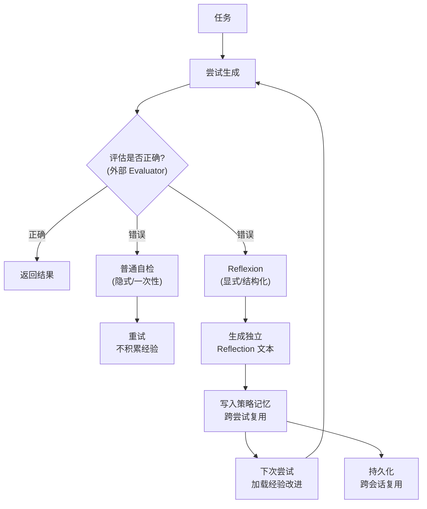

# Reflexion 和「让模型自己检查一遍」有什么不同

**当前答案**：
自检往往是一次性的；Reflexion 把评估与反思显式化、结构化，并跨尝试复用反思文本，形成可累积的「策略记忆」。工程上更易控制与评测。

**实战案例**：
在构建 SQL 生成 Agent 时，利用 Reflexion 记录“上次执行报错提示列名不存在”的反思文本，使得模型在第二次尝试时能自动修正 Schema 拼写错误，而普通自检往往会陷入重复报错。

**代码示例**：
```python
def reflexion_loop(task, max_trials=3):
    reflection_memory = ""
    for _ in range(max_trials):
        result = agent.run(task, reflection=reflection_memory)
        if evaluator.is_correct(result):
            return result
        # 生成结构化反思并累积
        error = evaluator.get_error(result)
        reflection_memory = reflector.generate_feedback(task, result, error)
    return "Max trials reached"
```

**对比表格**：

| 维度 | 普通自检 | Reflexion |
| :--- | :--- | :--- |
| **反思形式** | 隐式，通常在 Prompt 中要求“检查一遍” | 显式，生成独立的 `Reflection` 文本块 |
| **记忆复用** | 通常不跨尝试复用，每次重新检查 | 反思文本写入上下文，在后续尝试中持续生效 |
| **评估机制** | 依赖模型自我判断（可能产生幻觉） | 引入外部 Evaluator（如编译器检查、单元测试） |
| **适用场景** | 简单纠错、格式修正 | 复杂任务规划、代码/SQL 生成迭代 |

**边界情况**：
1. **反思幻觉累积**：如果 Evaluator 提供的错误反馈存在误导性（如误报），Reflexion 会将错误反思写入记忆，导致后续所有尝试都在修正“并不存在的错误”，陷入负优化。
2. **上下文溢出**：随着尝试次数增加，累积的反思文本可能超出模型 Context Window，导致模型忽略早期的关键指令或反思。
3. **无限循环/无效修复**：若错误无法通过代码或文本修复（如底层 API 变更），Reflexion 可能会不断重复类似的反思直到达到最大次数，造成资源浪费。

## 面试追问
1. 如果 Evaluator 返回的是非结构化的自然语言报错，Reflexion 如何确保提取出的反思是准确的？你会怎么设计 Prompt？
2. 当反思记忆过长导致上下文溢出时，你会采取什么策略进行压缩或筛选？
3. Reflexion 和 Chain-of-Thought (CoT) 结合使用时，反思内容应该放在 CoT 的哪个位置（前、中、后）效果最好？

## 易错点
1. **混淆 Evaluator 的作用**：误认为 Reflexion 的核心是 LLM 的自我反思能力，实际上其核心在于**外部 Evaluator** 提供的二元信号或具体错误信息，没有可信的 Evaluator，Reflexion 会退化为普通的自我修正。
2. **忽略负面示例**：在实现时容易只记录“错误是什么”，而忽略了记录“之前尝试过的方法为什么失败”，导致模型容易在后续尝试中重蹈覆辙。


## 核心流程图



## 核心知识点图


## 记忆要点

- Reflexion 显式累积反思文本，普通自检通常是一次性隐式检查。
- 核心差异在于外部 Evaluator 提供可信反馈，而非模型自我判断。
- 反思文本跨尝试复用，形成策略记忆，避免重复犯错。
- 风险：错误反馈会累积导致负优化，需警惕上下文溢出。

## 结构化回答

**30 秒电梯演讲：** 普通自检是一次性隐式检查，让模型"再看一遍"就完事；Reflexion 是显式生成结构化反思文本，还能跨尝试复用形成策略记忆。最关键的差异是 Reflexion 依赖外部 Evaluator（编译器、单元测试）提供可信反馈，而不是模型自我判断——没有可信 Evaluator，Reflexion 就退化为普通自检。风险是错误反馈累积会导致负优化。

**展开框架：**
1. **显式 vs 隐式** — Reflexion 生成独立反思文本块，普通自检只在 Prompt 里说"检查一遍"。
2. **外部 Evaluator 是核心** — 编译器、单元测试给二元信号，比模型自我判断可信得多。
3. **跨尝试复用** — 反思文本写入上下文形成策略记忆，避免重复犯错，但要防上下文溢出。

**收尾：** 我做 SQL 生成 Agent 时靠 Reflexion 记录"上次列名报错"的反思，第二次自动修正 Schema 拼写，普通自检只会重复报错。您想深入聊哪块，Evaluator 设计还是反思记忆压缩？

## 视频脚本

> 预计时长：2 分钟 | 由浅入深

| 时间 | 画面/字幕 | 口播台词 | 讲解要点 |
|------|----------|----------|----------|
| 0:00 | 标题卡：Reflexion vs 自检 | "让模型自己检查一遍和 Reflexion，差在哪？" | 开场钩子 |
| 0:15 | 两种模式对比图 | "自检是一次性隐式，Reflexion 显式生成反思文本还能跨尝试复用。" | 核心区别 |
| 0:45 | 外部 Evaluator 流程图 | "核心：外部 Evaluator 给可信反馈，没它 Reflexion 就退化成自检。" | 核心机制 |
| 1:10 | 反思记忆累积动画 | "反思文本写入上下文形成策略记忆，避免重复犯错。" | 记忆复用 |
| 1:35 | SQL 生成案例截图 | "实战：记录列名报错反思，第二次自动修正 Schema 拼写。" | 实战案例 |
| 1:50 | 区别口诀卡 | "记住：显式、外部 Evaluator、跨尝试复用。下期讲工具调用。" | 收尾 |

