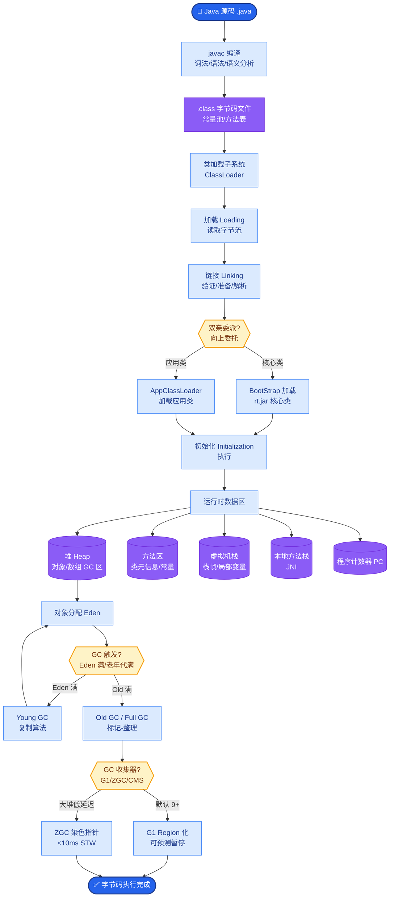

# LangChain 里 AgentExecutor 解决的核心问题是什么

AgentExecutor 解决的核心问题是**构建一个通用的“推理-行动”循环引擎**，将 LLM 的推理能力与工具的使用能力解耦并自动化。

它标准化了**ReAct（Reasoning + Acting）**模式的控制流，封装了从用户输入到最终输出的复杂迭代过程。

**核心职责**：
1.  **循环控制**：自动管理“思考 -> 行动 -> 观察 -> 再思考”的循环，直到 Agent 认为任务完成或达到最大迭代次数。
2.  **工具路由与执行**：根据 LLM 输出的 JSON/文本指令，匹配对应的工具并执行，捕获执行结果。
3.  **错误处理与回填**：处理工具执行异常（如 API 报错、参数缺失），并将错误信息转化为自然语言反馈给 LLM 进行自我修正，而不是直接崩溃。
4.  **上下文管理**：维护中间消息历史，确保 LLM 能看到之前的思考链和工具返回结果。

**执行流程图**：
```text
┌─────────┐
│ User Input │
└────┬────┘
     ▼
┌───────────────────────────────────────────────┐
│           AgentExecutor Loop                  │
│  ┌─────────────┐                              │
│  │   LLM Call  │ <───┐ (Thought + Action)     │
│  └──────┬──────┘     │                        │
│         ▼            │                        │
│  ┌─────────────┐     │                        │
│  │ Tool Parser │─────┘ (Parse tool name/args)│
│  └──────┬──────┘                              │
│         ▼                                     │
│  ┌─────────────┐     Execution Error?        │
│  │   Execute   │ ───> (Handle & Feedback) ──┐ │
│  └──────┬──────┘                             │ │
│         │ Observation                        │ │
│         └─────────────────────────────────────┘ │
│             (Append to Prompt)                 │
└───────────────────────────────────────────────────┘
     ▼
┌─────────┐
│Final Output│
└─────────┘
```

**实战案例**：
早期开发客服问答 Agent 时，未正确处理工具的 Timeout 异常，导致 AgentExecutor 直接抛出 Stack Trace 给用户。后续配置了 `handle_parsing_errors` 回调，将超时转化为温和的提示“系统繁忙，请稍后再试”，Agent 随即尝试调用备用知识库工具，用户体验显著提升。

**代码示例**：
```python
from langchain.agents import AgentExecutor, create_react_agent

# 定义错误处理回调，防止因格式错误导致崩溃
def handle_parse_error(error):
    return f"Action input formatting error: {error}. Please try again with correct JSON format."

agent_executor = AgentExecutor(
    agent=agent,
    tools=tools,
    verbose=True,
    handle_parsing_errors=handle_parse_error,  # 关键：捕获 LLM 输出格式错误
    max_iterations=5  # 关键：防止死循环
)
```

**边界情况**：
1.  **Token 溢出**：随着迭代次数增加，Prompt 中的历史记录不断累积，可能超出模型上下文窗口限制。需配合 `EarlyStoppingConfig` 或历史截断策略使用。
2.  **工具死循环**：当 LLM 陷入“Action A -> 观察 A -> 再次调用 Action A”的怪圈时，仅靠 `max_iterations` 也是一种被动保护，需引入更早熔断机制。
3.  **并发竞争**：如果同一个 AgentExecutor 实例被多线程调用（极少见但可能），内部状态管理可能导致错乱。

**面试追问**：
1.  如果 Agent 陷入无限循环但并未达到 `max_iterations`（例如在两个工具间无限反复跳出），除了限制次数，你有什么更智能的检测或中断方案？（考察对动态检测或自我反思机制的思考）
2.  AgentExecutor 运行过程中的中间历史记录非常消耗 Token，在生产环境中你是如何优化 Prompt 长度与上下文保留策略的？（考察 Memory/Window 管理）
3.  在 `handle_parsing_errors` 中直接将错误喂回给 LLM 有时会导致 LLM 重复犯错，你是如何改进错误反馈策略以引导其正确恢复的？（考察错误处理的艺术）

**易错点**：
1.  **混淆 Agent 与 Chain**：认为 AgentExecutor 只是简单的函数调用链，忽略了它是由 LLM 动态决策下一步行动的核心区别。
2.  **忽视 Early Stopping**：认为只要设置了 `max_iterations` 就万事大吉，忽略了在 Token 即将耗尽时基于 `EarlyStoppingConfig` 的主动退出逻辑，导致最后返回不完整的 JSON 或报错。

## 核心流程图



## 记忆要点

- 核心是构建通用的"推理-行动"循环引擎，标准化 ReAct 控制流。
- 自动管理循环、工具路由、错误回填与上下文维护。
- 关键配置：handle_parsing_errors 防崩溃，max_iterations 防死循环。
- 解决工具调用与 LLM 推理的解耦与自动化闭环问题。

## 结构化回答

**30 秒电梯演讲：** AgentExecutor 解决的核心问题是构建一个通用的"推理-行动"循环引擎，标准化 ReAct 控制流，让开发者只专注造工具和写 Prompt。它自动管理思考到行动到观察的循环、工具路由、错误回填和上下文维护。两个关键配置必须设：handle_parsing_errors 防格式错误崩溃，max_iterations 防死循环。本质是把 LLM 推理和工具调用解耦做自动化闭环。

**展开框架：**
1. **四大职责** — 循环控制、工具路由执行、错误处理回填、上下文管理维护历史。
2. **两个必设配置** — handle_parsing_errors 把格式错误转成温和提示而非崩溃，max_iterations 熔断防死循环。
3. **边界防护** — 配合 EarlyStoppingConfig 防 Token 溢出，历史截断策略控 Prompt 长度。

**收尾：** 我做客服 Agent 时没设 handle_parsing_errors，工具超时直接抛 Stack Trace 给用户，加了回调转温和提示后 Agent 还能切备用知识库。您想深入聊哪块，上下文截断还是错误反馈策略？

## 视频脚本

> 预计时长：2 分钟 | 由浅入深

| 时间 | 画面/字幕 | 口播台词 | 讲解要点 |
|------|----------|----------|----------|
| 0:00 | 标题卡：AgentExecutor 干啥的 | "AgentExecutor 就是 ReAct 的通用发动机底座。" | 开场钩子 |
| 0:15 | 循环引擎流程图 | "自动管理思考、行动、观察循环，加上工具路由和错误回填。" | 核心职责 |
| 0:45 | 两大关键配置截图 | "必设：handle_parsing_errors 防崩溃，max_iterations 防死循环。" | 关键配置 |
| 1:10 | Token 溢警示意 | "坑：迭代多了 Prompt 历史累积会溢出，要配 EarlyStopping。" | 边界情况 |
| 1:35 | 客服超时案例 | "实战：没设错误处理，工具超时直接抛 Stack Trace 给用户。" | 实战案例 |
| 1:50 | 核心职责口诀卡 | "记住：循环引擎加两大配置，解耦推理和工具。下期讲反思。" | 收尾 |

### 视频流程图


