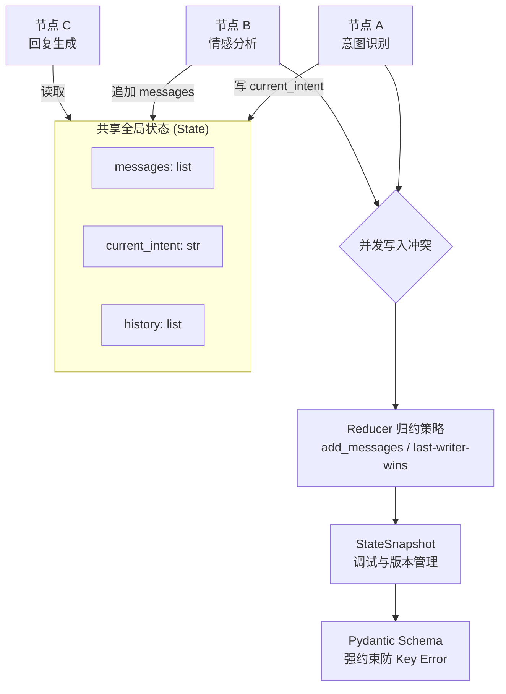

# LangGraph 的状态更新为什么要谨慎设计

LangGraph 采用的是**共享状态**模型，所有节点读写同一个全局状态对象，因此状态更新设计不当会导致数据冲突、逻辑混乱或难以调试。

**需谨慎设计的原因：**
1.  **并发写入冲突**：如果多个节点同时修改同一个字段（如 Node A 覆盖了 Node B 的结果），且没有定义优先级或归约逻辑，会导致数据丢失或非预期行为。
2.  **Schema 弱约束**：Python 的动态特性容易导致状态字段随意增加，若无严格的 Pydantic Schema 约束，下游节点读取时容易遇到 Key Error 或类型错误。
3.  **调试困难**：状态在图中流转，若更新逻辑分散在各个节点内部（副作用），难以追踪状态的变更历史。
4.  **版本漂移**：在长流程运行中，如果状态对象结构发生变更（如字段重命名），历史快照可能无法被新版本节点正确读取，导致流程中断。

**设计策略：**
1.  **明确读写职责**：定义每个节点是“读取者”还是“写入者”，避免随意修改公共字段。
2.  **定义归约策略**：对于列表类字段（如消息历史），需明确是 `replace`（覆盖）还是 `append`（追加）。LangGraph 内置了 `Annotated` 的 `add_messages` 等 Reducer。
3.  **快照与版本**：利用 LangGraph 的 `StateSnapshot` 功能，在调试时查看每一步的状态变化。
4.  **不可变更新**：尽量在节点内创建状态的副本进行修改，而不是直接在原对象上修改，以减少并发竞态条件。

**实战案例**：
在构建多轮对话客服时，曾因未对 `messages` 列表配置 Reducer，导致分支节点（如意图识别和情感分析）同时向历史记录追加信息，造成上下文 Token 消耗双倍且顺序混乱，最终通过配置 `Annotated[list, operator.add]` 解决。

**代码示例（Python）：**
```python
from typing import Annotated
from operator import add
from typing_extensions import TypedDict

class AgentState(TypedDict):
    # 使用 add 策略处理列表更新，避免覆盖冲突
    messages: Annotated[list, add]
    # 默认是 last writer wins，适合单一事实源
    current_intent: str
```

**对比表格（状态更新策略）：**
| 策略 | 适用场景 | 优点 | 缺点 |
| :--- | :--- | :--- | :--- |
| **Replace (默认)** | 单一事实源 (如最终结论) | 逻辑简单，状态紧凑 | 容易丢失并发写入的数据 |
| **Append (add_messages)** | 消息历史、日志列表 | 保留完整流转轨迹 | 列表无限增长，消耗 Token |
| **Custom Reducer** | 字典合并、去重集合 | 灵活处理复杂冲突 | 实现复杂度高，调试难 |

## 边界情况
1.  **空状态处理**：当节点尝试读取一个尚未初始化的字段（如第一次运行时的 `user_id`），需在 Schema 中定义 `Optional` 或设置 `default_factory`，防止 `KeyError` 崩溃。
2.  **循环状态死锁**：在循环图（如自我反思 Agent）中，如果状态中只累加错误日志而不清理，可能导致状态对象无限膨胀直至内存溢出（OOM）。
3.  **类型漂移**：节点 A 写入 `str` 类型的 `result`，节点 B 错误地期望其为 `list` 并进行遍历，导致运行时 `TypeError`，Pydantic 严格模式可预防此问题。

## 面试追问
1.  如果状态中的某个列表字段（如搜索结果）变得非常大（超过 10 万条 Token），你会如何在 LangGraph 架构层面进行优化或瘦身？
2.  LangGraph 的 `reducer` 是在每个节点执行后立即触发，还是在图遍历的特定阶段触发？谈谈你对状态更新时机的理解。
3.  在分布式执行 LangGraph（如使用 LangGraph Cloud）时，如何保证共享状态在并发情况下的原子性和一致性？

## 易错点
1.  **误用 Reducer**：对于需要覆盖的字段（如 `current_step`），错误地使用了 `add` 策略，导致状态变成 `['step1', 'step2']` 而非 `'step2'`。
2.  **直接修改引用**：在节点函数中直接 `state['list'].append(item)` 而不是返回新字典，可能导致某些特定的 Checkpoint 机制失效，难以回滚状态。


## 核心流程图



## 记忆要点

- LangGraph 采用共享状态模型，设计不当会导致并发冲突或逻辑混乱。
- 需定义归约策略（Reducer）：Replace 覆盖或 Append 追加。
- 避免直接修改引用，推荐不可变更新，使用 Pydantic 约束类型。
- 风险：状态无限膨胀导致 OOM，需配置快照与版本管理。

## 结构化回答

**30 秒电梯演讲：** LangGraph 是共享状态模型，所有节点读写同一个全局对象，设计不当就乱套。要谨慎的原因有四个：并发写入冲突会丢数据、Schema 弱约束容易 Key Error、调试难、版本漂移会让历史快照失效。设计上得明确读写职责、定义 Reducer 策略（replace 还是 append）、用 Pydantic 约束类型、做不可变更新。还得防状态无限膨胀导致 OOM。

**展开框架：**
1. **四大风险** — 并发写入冲突、Schema 弱约束、调试困难、版本漂移导致快照失效。
2. **Reducer 策略** — Replace 适合单一事实源，Append 适合消息历史，自定义 Reducer 处理复杂冲突。
3. **工程实践** — Pydantic 约束类型、不可变更新、StateSnapshot 调试、防 OOM 的清理机制。

**收尾：** 我做多轮对话客服时踩过——没给 messages 配 Reducer，意图识别和情感分析同时追加导致 Token 翻倍还顺序乱，加了 Annotated list 加 add 才解决。您想深入聊哪块，大列表瘦身还是分布式状态一致性？

## 视频脚本

> 预计时长：2 分钟 | 由浅入深

| 时间 | 画面/字幕 | 口播台词 | 讲解要点 |
|------|----------|----------|----------|
| 0:00 | 标题卡：LangGraph 状态为啥要谨慎 | "共享状态模型，更新设计不当就数据冲突、调试噩梦。" | 开场钩子 |
| 0:15 | 四大风险图 | "并发冲突、Schema 弱约束、调试难、版本漂移，四大坑。" | 风险分析 |
| 0:45 | Reducer 策略对比表 | "Replace 适合单一事实源，Append 适合消息历史，自定义处理复杂冲突。" | 归约策略 |
| 1:10 | 并发追加翻车动画 | "坑：没配 Reducer，多节点同时追加导致 Token 翻倍顺序乱。" | 实战痛点 |
| 1:35 | 客服 messages 案例 | "实战：加 Annotated list 加 add 策略，解决并发追加冲突。" | 实战案例 |
| 1:50 | 设计口诀卡 | "记住：定义 Reducer、不可变更新、防 OOM。下期讲 Checkpoint。" | 收尾 |

