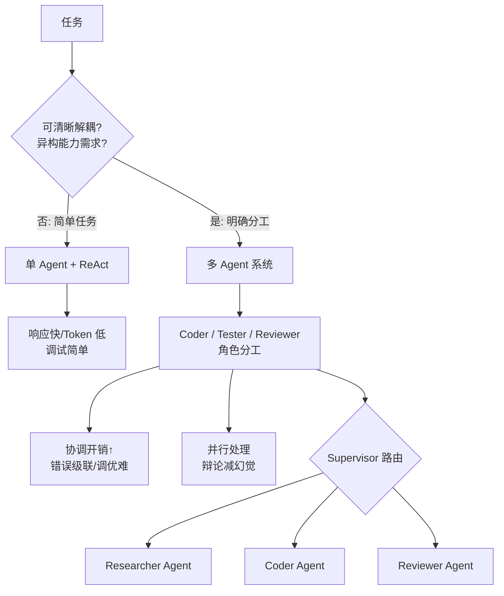

# 多 Agent 一定比单 Agent 更强吗

多 Agent 系统**不是万能银弹**，它增加了系统的复杂度，只有在特定场景下才有收益。

**多 Agent 的劣势与成本：**
1.  **协调开销**：Agent 之间通过自然语言通信，Token 消耗随着 Agent 数量和对话轮次指数级增长，导致延迟高、成本高。
2.  **错误级联**：如果一个上游 Agent 产生了幻觉或错误信息，下游 Agent 往往会顺着这个错误继续推理，很难自我纠正（即“垃圾进，垃圾出”）。
3.  **调优难度**：需要调试多个 Prompt、多个工具链以及它们之间的交互协议，排查问题极难。
4.  **局部最优**：单个 Agent 可能为了达成局部目标（如通过代码测试）而损害整体任务的最优性（如代码可维护性极差）。

**适用场景（何时更强）：**
*   **任务可清晰解耦**：如专门的 Coder（写代码）、Tester（写测试）、Reviewer（审核），角色职责明确且有客观验证标准。
*   **异构能力需求**：需要连接不同的数据源或使用完全不同的工具集，物理隔离更安全。
*   **辩论机制**：利用多 Agent 互相挑刺来减少幻觉（需引入裁判角色）。

**实战案例**：
在开发数据分析 Agent 时，初版使用多 Agent（一个写 SQL，一个执行，一个画图），结果发现简单查询耗时超过 10 秒。后改为单 Agent + ReAct 模式，延迟降低至 2 秒内，维护成本大幅下降。

**代码示例（LangGraph 架构选择）：**
```python
# 单 Agent 模式 (ReAct): 适合简单任务
def single_agent_node(state):
    response = llm.invoke([SYSTEM_PROMPT] + state["messages"])
    return {"messages": [response]}

# 多 Agent 模式 (Supervisor): 适合复杂分工
def supervisor_node(state):
    # 路由逻辑，决定下个由哪个子 Agent 处理
    return {"next_agent": "researcher"}
```

**对比表格（单 Agent vs 多 Agent）：**
| 维度 | 单 Agent (ReAct) | 多 Agent 系统 |
| :--- | :--- | :--- |
| **响应速度** | 快 (线性推理) | 慢 (多轮交互/路由) |
| **Token 成本** | 低 (一次上下文) | 高 (多次独立请求) |
| **复杂任务能力** | 一般 (受限于上下文窗口) | 强 (分工协作，并行处理) |
| **调试难度** | 低 (单一链路) | 高 (交互不可控) |

## 边界情况
1.  **通信带宽限制**：当两个 Agent 需要传输大量数据（如长文本或二进制数据）时，通过“自然语言摘要”传输会导致信息严重丢失，此时需改为共享存储引用而非直接传参。
2.  **无限循环**：多 Agent 互相争论如果没有终止条件（如 Token 上限或裁判介入），可能会陷入死循环，永不停歇。
3.  **冷启动问题**：在任务刚开始信息不足时，如果 Supervisor Agent 路由错误（将数学题派给了写作 Agent），可能导致系统早期陷入极度低效。

## 面试追问
1.  在多 Agent 系统中，如果某个 Agent 宕机或持续输出乱码，Supervisor 节点应该如何设计容错机制来保证整体流程的鲁棒性？
2.  你提到的“辩论机制”如何量化评估？是否真的比单 Agent 使用 CoT（思维链）效果更好？在什么情况下辩论会失效？
3.  如何处理多 Agent 之间的“上下文共享”问题？是让所有 Agent 看到所有历史对话，还是只看到摘要？各有何优劣？

## 易错点
1.  **过度拆分**：将简单的线性任务强行拆分为多个 Agent（如“搜索”和“总结”拆开），导致不必要的上下文传递开销和延迟。
2.  **忽略通信成本**：设计 Agent 交互时，假设通信是无成本且无损耗的，导致实际生产环境中出现 Token 泄露或预算超支。


## 核心流程图




## 记忆要点

- 多 Agent 不是万能银弹，增加协调开销与调试难度。
- 劣势：Token 成本高、错误级联、易陷入局部最优。
- 适用场景：任务可清晰解耦、需异构能力或客观验证标准。
- 简单任务单 Agent 更快，复杂任务多 Agent 分工协作更强。

## 结构化回答

**30 秒电梯演讲：** 不一定，多 Agent 不是银弹。它有四大劣势：协调开销大（Token 指数级增长）、错误级联（上游幻觉下游跟着错）、调优难、易陷局部最优。只有任务能清晰解耦、需要异构能力或有客观验证标准时，多 Agent 才有明显收益。简单任务单 Agent 加 ReAct 更快更省，我做过对比，简单查询从 10 秒降到 2 秒。

**展开框架：**
1. **四大劣势** — 协调开销、错误级联、调优难度、局部最优，不是越多 Agent 越好。
2. **三大适用场景** — 任务可清晰解耦、异构能力需求、辩论机制减幻觉。
3. **选型原则** — 简单线性任务单 Agent 加 ReAct，复杂分工任务才上多 Agent。

**收尾：** 我做数据分析 Agent 时踩过过度拆分的坑——写 SQL、执行、画图拆三个 Agent，简单查询耗时 10 秒，改单 Agent ReAct 后降到 2 秒。您想深入聊哪块，Supervisor 容错还是辩论机制评估？

## 视频脚本

> 预计时长：2 分钟 | 由浅入深

| 时间 | 画面/字幕 | 口播台词 | 讲解要点 |
|------|----------|----------|----------|
| 0:00 | 标题卡：多 Agent 一定更强吗 | "多 Agent 不是银弹，简单任务反而更慢更贵。" | 开场钩子 |
| 0:15 | 四大劣势图 | "协调开销、错误级联、调优难、局部最优，四大坑。" | 劣势分析 |
| 0:45 | 三大适用场景 | "任务可解耦、需异构能力、辩论减幻觉，这三种才上多 Agent。" | 适用场景 |
| 1:10 | 过度拆分警示动画 | "坑：写 SQL、执行、画图拆三个 Agent，简单查询耗 10 秒。" | 易错点 |
| 1:35 | 数据分析案例数据 | "实战：改单 Agent ReAct 后，延迟从 10 秒降到 2 秒。" | 实战案例 |
| 1:50 | 选型口诀卡 | "记住：简单单 Agent，复杂才多 Agent。下期讲 Supervisor。" | 收尾 |

