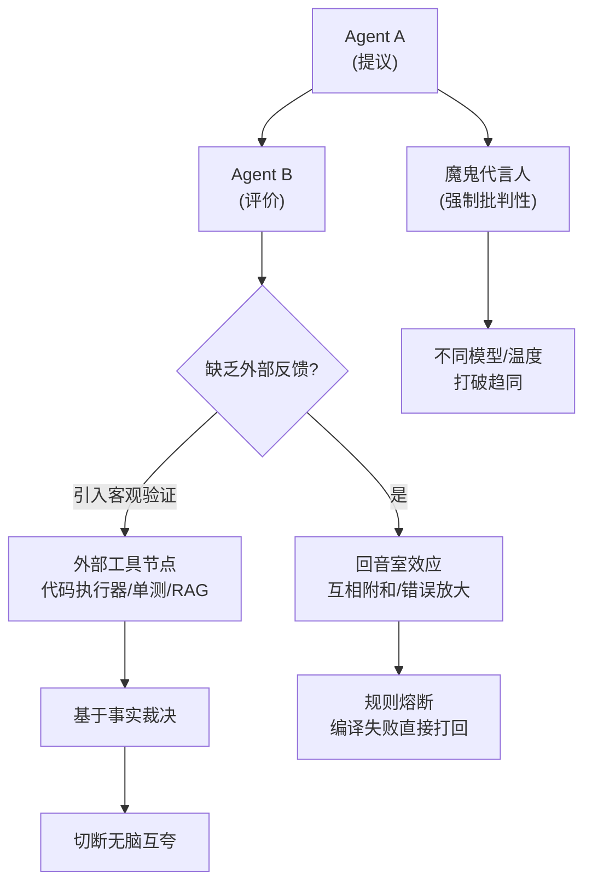

# 如何避免多 Agent「互相附和」

多 Agent 系统中，如果缺乏外部反馈，模型很容易陷入“互相捧场”的**回音室效应**，导致错误被不断放大。

**避免互相附和的策略：**
1.  **引入客观验证**：在 Agent 之间插入**外部工具节点**（如代码执行器、单元测试、RAG 检索验证），用客观事实裁决对错，而不是靠 Agent 互相评价。
2.  **设置对立角色**：在提示词中明确要求某些 Agent 扮演“魔鬼代言人”，专门寻找前序方案的漏洞，强制输出批判性意见。
3.  **基于规则的熔断**：设置硬性规则或指标（如代码编译失败、检索相似度为 0），一旦触发直接终止流程或降级处理，不交给 Agent 讨论。
4.  **盲评机制**：在辩论阶段，暂时隐藏建议者的身份，仅基于内容进行评估，减少由于模型趋同性导致的盲目跟随。
5.  **初始化多样性**：让不同 Agent 使用不同的模型（如 GPT-4 vs Claude 3）或不同的温度参数，打破模型固有的偏好一致性。

**实战案例**：
在一个代码审查系统中，两个 AI Agent 互相点赞，明显有 bug 的代码被通过。后来引入了一个 `PythonSyntaxCheck` 工具节点，只要有 Syntax Error，审查流程直接强制打回，切断了 Agent 的无脑互夸。

**代码示例（LangGraph 强制工具调用）：**
```python
from langgraph.prebuilt import ToolNode

def critic_node(state):
    # 强制要求 Critic 节点必须调用搜索工具验证事实
    response = llm_with_tools.invoke(
        state["messages"], 
        tool_choice={"type": "function", "function": {"name": "web_search"}}
    )
    return {"messages": [response]}

# 普通节点只会“动嘴”，工具节点引入客观世界反馈
```

**对比表格（避免附和的手段）：**
| 手段 | 实现方式 | 有效性 | 成本 |
| :--- | :--- | :--- | :--- |
| **Prompt 设定** | System Prompt 要求“唱反调” | 弱 (模型偏好难压倒) | 低 |
| **外部工具验证** | 接入代码解释器/搜索引擎 | 强 (基于事实) | 中 (需开发工具) |
| **人类介入 (HITL)** | 关键节点人工确认 | 极强 (金标准) | 高 (人力成本) |

## 边界情况
1.  **客观标准缺失**：在创意写作或战略规划等缺乏绝对“对错”的场景，外部工具无法提供反馈，此时极度依赖人类介入或盲评机制。
2.  **工具幻觉**：如果 Agent 调用的搜索工具返回了错误信息（如过时网页），Agent 会基于错误信息达成虚假共识，这种附和比纯 LLM 幻觉更难纠正。
3.  **Sycophancy 极端化**：如果 Critic Agent 的 Prompt 过于激进，可能会导致为了反驳而反驳的无休止争论，阻碍任务收敛。

## 面试追问
1.  如果无法引入外部工具（例如纯逻辑推理任务），如何设计机制来打破多 Agent 的共识循环？
2.  在盲评机制中，如果 Agent 仅仅因为文字风格不同而否决了正确的建议，如何解决这种“偏见性否决”？
3.  “客观验证”通常会增加延迟和成本，如何在“避免附和”和“系统性能”之间做权衡？有没有轻量级的验证方案？

## 易错点
1.  **Prompt 依赖**：试图仅通过 System Prompt（如“你要非常挑剔”）来彻底解决附和问题，忽略了模型 Alignment 导致的 Sycophancy（阿谀奉承）倾向是根深蒂固的。
2.  **过度依赖人类**：设计了一个流程，每一个决策点都需要人工确认，导致系统失去了自动化的意义，Human-in-the-loop 应仅在关键节点介入。


## 核心流程图




## 记忆要点

- 核心风险：缺乏外部反馈导致"回音室效应"，错误被放大。
- 策略：引入客观工具验证（代码/搜索）、设置对立角色或盲评。
- 仅靠 Prompt 设定"唱反调"效果弱，必须接入物理世界反馈。
- 客观标准缺失时（如创意），极度依赖人类介入或模型多样性。

## 结构化回答

**30 秒电梯演讲：** 多 Agent 缺乏外部反馈就会陷入回音室效应，互相点赞把错误放大。避免附和最有效的是引入客观工具验证——代码执行器、单元测试、RAG 检索，用物理世界事实裁决对错。光靠 Prompt 让 Agent 唱反调效果很弱，因为模型的阿谀奉承倾向是根深蒂固的。创意类没有绝对对错的任务，才靠盲评、模型多样性或人类介入。

**展开框架：**
1. **核心风险** — 回音室效应，Agent 互相附和把错误不断放大。
2. **最有效的策略** — 外部工具验证（代码、搜索），客观事实裁决，强于 Prompt 设定。
3. **补充手段** — 对立角色、规则熔断、盲评、初始化多样性，创意任务靠人类介入。

**收尾：** 我做代码审查时踩过——两个 Agent 互夸把明显 Bug 放行，加了 PythonSyntaxCheck 工具节点，有语法错误直接打回，切断了无脑互夸。您想深入聊哪块，工具验证的延迟权衡还是盲评的偏见处理？

## 视频脚本

> 预计时长：2 分钟 | 由浅入深

| 时间 | 画面/字幕 | 口播台词 | 讲解要点 |
|------|----------|----------|----------|
| 0:00 | 标题卡：避免多 Agent 互附和 | "多 Agent 互相点赞，错误被越放越大，怎么破？" | 开场钩子 |
| 0:15 | 回音室效应动画 | "缺乏外部反馈，Agent 陷入回音室，错误被不断放大。" | 核心风险 |
| 0:45 | 外部工具验证流程图 | "最有效：接入代码执行器、单元测试、RAG，用客观事实裁决。" | 核心策略 |
| 1:10 | Prompt 唱反调弱效警示 | "坑：光靠 Prompt 让 Agent 唱反调效果弱，阿谀倾向根深蒂固。" | 易错点 |
| 1:35 | 代码审查案例截图 | "实战：加 PythonSyntaxCheck 工具节点，有语法错误直接打回。" | 实战案例 |
| 1:50 | 避附和口诀卡 | "记住：外部工具验证最有效，Prompt 唱反调是弱招。下期讲通信。" | 收尾 |

