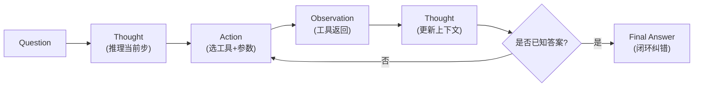

# 请用一句话解释 ReAct.

ReAct 是一种 Prompting 策略，它结合了**Reasoning（推理追踪）**和**Acting（交互行动）**，通过交替生成“思考”和“行动”让模型利用外部工具动态求解问题，形成闭环纠错。

**核心逻辑：**
*   **Thought**：解释当前步骤的意图，分解任务，推理下一步该做什么。
*   **Action**：选择具体的工具并构造参数。
*   **Observation**：接收工具执行的结果，作为下一步 Thought 的输入。

这种范式将 LLM 从“闭卷考试”转变为“开卷查阅资料+逻辑推导”的过程。

**实战案例**：
在开发企业知识库助手时，单纯使用 LLM 经常编造公司内部政策。接入 ReAct 模式后，Agent 会先思考需要查询哪个文档，再调用搜索工具，最后基于文档内容回答，幻觉率降低了 80%。

**代码示例（ReAct Prompt 结构）：**
```python
REACT_PROMPT = """
Answer the following questions as best you can. You have access to the following tools:
{tools}

Use the following format:

Question: the input question you must answer
Thought: you should always think about what to do
Action: the action to take, should be one of [{tool_names}]
Action Input: the input to the action
Observation: the result of the action
... (this Thought/Action/Action Input/Observation can repeat N times)
Thought: I now know the final answer
Final Answer: the final answer to the original input question

Begin!

Question: {input}
Thought: {agent_scratchpad}
"""
```

## 边界情况
1.  **循环陷入**：当工具返回的结果为空或无关信息时，模型可能会困惑并重复调用同一个工具，导致 `Thought-Action` 死循环，需设置最大步数限制。
2.  **工具参数注入攻击**：如果 `Action Input` 直接由用户输入控制而不加校验，恶意用户可能构造参数对工具后端进行注入攻击（如 SQL 注入）。
3.  **Thought 省略**：模型有时会跳过 `Thought` 直接输出 `Action`，导致推理链断裂，特别是在 Token 预算紧张或 Temperature 设置较高时。

## 面试追问
1.  ReAct 模式通常会导致推理 Token 消耗较大，你有什么优化策略（如 Thought 压缩、Thought 省略）来降低成本且保持准确率？
2.  如果工具调用失败（如 API 超时），ReAct 的循环应该如何设计才能让 Agent 自动重试或优雅降级，而不是直接报错？
3.  对比 ReAct 和 Plan-and-Solve，为什么 ReAct 在处理未知任务时泛化性更好，但在长程任务中容易“走神”？

## 易错点
1.  **Prompt 格式硬编码**：在 Prompt 中死板地固定了 `Action:` 和 `Action Input:` 的格式，一旦 LLM 输出了少一个空格或多一行换行，解析器就会崩溃，需配合 LLM 的原生 Function Call 能力。
2.  **上下文截断**：在多轮 ReAct 循环后，History 超过上下文窗口被截断，往往截断了最开始的 `Question` 或关键的 `Observation`，导致 Agent 遗忘目标。


## 核心流程图




## 记忆要点

- 一句话：交替生成推理追踪和交互行动，利用工具动态求解。
- 核心流程：Thought（思考）-> Action（行动）-> Observation（观察）。
- 将 LLM 从闭卷转为开卷，形成闭环纠错机制。
- 风险：易陷入死循环，需设置最大步数限制。

## 结构化回答

**30 秒电梯演讲：** 一句话：ReAct 是结合推理和行动的 Prompting 策略，让模型交替生成 Thought 思考和 Action 行动，利用工具的 Observation 反馈闭环纠错。本质是把 LLM 从闭卷考试变成开卷查资料加逻辑推导。核心流程就是 Thought 到 Action 到 Observation 三步循环，直到得出最终答案。最大风险是容易陷入死循环，必须设最大步数限制。

**展开框架：**
1. **核心定义** — Reasoning 加 Acting 交替，用工具动态求解，不是纯脑子想。
2. **三步循环** — Thought 解释意图、Action 选工具填参数、Observation 接收结果喂回下一步。
3. **闭环价值与风险** — 从闭卷转开卷大幅降幻觉，但易死循环需熔断，还要防参数注入。

**收尾：** 我做企业知识库助手时靠 ReAct 把幻觉率降了 80%——Agent 先思考查哪个文档，再调搜索工具，基于真实内容回答。您想深入聊哪块，Thought 压缩降成本还是工具失败的重试设计？

## 视频脚本

> 预计时长：3 分钟 | 由浅入深

| 时间 | 画面/字幕 | 口播台词 | 讲解要点 |
|------|----------|----------|----------|
| 0:00 | 标题卡：一句话解释 ReAct | "ReAct 就是推理加行动交替，用工具反馈闭环纠错。" | 开场钩子 |
| 0:20 | 三步循环流程图 | "Thought 思考意图，Action 调工具填参数，Observation 接结果喂回。" | 核心流程 |
| 0:55 | 闭卷 vs 开卷对比 | "本质：把 LLM 从闭卷考试变成开卷查资料加逻辑推导。" | 核心价值 |
| 1:30 | 死循环风险警示 | "坑：工具返回空结果易死循环，必须设最大步数限制。" | 风险提示 |
| 2:05 | 知识库助手案例 | "实战：接入 ReAct 后，Agent 先查文档再回答，幻觉率降 80%。" | 实战案例 |
| 2:35 | 一句话口诀卡 | "记住：推理加行动交替，工具反馈闭环。下期讲 Plan-and-Solve。" | 收尾 |

