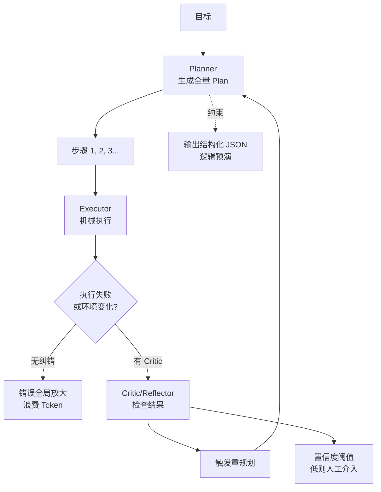

# Plan-and-Execute 的最大风险是什么?如何缓解

Plan-and-Execute（先规划后执行）模式的最大风险是**规划阶段的错误会在执行阶段被全局放大**，且在执行中途缺乏灵活性。

**具体风险分析：**
1.  **错误传播**：如果 Planner 在第一步就生成了错误的计划或不可行的步骤，Executor 会机械地执行错误的指令，直到失败才可能发现，浪费大量 Token 和时间。
2.  **缺乏纠错**：传统的 Plan-and-Execute 往往是线性执行，一旦环境发生变化或获得新信息，原计划可能失效，系统难以动态调整。

**缓解策略：**
1.  **重规划机制**：允许在 Executor 遇到无法解决的错误时，将错误信息回传给 Planner 进行动态调整计划，而不是直接报错。
2.  **自我验证/反思**：在每一步执行后，增加一个“Critic”或“Reflector”节点，检查当前结果是否符合预期，并决定是否继续下一步或回退。
3.  **Planner 约束**：通过 Prompt Engineering 强制 Planner 输出格式化的计划（如 JSON），并在规划阶段进行逻辑预演。
4.  **执行期监控**：设置置信度阈值，如果某一步骤的成功率低，自动触发人工介入或搜索替代方案。

**实战案例**：
曾尝试用 Plan-and-Execute 做竞品分析报告，Planner 计划先去 X（假设的竞品官网）抓数据，结果该网站宕机，导致整个流程报错挂起。改进后加入了 `re-plan` 边界，当步骤失败超过 3 次自动触发重规划节点寻找替代数据源。

**代码示例（重规划逻辑）：**
```python
def should_re_plan(state: AgentState):
    # 如果最后一条消息包含错误标记，触发重规划
    last_msg = state["messages"][-1]
    if "ERROR" in last_msg.content:
        return "planner"  # 路由回规划节点
    return "continue"  # 继续执行下一步
```

**对比表格（Plan-and-Execute vs ReAct）：**
| 维度 | Plan-and-Execute (规划-执行) | ReAct (推理-行动) |
| :--- | :--- | :--- |
| **路径依赖** | 弱 (初期生成全量计划) | 强 (下一步依赖上一步结果) |
| **灵活性** | 低 (需显式触发重规划) | 高 (每步动态决策) |
| **Token 效率** | 差 (长程任务需重载上下文) | 优 (逐步推理，无需长 Prompt) |
| **适用任务** | 多步骤、目标明确的长任务 | 简单探索、需即时反馈的任务 |

## 边界情况
1.  **幻觉任务**：Planner 可能会生成一个看起来合理但实际上不可执行的任务（如“分析竞争对手未公开的内部财务数据”），Executor 会因此陷入无限尝试。
2.  **目标漂移**：在执行过程中引入了重规划机制，如果缺乏强约束，Planner 可能会被新信息带偏，导致永远无法完成最初的目标，陷入“计划-执行-修改计划”的死循环。
3.  **计划粒度过细**：Planner 将任务拆解得过细（如“打开网页” -> “移动鼠标” -> “点击按钮”），导致 Executor 退化为低级指令执行器，失去了 LLM 的语义理解优势。

## 面试追问
1.  在 Plan-and-Execute 模式中，Planner 生成的计划长度受限于 Context Window，对于超长任务（如开发一个完整的 Web 应用），你如何处理计划的分段与衔接？
2.  如果 Executor 在某一步失败了，但不知道是因为“计划错了”还是“执行错了”，重规划机制如何诊断失败根源？
3.  相比于 ReAct，Plan-and-Execute 如何避免“早知如此，何必当初”的低效问题？有没有混合模式的最佳实践？

## 易错点
1.  **计划僵化**：将 Plan-and-Execute 视为静态流水线，认为一旦生成了计划就必须严格按顺序执行完，忽视了 Agent 在执行过程中的动态学习能力。
2.  **过度重规划**：设置了过于敏感的重规划触发条件（如一次搜索无结果就重规划），导致系统在遇到小困难时就不断推倒重来，无法通过简单的重试解决问题。

## 核心流程图



## 记忆要点

- 最大风险：规划阶段错误会在执行阶段全局放大，缺乏灵活性。
- 缓解：引入重规划机制、自我验证节点或执行期监控。
- 对比 ReAct：适合长程任务但 Token 效率差，灵活性低。
- 避免计划僵化，遇到错误应动态调整而非机械执行。

## 结构化回答

**30 秒电梯演讲：** 最大风险是规划阶段的错误会在执行阶段被全局放大——地图画错了，走得越快离目标越远。Planner 第一步错了，Executor 会机械执行错误指令，浪费大量 Token 才发现。缓解有几招：加重规划机制让错误回传 Planner 动态调整、加自我验证 Critic 节点、Planner 强约束输出格式化计划、执行期设置信度阈值触发人工介入。核心是避免计划僵化。

**展开框架：**
1. **两大风险** — 错误传播（一步错全盘错）、缺乏纠错（环境变化时无法动态调整）。
2. **四招缓解** — 重规划机制、自我验证反思节点、Planner 强约束、执行期置信度监控。
3. **边界防护** — 防幻觉任务、防目标漂移死循环、防计划粒度过细退化成低级指令执行器。

**收尾：** 我做竞品分析时踩过——Planner 计划抓某官网数据，结果网站宕机整个流程挂起，加了失败超 3 次自动重规划找替代数据源才解决。您想深入聊哪块，失败根源诊断还是混合模式设计？

## 视频脚本

> 预计时长：2 分钟 | 由浅入深

| 时间 | 画面/字幕 | 口播台词 | 讲解要点 |
|------|----------|----------|----------|
| 0:00 | 标题卡：Plan-Execute 最大风险 | "地图画错了，走得越快离目标越远，这就是最大风险。" | 开场钩子 |
| 0:15 | 错误传播放大动画 | "Planner 第一步错，Executor 机械执行，错误全局放大。" | 核心风险 |
| 0:45 | 四招缓解策略图 | "重规划机制、自我验证节点、Planner 强约束、执行期监控。" | 缓解策略 |
| 1:10 | 目标漂移死循环警示 | "坑：重规划太敏感会让 Planner 被新信息带偏，陷入死循环。" | 边界情况 |
| 1:35 | 竞品分析案例截图 | "实战：网站宕机整个流程挂起，加失败超 3 次重规划找替代源。" | 实战案例 |
| 1:50 | 风险缓解口诀卡 | "记住：错误会放大，靠重规划加验证缓解。下期讲 ReAct。" | 收尾 |

### 视频流程图


