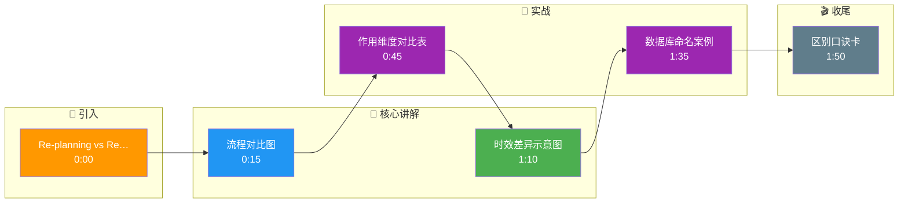

# Re-planning 与 Reflexion 都「改正错误」,区别是什么

**核心区别**：Re-planning 侧重于「当前计划的修正」与「路径重算」，关注物理/逻辑步骤的连通性；Reflexion 侧重于「元认知」与「经验沉淀」，关注将错误抽象为语言化总结以指导未来行为。

**细节增强**：
1. **作用维度**：Re-planning 通常发生在执行失败或环境状态突变时，通过生成器重新生成 Steps A->B->C。Reflexion 则在任务结束后（或中间检查点），通过 Self-Reflection 模块生成“我为什么失败”的文本，并将其作为上下文存储到 Memory 中，供后续任务复用。
2. **修改粒度**：Re-planning 调整的是“下一步怎么做”（微调动作序列）；Reflexion 调整的是“以后怎么做这类事”（更新 Agent 的策略或 Prompt 模板）。
3. **边界情况**：当环境状态发生不可逆的物理变化（如下棋被将军、无人机撞毁），Re-planning 是必须的应对机制，仅靠 Reflexion 的经验积累无法挽救当前局面；而在同一类重复性任务（如多次修复不同代码库的 Bug）中，Reflexion 的泛化能力远超 Re-planning。

**流程对比图**：
```text
Re-planning Loop:
State -> Plan -> Act -> Observe(Error) -> [Re-plan] -> Act...

Reflexion Loop:
Task -> Act -> Fail -> Reflect(生成文本经验) -> Store Memory
                     ^
                     | (下次任务时加载)
New Task + Memory Context -> Act (策略已改进)
```

**实战案例**：
在数据库查询 Agent 中，如果 ReAct 报错“列名不存在”，Re-planning 只是简单地重写 SQL 修正列名；而 Reflexion 会总结出“该业务库的表命名惯例使用下划线而非驼峰”，将此规则写入 Memory。当下次遇到类似表名时，Agent 会直接应用此规则，避免同类错误，体现了从“修正错误”到“学习规则”的跨越。

**代码示例 (Python)**：
```python
# Reflexion: 构建带有反思记忆的 Prompt
def build_reflexion_prompt(task, history, memory):
    reflection_context = ""
    if memory:
        reflection_context = f"Previous Errors & Rules:\n{memory}\n"
    
    return f"""Task: {task}
{reflection_context}
Previous Attempts: {history}

Based on the reflection rules and previous errors, generate the next step:"""
```

**对比表格**：
| 维度 | Re-planning | Reflexion |
| :--- | :--- | :--- |
| **触发时机** | 步骤执行失败或环境中断 | 任务失败或阶段结束复盘 |
| **修改对象** | 短期执行计划 | 长期策略与 Prompt 上下文 |
| **持久化** | 仅当前会话有效 | 经验存入 Memory，跨会话复用 |
| **思维层级** | 操作层 | 元认知层 |

## 常见考点
1. **Reflexion 的 Memory 类型**：通常存储什么格式的数据？
2. **长期影响**：Re-planning 是否会遗忘之前的错误经验？
3. **触发条件**：Reflexion 是在每次失败都触发，还是基于置信度阈值触发？

## 面试追问
1. Reflexion 产生的“经验文本”如果出现错误（幻觉），会在后续所有任务中传播错误，如何避免这种“负迁移”？（提示：验证机制、置信度加权或定期清理 Memory）
2. 在 Multi-Agent 协作场景中，如果一个 Agent 使用 Reflexion，另一个使用 Re-planning，如何保证它们的行为一致性？
3. Reflexion 的反思步数是否会无限增长？如何设计反思的终止条件或归纳粒度？

## 易错点
1. **混淆 Re-planning 与 Reflexion 的时序**：Re-planning 是“即时生效”的动作修正，而 Reflexion 往往是“延时生效”的策略更新，不能指望 Reflexion 解决当前的报错。
2. **认为 Re-planning 不需要记忆**：其实 Re-planning 也依赖当前的 State Memory，但它不依赖跨任务的经验库。

## 核心流程图

```mermaid
flowchart TB
    classDef start fill:#4CAF50,color:#fff
    classDef process fill:#2196F3,color:#fff
    classDef decision fill:#FF9800,color:#fff
    classDef special fill:#9C27B0,color:#fff
    classDef error fill:#f44336,color:#fff
    classDef info fill:#607D8B,color:#fff
    class Act start
    class Act1 process
    class Act2 decision
    class Act2Better special
    class Context error
    class Error info
    class Fail start
    class Focus1 process
    class Focus2 decision
    class Loop special
    class Mem error
    class Memory info
    class New start
    class Obs1 process
    class Observe decision
    class P1 special
    class Plan error
    class Re info
    class ReP start
    class RePlan process
    class Reflect decision
    class Reflex special
    class Reflexion error
    class S1 info
    class State start
    class Store process
    class T2 decision
    class T2New special
    class Task error
    class br info
    class plan start
    class planning process
    subgraph RePlan["Re-planning Loop"]
        S1["State"] --> P1["Plan"]
        P1 --> Act1["Act"]
        Act1 --> Obs1["Observe Error"]
        Obs1 --> ReP["Re-plan"]
        ReP --> Act1
    end
    subgraph Reflex["Reflexion Loop"]
        T2["Task"] --> Act2["Act"]
        Act2 --> Fail["Fail"]
        Fail --> Reflect["Reflect<br/>生成文本经验"]
        Reflect --> Mem["Store Memory"]
        Mem -.->|下次任务加载| T2New["New Task<br/>+ Memory Context"]
        T2New --> Act2Better["Act<br/>策略已改进"]
    end
    RePlan --> Focus1["修改对象: 短期执行计划<br/>思维层级: 操作层"]
    Reflex --> Focus2["修改对象: 长期策略<br/>思维层级: 元认知"]
```



## 记忆要点

- Re-planning 修正当前计划路径，关注物理/逻辑连通性，即时生效；Reflexion 沉淀经验，更新长期策略。
- Re-planning 调整"下一步怎么做"；Reflexion 调整"以后怎么做这类事"，存入 Memory 跨会话复用。
- 环境突变（如撞毁）必须 Re-planning；重复性任务（如修 Bug）Reflexion 泛化能力更强。
- Re-planning 是操作层即时修正；Reflexion 是元认知层延时生效，不能解决当前报错。

## 结构化回答

**30 秒电梯演讲：** 区别在作用维度和时效。Re-planning 修正的是"下一步怎么做"——执行失败时重算计划路径，即时生效，只管当前会话。Reflexion 沉淀的是"以后怎么做这类事"——任务结束后总结经验文本存入 Memory，跨会话复用。简单说：Re-planning 是操作层即时救火，Reflexion 是元认知层延时学习，不能指望 Reflexion 解决当前报错。

**展开框架：**
1. **作用维度** — Re-planning 重算步骤路径即时生效；Reflexion 生成经验文本存 Memory 长期复用。
2. **修改粒度** — Re-planning 调动作序列，Reflexion 调 Agent 策略或 Prompt 模板。
3. **场景互补** — 环境突变（撞毁、被将军）必须 Re-planning，重复性任务（修 Bug）Reflexion 泛化更强。

**收尾：** 我做数据库查询 Agent 对比过——列名报错时 Re-planning 只重写 SQL，Reflexion 会总结"该库用下划线命名"存 Memory，下次直接避免同类错误。您想深入聊哪块，负迁移防范还是反思终止条件？

## 视频脚本

> 预计时长：2 分钟 | 由浅入深

| 时间 | 画面/字幕 | 口播台词 | 讲解要点 |
|------|----------|----------|----------|
| 0:00 | 标题卡：Re-planning vs Reflexion | "都改错，区别在哪？一个救火，一个学习。" | 开场钩子 |
| 0:15 | 流程对比图 | "Re-planning 即时重算路径，Reflexion 总结经验存 Memory 跨会话复用。" | 核心区别 |
| 0:45 | 作用维度对比表 | "Re-planning 调下一步怎么做，Reflexion 调以后怎么做这类事。" | 维度对比 |
| 1:10 | 时效差异示意图 | "Re-planning 即时生效，Reflexion 延时生效，不能指望它救当前报错。" | 时效差异 |
| 1:35 | 数据库命名案例 | "实战：Reflexion 总结下划线命名规则存 Memory，下次自动避免。" | 实战案例 |
| 1:50 | 区别口诀卡 | "记住：救火用 Re-planning，学习用 Reflexion。下期讲 LATS。" | 收尾 |

### 视频流程图




