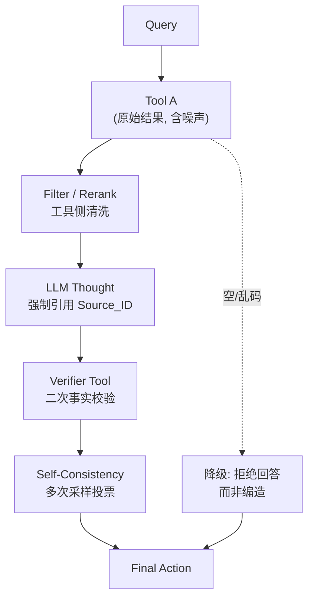

# 如果工具返回噪声很大,ReAct 可能出什么问题?怎么改进

**核心问题**：模型可能将工具返回的噪声（错误信息、幻觉内容、无关干扰）视为事实，导致 Thought 产生误导性推理，进而 Action 调用错误工具或参数，陷入“错误级联”的死循环。

**改进措施与细节**：
1. **工具侧增强**：要求工具输出结构化数据（JSON）而非纯文本，减少解析歧义；对检索类工具增加 Rerank（重排序）环节，过滤低分文档。
2. **模型侧校验**：引入“验证器”步骤，强制 LLM 在 Thought 中引用证据片段，并通过 CoT 生成结论后，再调用一次反向验证工具。
3. **生成策略**：使用 Self-Consistency（多次采样投票）或 Majority Voting，降低单次噪声的影响。
4. **边界情况**：极端情况下，工具返回空列表或非预期的乱码，Agent 必须具备“拒绝回答”或“降级处理”的能力，而不是强行编造。例如，搜索工具无结果时，应直接告知用户未找到信息，而非生成幻觉答案。

**抗噪流程图**：
```text
Query -> Tool A (原始结果)
             |
             v
      [Filter/Rerank]  <-- 工具侧清洗
             |
             v
      LLM Thought (强制引用 Source_ID)
             |
             v
      [Verifier Tool] (二次检查事实性) <-- 校验工具
             |
             v
      Final Action
```

**实战案例**：
在构建企业知识库问答时，向量检索工具经常返回“过时”的文档作为上下文（噪声）。如果直接喂给 LLM，它会自信地回答旧政策。改进方案是：在检索结果中加入 `last_updated` 字段，Prompt 强制要求 LLM 在回答前核对日期，若发现旧数据则主动触发搜索工具，而不是强行编造答案。

**代码示例 (Python)**：
```python
# 引入置信度阈值的工具调用决策
def call_tool_with_threshold(tool, query, confidence_threshold=0.8):
    result = tool.run(query)
    # 假设工具返回包含 relevance_score 的结构化数据
    if result.score < confidence_threshold:
        return "Tool output confidence too low, treating as noise."
    return result.content
```

**对比表格**：
| 策略 | 实现方式 | 抗噪效果 | 性能损耗 |
| :--- | :--- | :--- | :--- |
| **过滤/Rerank** | 工具输出层截断低分内容 | 高 (直接物理隔离) | 低 (重排序耗时) |
| **验证器** | 增加 LLM 校验步骤 | 中 (取决于模型能力) | 高 (多轮推理) |
| **Self-Consistency** | 多次采样投票 | 高 (降低随机噪声) | 极高 (线性增加成本) |

## 常见考点
1. **评估指标**：如何量化工具噪声对 Agent 成功率的影响？
2. **Prompt 技巧**：如何设计 Prompt 让 LLM 自觉识别不可信信息？
3. **边界条件**：如果工具完全返回空或报错，Agent 应该有怎样的 Fallback 机制？

## 面试追问
1. 当工具返回结果置信度中等（例如 0.6）时，直接丢弃可能丢失信息，直接使用可能引入噪声，你会如何设计策略来处理这种模糊地带？（提示：请求用户澄清或引入多个互补工具交叉验证）
2. 在 RAG 场景中，如果检索到的文档内容本身包含事实性错误（知识源噪声），单纯的重排序和 Rerank 并无法解决，Agent 层面如何检测？（提示：利用 LLM 的内部世界知识进行 Cross-Check）
3. 如何平衡验证器的精度与成本？是否所有 Action 都需要经过 Verifier？（提示：基于风险分层，高风险操作如“删除文件”必验，低风险如“总结文本”可选）。

## 易错点
1. **过度依赖 LLM 的抗噪能力**：认为 LLM 可以自动识别并忽略噪声，实际上在提示词工程不足时，LLM 倾向于顺从上下文中的错误信息。
2. **忽略工具异常处理**：仅仅考虑了内容的语义噪声，忽略了工具超时、API 格式报错等非语义噪声对解析逻辑的破坏。


## 核心流程图



## 核心知识点图


## 记忆要点

- 核心问题：模型将噪声视为事实，导致推理误导，陷入错误级联死循环。
- 工具侧：输出结构化 JSON，增加 Rerank 环节过滤低分文档。
- 模型侧：引入验证器，强制引用证据，或使用 Self-Consistency 多次采样投票。
- 边界处理：工具返回空或乱码时，Agent 应拒绝回答或降级处理，避免强行编造。

## 结构化回答

**30 秒电梯演讲：** 核心问题是模型会把噪声当事实，导致 Thought 被误导、Action 调错工具，陷入错误级联死循环。改进分两侧：工具侧输出结构化 JSON、加 Rerank 过滤低分文档；模型侧引入验证器强制引用证据、用 Self-Consistency 多次采样投票降随机噪声。最关键的边界处理是——工具返回空或乱码时 Agent 必须拒绝回答或降级，不能强行编造。

**展开框架：**
1. **核心问题** — 模型顺从上下文错误信息，噪声被视为事实导致错误级联死循环。
2. **工具侧改进** — 结构化输出减少歧义，Rerank 过滤低分文档物理隔离噪声。
3. **模型侧与边界** — 验证器强制引用证据，Self-Consistency 投票；空结果必须拒绝回答而非编造。

**收尾：** 我做企业知识库问答时踩过——向量检索返回过时文档，LLM 自信回答旧政策，加了 last_updated 字段让 LLM 核对日期后才解决。您想深入聊哪块，置信度模糊地带处理还是验证器成本权衡？

## 视频脚本

> 预计时长：2 分钟 | 由浅入深

| 时间 | 画面/字幕 | 口播台词 | 讲解要点 |
|------|----------|----------|----------|
| 0:00 | 标题卡：工具噪声害惨 ReAct | "工具返回噪声，ReAct 会把它当事实，越做越错。" | 开场钩子 |
| 0:15 | 错误级联死循环动画 | "噪声误导 Thought，Action 调错工具，陷入错误级联死循环。" | 核心问题 |
| 0:45 | 工具侧改进流程图 | "工具侧：输出结构化 JSON，加 Rerank 过滤低分文档。" | 工具改进 |
| 1:10 | 模型侧验证器示意 | "模型侧：验证器强制引用证据，Self-Consistency 多次采样投票。" | 模型改进 |
| 1:35 | 旧文档噪声案例 | "实战：检索返回过时文档，加 last_updated 让 LLM 核对日期。" | 实战案例 |
| 1:50 | 抗噪口诀卡 | "记住：工具结构化加 Rerank，模型验证加投票。下期讲空结果。" | 收尾 |

