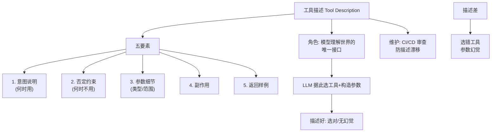

# 为什么说「工具描述」是 Agent 的接口设计

**核心原理**：LLM 无法直接“运行”工具，只能依靠自然语言描述来理解工具的功能、输入输出格式及适用场景。工具描述充当了 API 文档的角色，是 LLM 进行**函数路由**和**参数填充**的唯一依据。

**细节增强**：
1. **路由机制**：LLM 根据 Tool Name 和 Description 计算语义相似度，决定调用哪个工具。描述模糊会导致路由错误。
2. **参数生成**：LLM 依据 Description 中定义的参数类型、约束来生成 JSON 参数。描述不清会导致参数缺失或类型错误。
3. **接口设计规范**：高质量的描述应包含：功能意图、输入参数定义（含类型和示例）、输出结果说明。
4. **边界情况**：当工具数量达到数百甚至上千个时，将所有描述直接塞入 Context Window 会导致显存溢出且极大降低检索准确率。此时工具描述的设计必须配合“向量检索工具描述”的机制，即“工具的元描述”需要足够精准以便被检索到，而“详细参数说明”可以按需加载。

**接口映射图**：
```text
LLM Core (Brain)
   |
   | (1) 读取 Tool Registry
   v
[ Tool A: "搜索天气..." ] <-- 接口定义
[ Tool B: "计算股价..." ]
   |
   | (2) 意图识别与参数生成
   v
Call ToolB(params={...})
```

**实战案例**：
在早期的金融 Agent 开发中，`get_stock_price` 的描述仅为“获取股价”，导致 LLM 在用户问“现在的趋势如何”时错误地调用了该工具，结果只拿到了一个孤立的数字，无法画图。改进方案是将描述优化为“获取指定股票在特定历史日期的收盘价（输入：ticker, date_str）”，明确指出了入参和局限性，并补充了 `get_stock_trend` 工具，从而解决了路由混淆问题。

**代码示例 (Python)**：
```python
# 高质量的工具定义 Schema (OpenAI Function Calling 风格)
tools = [
    {
        "type": "function",
        "function": {
            "name": "calculate_compound_interest",
            "description": "计算复利。适用于评估长期投资收益。本金和年化收益率必须为正数。",
            "parameters": {
                "type": "object",
                "properties": {
                    "principal": {"type": "number", "description": "初始本金金额"},
                    "rate": {"type": "number", "description": "年化收益率 (如 0.05 代表 5%)"},
                    "years": {"type": "integer", "description": "投资年限"}
                },
                "required": ["principal", "rate", "years"]
            }
        }
    }
]
```

**对比表格**：
| 描述质量 | 特征 | LLM 表现 |
| :--- | :--- | :--- |
| **低质量** | 仅名称，含糊不清 (如“查天气”) | 频繁幻觉参数，错误调用 |
| **中质量** | 解释功能，列出参数名 | 能调用，但参数格式容易出错 |
| **高质量** | 包含意图、约束、参数类型、Few-shot 示例 | 路由精准，参数符合 JSON Schema 格式 |

## 常见考点
1. **描述优化**：如何编写 Tool Description 以提高 LLM 的调用准确率（Few-shot 示例的作用）？
2. **Token 消耗**：工具数量很多时，如何降低描述对 Context Window 的占用（如检索工具描述）？
3. **安全边界**：工具描述中如何注入安全约束以防止恶意调用？

## 面试追问
1. 对于参数极其复杂的工具（例如包含 20 个可选参数），写在 Description 里会非常冗长且影响解析，如何优化？（提示：将复杂参数结构单独定义为 Schema，或在 Description 中只列出关键参数，其他由模型根据上下文推断或通过特定对象传递）
2. 如何评估工具描述的质量？除了人工 Review，是否可以通过自动化指标来衡量？（提示：使用 LLM 作为 Judge，测试大量 Query 下模型选择工具的准确率）
3. 如果两个工具的功能高度相似（例如 `search_by_id` 和 `search_by_name`），如何通过 Description 设计让 LLM 能够精准区分，或者支持混合调用？（提示：在描述中明确指出的适用场景和数据源的差异）

## 易错点
1. **过度依赖 Description 而忽视模型理解力**：认为写得越详细越好，实际上过长的 Description 会引入噪声，稀释关键信息的注意力。
2. **忽略参数类型的强约束**：仅在文本中描述参数应“大于0”是不够的，必须配合 JSON Schema 的 `min` 字段才能在底层强制拦截非法参数生成。

## 核心流程图



## 记忆要点

- 工具描述是 LLM 理解功能的唯一依据，充当 API 文档，决定函数路由和参数填充。
- 描述模糊导致路由错误，不清导致参数缺失；高质量描述需含意图、参数定义及示例。
- 工具数量多时，需配合向量检索机制，避免 Context 溢出且降低检索准确率。
- 设计规范：功能意图、输入参数（类型/示例）、输出说明，防止幻觉参数。

## 结构化回答

**30 秒电梯演讲：** 工具描述就是 Agent 的接口设计，因为 LLM 不能直接跑代码，全靠这段自然语言描述来理解功能、决定调哪个工具、参数怎么填——它就是 LLM 的 API 文档。描述模糊会路由错误，不清会参数缺失。高质量描述得有功能意图、参数类型加示例、输出说明。工具数量一多，还得配向量检索机制避免 Context 溢出。

**展开框架：**
1. **核心原理** — LLM 靠描述计算语义相似度做路由，靠参数约束生成 JSON，描述就是唯一接口。
2. **三大设计规范** — 功能意图、输入参数（类型和示例）、输出结果说明，防幻觉参数。
3. **规模化挑战** — 工具数百上千时，元描述要精简便于检索，详细参数按需加载。

**收尾：** 我做金融 Agent 时踩过——get_stock_price 只写"获取股价"，用户问趋势被错误调用只拿到孤立数字，补全描述加 get_stock_trend 工具才解决路由混淆。您想深入聊哪块，复杂参数 Schema 优化还是描述质量自动化评估？

## 视频脚本

> 预计时长：3 分钟 | 由浅入深

| 时间 | 画面/字幕 | 口播台词 | 讲解要点 |
|------|----------|----------|----------|
| 0:00 | 标题卡：工具描述是接口设计 | "工具描述就是 Agent 的 API 文档，写错就全乱套。" | 开场钩子 |
| 0:20 | 路由与参数生成流程图 | "LLM 靠描述计算语义相似度路由，靠参数约束生成 JSON。" | 核心原理 |
| 0:55 | 三大设计规范图 | "功能意图、输入参数类型加示例、输出说明，防幻觉参数。" | 设计规范 |
| 1:30 | 工具爆炸向量检索示意 | "工具数百上千时，元描述精简便于检索，详细参数按需加载。" | 规模化挑战 |
| 2:05 | 金融路由混淆案例 | "实战：get_stock_price 描述太糊，用户问趋势被错调用。" | 实战案例 |
| 2:35 | 接口设计口诀卡 | "记住：描述是 API 文档，意图加参数加示例。下期讲记忆。" | 收尾 |

### 视频流程图


---

## 延伸：工具描述为什么重要

> 合并自 `agf-008`（相似度 68%）

工具描述本质上是 LLM 调用工具的**用户手册**，直接决定了 Agent 的决策准确性和上下文理解能力。

**重要性细节**：
1.  **语义路由基础**：LLM 无法直接运行代码，它完全依赖描述来理解“这个工具是做什么的”以及“什么时候该用它”。模糊的描述会导致选错工具。
2.  **参数指导**：描述中必须明确参数的类型、格式、枚举值和必填项。如果描述不清，LLM 容易产生“参数幻觉”，即构造出工具无法识别的参数（如拼写错误或格式错误）。
3.  **上下文边界**：应告知工具的局限性（如数据范围、时效性），防止 LLM 产生不切实际的预期。

**高质量描述要素**：
*   **一句话摘要**：清晰的功能定义。
*   **输入输出规范**：参数 Schema 定义（JSON Schema），说明输入要求和返回数据结构。
*   **边界条件**：什么情况*不能*用。
*   **Few-shot 示例**：提供 1-2 个典型的调用示例，大幅提升 LLM 的模仿能力。

**实战案例**：
开发天气查询 Agent 时，最初工具描述为“查询天气”，导致模型经常传递城市名中英文混杂（如“BeiJing”）而调用失败。优化为“查询指定城市的实时天气，请务必使用标准英文城市代码作为 city_code 参数（如 beijing, shanghai）”后，解析成功率从 60% 提升至 95%。

**代码示例**：
```python
from pydantic import BaseModel, Field

class WeatherInput(BaseModel):
    city_code: str = Field(description="Standard city code, e.g., 'beijing', 'london'")

tools = [
    Tool(
        name="get_weather",
        description="Get current weather for a specific city using its standard code.",
        func=get_current_weather,
        args_schema=WeatherInput  # 关键：强类型约束 + Description
    )
]
```

**对比表格**：

| 描述质量 | LLM 行为表现 | 典型后果 |
| :--- | :--- | :--- |
| **低质量（模糊）** | 猜测意图，频繁尝试错误参数 | Token 浪费，任务中断 |
| **中质量（规范）** | 能正确路由，参数类型基本正确 | 可用，但缺乏鲁棒性 |
| **高质量（+约束+示例）** | 精确匹配意图，参数格式完全符合预期 | 高成功率高，推理路径短 |

**常见考点**
1.  **中文 vs 英文描述**：对于基座模型（如 GPT-4），英文描述的效果通常优于中文，为什么？（因为训练语料中代码和文档的英文占比更高，对英文指令的遵循能力更强）。
2.  **参数注入攻击**：如果工具描述中包含过多敏感信息或指令，是否存在 Prompt Injection 风险？（存在，恶意用户可能通过注入指令诱导模型调用意外工具）。
3.  **动态描述**：在某些场景下，是否需要根据用户意图动态生成或修改工具描述？（需要，例如在 RAG 中，可以根据检索到的相关文档片段动态调整工具的描述，以引导模型更准确地检索）。

**边界情况**：
1. **工具描述过长**：当工具参数非常多且复杂时，描述加上 Schema 可能消耗数千 Token，甚至超过单次推理限制。此时需要进行描述压缩或分层描述。
2. **工具名称冲突**：如果有多个工具功能相似但名称不同（如 `search_v1` 和 `search_v2`），描述如果没有强调 `v2` 的优势或特定场景，模型可能会随机选择。
3. **Side Effects（副作用）**：描述中若未声明该工具具有“破坏性”或“不可逆”操作（如 DeleteUser），模型可能会在非必要情况下错误调用。

## 面试追问
1. 当工具数量达到几百个时，如何优化 Tool 描述的召回和匹配效率？（例如：引入 Router Agent 或向量化检索）
2. LLM 为什么即使在有 JSON Schema 的情况下，仍然会生成格式错误的参数？如何从工程角度解决？
3. 如何评估一组工具描述的质量？有没有自动化的评估指标？

## 易错点
1. **过度描述**：在描述中堆砌过多业务背景或营销话术，导致 LLM 混淆了“功能边界”与“业务愿景”，产生幻觉调用。
2. **忽视 Enum 约束**：仅在文本描述中说明“只能填 A 或 B”，却未在 Schema 的 `enum` 字段中定义，导致模型尝试填入 C 或 D。

## 记忆要点

- 工具描述是 LLM 的用户手册，直接决定路由准确性与参数格式。
- 必须包含摘要、Schema 规范、边界条件及 Few-shot 示例。
- 模糊描述导致选错工具或参数幻觉，英文描述通常优于中文。
- 注意描述过长消耗 Token，需声明副作用防止误操作。

## 结构化回答

**30 秒电梯演讲：** 工具描述就是 LLM 的用户手册，模型不读代码，全靠这段文字决定调哪个工具、参数怎么填。高质量描述得有四要素：一句话功能摘要、JSON Schema 输入输出规范、边界条件（什么时候不能用）、Few-shot 示例。模糊描述会导致选错工具或参数幻觉，英文描述通常比中文效果好。还要声明副作用，防止误调用破坏性操作。

**展开框架：**
1. **三大作用** — 语义路由基础（选对工具）、参数指导（防幻觉）、上下文边界（告知局限性）。
2. **四要素写法** — 摘要、Schema、边界条件、Few-shot 示例，缺一个就出问题。
3. **工程注意** — 描述太长消耗 Token 要压缩，副作用必须声明，Enum 约束要写进 Schema。

**收尾：** 我做天气查询 Agent 时踩过——描述只写"查询天气"，模型传"BeiJing"中英文混杂全失败，改成"用标准英文城市代码如 beijing"后成功率从 60% 到 95%。您想深入聊哪块，工具数量爆炸的路由还是描述自动化评估？

## 视频脚本

> 预计时长：2 分钟 | 由浅入深

| 时间 | 画面/字幕 | 口播台词 | 讲解要点 |
|------|----------|----------|----------|
| 0:00 | 标题卡：工具描述为啥重要 | "工具描述就是 LLM 的用户手册，写不好模型就乱按按钮。" | 开场钩子 |
| 0:15 | 四要素拆解图 | "摘要、Schema、边界条件、Few-shot 示例，四要素一个不能少。" | 写法要素 |
| 0:45 | 参数幻觉错误演示 | "模糊描述会导致选错工具或参数幻觉，比如中英文混杂传参。" | 常见问题 |
| 1:10 | 副作用声明警示 | "坑：破坏性操作必须声明副作用，否则模型可能误调用。" | 工程注意 |
| 1:35 | 天气查询案例数据 | "实战：描述加标准城市代码示例后，成功率从 60% 到 95%。" | 实战案例 |
| 1:50 | 四要素口诀卡 | "记住：摘要、Schema、边界、示例，英文优于中文。下期讲 Schema。" | 收尾 |
