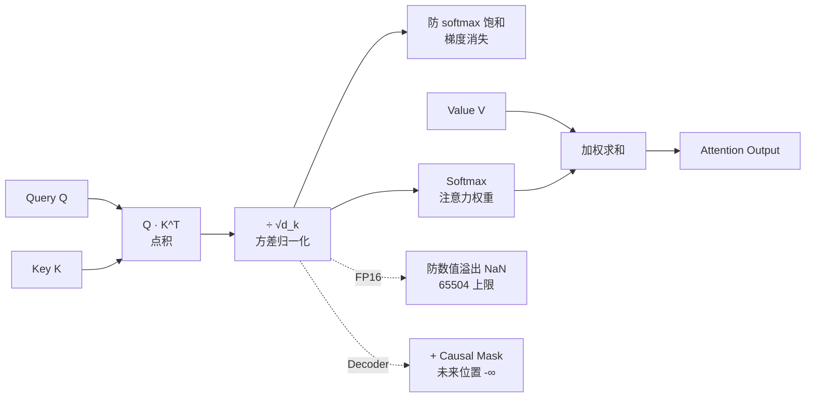

# 写出缩放点积注意力的公式,并解释 (√d_k).

**公式**：
$$ Attention(Q,K,V) = \text{softmax}\left(\frac{QK^T}{\sqrt{d_k}}\right)V $$

**原理细节与边界条件**：
1. **数值稳定性**：当 $d_k$ 很大时，点积 $QK^T$ 的数量级会增大，导致 softmax 输入进入饱和区（梯度极小）。除以 $\sqrt{d_k}$ 将点积的方差控制在 1 左右，保证梯度有效流动。
2. **数学推导**：假设 $q, k$ 的分量均值为 0，方差为 1。点积 $q \cdot k = \sum_{i=1}^{d_k} q_i k_i$，其方差为 $d_k$。标准差为 $\sqrt{d_k}$，故除以此值归一化。
3. **Mask 机制**：在 Decoder 中，计算 Softmax 前需加一个 Mask 矩阵（将未来位置置为 $-\infty$），以保证自回归属性。
4. **边界情况**：
    - **零除风险**：理论上 $d_k \ge 1$，但在某些可变维度实现中需防止维度为0。
    - **极小值处理**：在使用 FP16/BF16 混合精度时，Mask 填充的 $-\infty$ 不能直接取 `float('-inf')`，通常取 `-1e4` 或 `-65504` (FP16 max) 的极小值，否则计算结果直接变为 NaN。

### 实战深化
- **实战案例**：在 BERT 或 GPT 的 FP16 混精度训练中，若忘记添加 $\sqrt{d_k}$ 缩放，点积值往往会超过 65504（FP16 上限），导致计算结果直接变成 NaN，训练立即崩溃。在 FlashAttention 实现中，Softmax 是分块在线计算的，缩放因子直接决定了数值溢出的风险阈值。

- **代码示例**：
```python
import torch
import torch.nn.functional as F

def scaled_dot_product_attention(q, k, v, mask=None):
    # d_k 通常取 q.size(-1)
    d_k = q.size(-1)
    # 关键：除以 sqrt(d_k) 防止梯度消失/数值溢出
    scores = torch.matmul(q, k.transpose(-2, -1)) / (d_k ** 0.5)
    
    if mask is not None:
        # Additive Mask: 将 mask 位置设为极小值，Softmax 后趋近 0
        # 注意：FP16 下避免使用 -1e9，建议使用 -1e4 或 torch.finfo(scores.dtype).min
        scores = scores.masked_fill(mask == 0, -1e9)
    
    attn_weights = F.softmax(scores, dim=-1)
    return torch.matmul(attn_weights, v)
```

## 面试追问
1. **缩放因子的替代方案**：除了 $\sqrt{d_k}$，如果将注意力机制换为 Cosine Similarity，还需要这个缩放因子吗？为什么？
2. **多头注意力中的 $d_k$**：在多头注意力中，$d_k$ 指的是总隐藏层维度，还是每个头的维度？如果头数发生变化，这个缩放因子需要调整吗？
3. **FlashAttention 的数值稳定性**：FlashAttention 在做分块 Softmax 时，是如何处理极大值以保证数值精度的？

## 易错点
1. **维度误解**：错误地认为 $d_k$ 是模型的总维度，实际上它应该是每个注意力头对应的向量维度（即 $d_{model} / h$）。
2. **精度陷阱**：在低精度（FP16）推理中，直接使用 `float('-inf')` 作为 mask 值会导致硬件运算溢出，应使用该精度下的最小可表示数值。

## 常见考点
1. **其他缩放因子**：为什么不用除以 $d_k$ 或 $\sqrt[4]{d_k}$？
2. **FlashAttention**：在具体实现中，该公式是如何优化显存访问的？
3. **数值溢出**：如果不做缩放，在 FP16 下可能发生什么后果？


## 核心流程图



## 核心知识点图


## 记忆要点

- 公式：Attention(Q,K,V) = softmax(QK^T / √d_k)V。
- 作用：除以 √d_k 将点积方差控制在 1，防止 d_k 大时 softmax 进入饱和区导致梯度消失。
- 原理：假设 q,k 分量方差为 1，点积方差为 d_k，标准差为 √d_k，故归一化。
- 注意：FP16 下 Mask 值不能用 -inf，需用 -1e4 等极小值防止溢出 NaN。

## 结构化回答

**30 秒电梯演讲：** 公式是 Attention 等于 softmax 的 QK 转置除以根号 d_k 再乘 V。除以根号 d_k 的原因是数值稳定性——假设 q 和 k 的分量方差都是 1，点积的方差就是 d_k，标准差是根号 d_k，除以它能把方差控制在 1 左右，防止 d_k 大时 softmax 进饱和区导致梯度消失。FP16 下还得注意 Mask 值不能用负无穷，要用 -1e4 这种极小值防 NaN。

**展开框架：**
1. **公式记忆** — softmax QK 转置除根号 d_k 乘 V，d_k 是每个头的维度不是总维度。
2. **根号 d_k 的数学原理** — 点积方差是 d_k，标准差是根号 d_k，归一化后方差为 1。
3. **精度陷阱** — FP16 下不缩放会超 65504 上限变 NaN，Mask 值不能用负无穷。

**收尾：** 我在 BERT 混精度训练时踩过——忘了加缩放因子，点积超 FP16 上限直接 NaN 崩溃。您想深入聊哪块，FlashAttention 的分块 softmax 还是 Cosine Similarity 的替代方案？

## 视频脚本

> 预计时长：2 分钟 | 由浅入深

| 时间 | 画面/字幕 | 口播台词 | 讲解要点 |
|------|----------|----------|----------|
| 0:00 | 标题卡：缩放点积注意力公式 | " Attention 公式里那个根号 d_k 到底为啥要除？" | 开场钩子 |
| 0:15 | 公式逐项拆解图 | "softmax QK 转置除根号 d_k 乘 V，d_k 是每个头的维度。" | 公式拆解 |
| 0:45 | 方差推导动画 | "q k 分量方差 1，点积方差 d_k，除根号 d_k 归一化到 1。" | 数学原理 |
| 1:10 | softmax 饱和区曲线 | "不缩放会进饱和区梯度消失，d_k 越大问题越严重。" | 作用解释 |
| 1:35 | FP16 NaN 翻车案例 | "实战：混精度训练忘加缩放，点积超 65504 直接 NaN 崩溃。" | 实战案例 |
| 1:50 | 公式口诀卡 | "记住：除根号 d_k 控方差，FP16 用 -1e4 防 NaN。下期讲 MHA。" | 收尾 |

