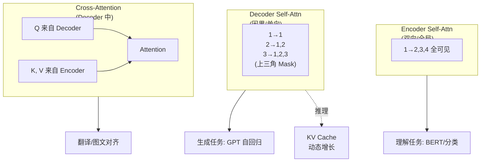
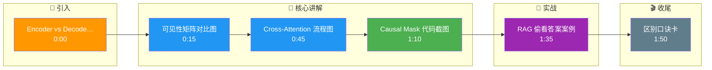

# Encoder 和 Decoder 的自注意力有何不同

**核心区别**：
1. **Encoder Self-Attention**：**双向**。所有 Token 可以互相看见，没有掩码限制。适用于理解上下文全局信息（如 BERT、文本分类）。
2. **Decoder Self-Attention**：**因果**。引入 Upper Triangular Mask（上三角掩码），当前位置只能看见自己和之前的位置。适用于生成任务（如 GPT）。
3. **Cross-Attention**：存在于 Seq2Seq 结构的 Decoder 中。Query 来自 Decoder（当前时刻），Key 和 Value 来自 Encoder（源序列输出）。这使得生成过程能够关注源序列的不同部分。
4. **边界情况**：
    - **KV Cache 维度**：在推理阶段使用 KV Cache 时，Cache 的长度是动态增长的，Decoder 的 Mask 必须能处理 Prompt 阶段（全量计算）和 Decode 阶段（增量计算）的长度差异。
    - **Padding Mask**：在 Batch 训练/推理中，除了 Causal Mask，还必须叠加 Padding Mask，避免模型关注填充符（Pad Token）。

**架构对比图**：
```text
Encoder Self-Attn:      Decoder Self-Attn (Masked):
  1 2 3 4                 1 2 3 4
1 X O O O               1 X - - -  (- 表示Mask)
2 O X O O               2 O X - -
3 O O X O               3 O O X -
4 O O O X               4 O O O X

Cross-Attn (in Decoder):
  (Decoder Q)  x  (Encoder K, V)
```

### 实战深化
- **实战案例**：在实现 RAG（检索增强生成）时，如果直接将检索到的文档拼接到 Prompt 中使用双向 Encoder 处理，会破坏生成模型的自回归属性；必须使用 Cross-Attention（或在 Decode 阶段拼接 KV Cache）才能让生成的 Token 正确关注外部知识库内容而不“偷看”答案。

- **代码示例**：
```python
import torch

def generate_causal_mask(seq_len, device):
    # 生成上三角掩码，1表示可见，0表示被mask
    # 或者: 1表示有效，-inf在attention中处理
    mask = torch.tril(torch.ones(seq_len, seq_len, device=device))
    return mask  # shape: [seq_len, seq_len]

# 在多头注意力中的应用示意
# def forward(self, x):
#     B, T, C = x.shape
# # ... (qkv proj) ...
#     att = (q @ k.transpose(-2, -1)) * self.scale
#     att = att.masked_fill(self.mask[:T, :T] == 0, float('-inf')) # 关键应用
#     att = F.softmax(att, dim=-1)
```

- **对比表格**：

| 特性 | Encoder Self-Attention | Decoder Self-Attention | Cross-Attention |
| :--- | :--- | :--- | :--- |
| **可见性** | 全局可见（双向） | 仅历史可见（单向/因果） | Q可见K,V的全部内容 |
| **掩码机制** | 无需 Mask | 上三角 Mask（Causal Mask） | 视任务定（通常无 Mask） |
| **典型用途** | 特征提取、理解任务 | 文本生成、LLM 推理 | 机器翻译、图文对齐 |
| **推理模式** | 并行处理整个序列 | 串行自回归生成 | 依赖 Decoder 当前状态 |

## 面试追问
1. **Prefix-LM 实现细节**：Prefix-LM（如 GLM）在 Prefix 部分使用双向 Attention，而在生成部分使用单向 Attention。这种混合机制是如何在一个 Attention 矩阵中高效实现的？
2. **Cross-Attention 的 Mask**：在机器翻译任务中，如果 Encoder 输出包含填充符，Cross-Attention 需要加 Mask 吗？如果需要，应该如何加？
3. **KV Cache 下的 Mask**：在自回归推理且使用 KV Cache 时，Attention Score 矩阵的维度通常是 $1 \times L_{cache}$，此时 Causal Mask 是否还需要计算？

## 易错点
1. **Padding 忽略**：在实际 Batch 推理中，容易只关注 Causal Mask 而忽略针对 Pad Token 的 Attention Mask，导致模型关注无效信息。
2. **Cross-Attention 误区**：误以为 Cross-Attention 也像 Decoder Self-Attention 一样需要 Mask，实际上 Cross-Attention 中的 Query 来自当前时刻，但 Key/Value 通常来自 Encoder 的完整上下文，不需要遮挡未来信息。

## 常见考点
1. **Prefix-LM**：有些模型（如 GLM）如何结合两者优势？
2. **KV Cache**：在推理时，Causal Mask 对 KV Cache 的构建有何影响？
3. **掩码实现**：如何在代码中高效实现 Causal Mask（如 Additive Mask vs Multiplicative Mask）？

## 核心流程图



## 记忆要点

- Encoder 自注意力是双向的，全局可见，无掩码；Decoder 自注意力是因果的，仅见历史。
- Decoder 使用上三角 Mask 保证自回归属性；Encoder 用于理解，Decoder 用于生成。
- Cross-Attention 存在于 Decoder 中，Q 来自 Decoder，K/V 来自 Encoder，关注源序列。
- 注意：Batch 推理时需叠加 Padding Mask，避免模型关注填充符。

## 结构化回答

**30 秒电梯演讲：** 核心区别在可见性。Encoder 自注意力是双向的，所有 Token 互相可见没有掩码，适合理解任务；Decoder 自注意力是因果的，用上三角 Mask 保证当前位置只能看历史，适合自回归生成。另外 Seq2Seq 的 Decoder 里还有 Cross-Attention，Q 来自 Decoder 当前状态，K/V 来自 Encoder 源序列。Batch 推理时还得叠加 Padding Mask 防关注填充符。

**展开框架：**
1. **Encoder 双向 vs Decoder 因果** — Encoder 全局可见无掩码，Decoder 上三角 Mask 仅见历史。
2. **Cross-Attention 机制** — Q 来自 Decoder，K/V 来自 Encoder，让生成关注源序列，通常无 Mask。
3. **工程细节** — KV Cache 下 Mask 处理动态长度，Batch 推理叠加 Padding Mask。

**收尾：** 我做 RAG 时踩过——直接把检索文档拼 Prompt 用双向 Encoder 会破坏自回归属性，必须用 Cross-Attention 或 Decode 阶段拼 KV Cache。您想深入聊哪块，Prefix-LM 混合机制还是 KV Cache 下的 Mask？

## 视频脚本

> 预计时长：2 分钟 | 由浅入深

| 时间 | 画面/字幕 | 口播台词 | 讲解要点 |
|------|----------|----------|----------|
| 0:00 | 标题卡：Encoder vs Decoder 自注意力 | "同样是自注意力，Encoder 和 Decoder 差在哪？" | 开场钩子 |
| 0:15 | 可见性矩阵对比图 | "Encoder 双向全局可见，Decoder 因果仅见历史加上三角 Mask。" | 核心区别 |
| 0:45 | Cross-Attention 流程图 | "Seq2Seq 的 Decoder 有 Cross-Attention，Q 来自 Decoder，K/V 来自 Encoder。" | Cross 机制 |
| 1:10 | Causal Mask 代码截图 | "用 torch.tril 生成下三角矩阵，masked_fill 掉上三角防偷看未来。" | 掩码实现 |
| 1:35 | RAG 偷看答案案例 | "实战：双向 Encoder 拼检索文档会破坏自回归，要用 Cross-Attention。" | 实战案例 |
| 1:50 | 区别口诀卡 | "记住：Encoder 双向理解，Decoder 因果生成。下期讲 MHA。" | 收尾 |

### 视频流程图




