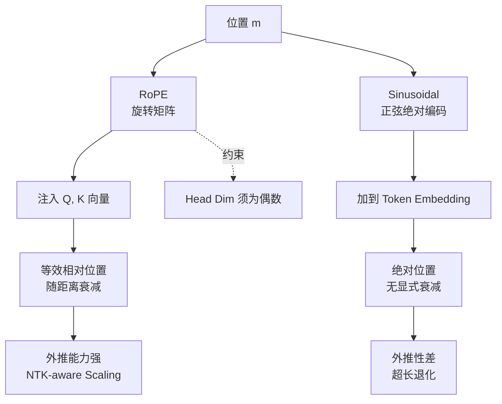
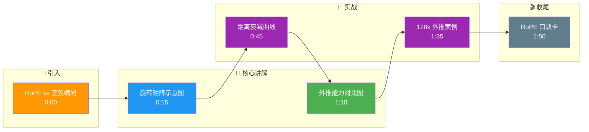

# RoPE 与正弦绝对位置编码各有什么特点

**RoPE (Rotary Positional Embedding)**：
1. **原理**：通过绝对位置的旋转矩阵将位置信息注入到 Query 和 Key 的向量中，但计算 Attention 时等效于相对位置编码。$f(x, m) \cdot f(x, n)^T = g(x, m-n)$。
2. **特点**：具有**相对位置敏感性**，随距离增加衰减；支持**外推**（通过 NTK-aware scaling 等技巧可训练更长的上下文）；无需额外的参数矩阵。是现代 LLM（如 LLaMA, PaLM）的主流选择。

**正弦位置编码**：
1. **原理**：使用固定频率的正弦和余弦函数对不同维度进行编码。
2. **特点**：**绝对位置编码**，理论上允许模型通过线性组合学习相对位置；但外推性较差，训练长度以外的位置性能下降明显。

3. **边界情况**：
    - **维度对齐**：RoPE 要求 Head Dimension 必须是偶数，否则无法进行两两配对的旋转操作。如果 Head Dim 是奇数，通常需要 padding 或截断。
    - **频率截断**：在长文本外推时，如果不使用 NTK Scaling，RoPE 的高频分量会快速震荡，导致注意力分数在远处位置趋于混乱。

### 实战深化
- **实战案例**：在做 Long Context 微调时，直接将原本训练在 2k 长度的 LLaMA 模型推理 128k 长度，效果会断崖下跌（注意力分数集中到最近 few tokens）。通过引入 NTK-aware RoPE scaling（调整 base frequency），可以在不重新训练全量参数的情况下，实现近乎无损的长文本外推。

- **代码示例**：
```python
import torch

def rotate_half(x):
    # RoPE 旋转操作: 将向量 x 分为两半，分别做 sin/cos 变换
    x1, x2 = x[..., :x.shape[-1]//2], x[..., x.shape[-1]//2:]
    return torch.cat((-x2, x1), dim=-1)

def apply_rotary_pos_emb(q, k, cos, sin):
    # q, k: [batch, seq_len, heads, head_dim]
    # cos, sin: [seq_len, head_dim] (广播)
    q_embed = (q * cos) + (rotate_half(q) * sin)
    k_embed = (k * cos) + (rotate_half(k) * sin)
    return q_embed, k_embed
```

- **对比表格**：

| 特性 | RoPE (旋转位置编码) | Sinusoidal (正弦位置编码) |
| :--- | :--- | :--- |
| **编码类型** | 相对位置（通过绝对位置变换实现） | 绝对位置 |
| **计算方式** | 向量旋转（几何乘法） | 向量加法（可加性） |
| **外推能力** | 较强（可配合动态 NTK Scaling） | 较差（超出训练长度严重退化） |
| **距离衰减** | 天然具备（随相对距离增加注意衰减） | 无显式衰减机制 |
| **主流应用** | LLaMA, PaLM, Mistral 等 LLM | 原始 Transformer, BERT (需学习位置) |

## 面试追问
1. **部分 RoPE (Partial RoPE)**：如果只对 Q 和 K 的一部分维度应用 RoPE，保留一部分维度作为全局注意力，会有什么效果？这种设计在多模态模型中常见吗？
2. **长序列的频率衰减**：在超长序列（如 1M token）下，RoPE 的高频部分可能无法区分远处的 Token，有哪些改进方案（如 YaRN 等）？
3. **位置编码插值**：为什么对 RoPE 进行线性插值往往不如 NTK Scaling 效果好？

## 易错点
1. **仅旋转 Q 或 K**：RoPE 必须同时应用于 Query 和 Key，如果只应用一边，相对位置信息将无法在点积中正确约去，导致位置编码失效。
2. **维度奇偶性**：在自定义模型架构时，若将 Head Dim 设为奇数（如 41, 63），直接应用 RoPE 会导致切片错误或维度不匹配，必须保证 Head Dim 为偶数。

## 常见考点
1. **长文本外推**：RoPE 在处理超长文本时常见的扩展方法有哪些？
2. **ALiBi**：对比 RoPE，ALiBi 的核心优势是什么？
3. **多模态扩展**：RoPE 如何应用到非序列数据（如 Vision Transformer）中？

## 核心流程图



## 记忆要点

- RoPE 通过旋转注入位置信息，计算时等效相对位置编码，随距离衰减，支持外推。
- 正弦编码是绝对位置编码，理论可学习相对位置，但外推性差，长文本性能下降。
- RoPE 是现代 LLM 主流（LLaMA 等），无需额外参数；正弦用于原始 Transformer。
- 注意：RoPE 要求 Head Dim 为偶数，且必须同时应用于 Q 和 K。

## 结构化回答

**30 秒电梯演讲：** RoPE 是旋转位置编码，通过对 Q 和 K 做绝对位置的旋转变换，在 Attention 点积时等效于相对位置编码，天然随距离衰减，还支持外推，是 LLaMA 这些现代 LLM 的主流选择。正弦编码是绝对位置编码，加到向量上，外推性差超训练长度就严重退化，主要用于原始 Transformer。两个坑要记：RoPE 必须同时应用于 Q 和 K，Head Dim 必须是偶数。

**展开框架：**
1. **RoPE 原理与优势** — 旋转注入位置，点积等效相对位置，随距离衰减，无需额外参数。
2. **正弦编码局限** — 绝对位置加法编码，外推差，长文本性能断崖下降。
3. **工程红线** — Q 和 K 必须同时旋转，Head Dim 必须偶数，长文本要配 NTK Scaling。

**收尾：** 我做 Long Context 微调时踩过——2k 训练的 LLaMA 直接推 128k 效果断崖，加了 NTK-aware RoPE Scaling 调 base frequency 才近乎无损外推。您想深入聊哪块，YaRN 长文本扩展还是部分 RoPE 多模态应用？

## 视频脚本

> 预计时长：2 分钟 | 由浅入深

| 时间 | 画面/字幕 | 口播台词 | 讲解要点 |
|------|----------|----------|----------|
| 0:00 | 标题卡：RoPE vs 正弦编码 | "RoPE 和正弦位置编码，现代 LLM 为啥都选 RoPE？" | 开场钩子 |
| 0:15 | 旋转矩阵示意图 | "RoPE 对 Q 和 K 做旋转，点积时等效相对位置编码。" | RoPE 原理 |
| 0:45 | 距离衰减曲线 | "RoPE 天然随距离衰减，正弦编码无显式衰减机制。" | 特性对比 |
| 1:10 | 外推能力对比图 | "RoPE 配 NTK Scaling 能外推，正弦超训练长度断崖下降。" | 外推能力 |
| 1:35 | 128k 外推案例 | "实战：2k 训练的 LLaMA 加 NTK Scaling 后近乎无损推 128k。" | 实战案例 |
| 1:50 | RoPE 口诀卡 | "记住：旋转等效相对位置，Q K 同时转，Head Dim 偶数。下期讲 MHA。" | 收尾 |

### 视频流程图




