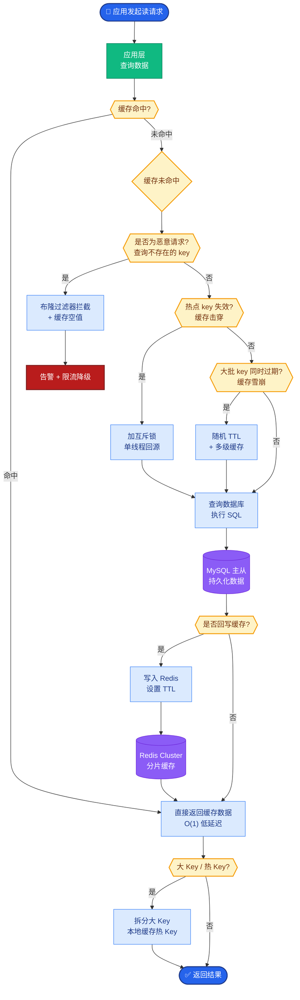

# Prefill 和 Decode 阶段特点

大模型推理分为 Prefill（预填充/编码）和 Decode（解码/生成）两个截然不同的阶段，其计算模式、访存特征和性能瓶颈完全不同。

**1. Prefill 阶段**
- **特点**：处理用户输入的 Prompt。
- **计算模式**：高度并行。输入的所有 Token 同时参与 Self-Attention 计算，利用 GPU 的大规模并行计算能力。
- **性能瓶颈**：受限于**算力**。因为计算密度高，GPU 利用率通常很高，延迟主要取决于 Prompt 长度和模型层数。

**2. Decode 阶段**
- **特点**：自回归生成，一次生成一个 Token。
- **计算模式**：串行生成。每生成一个新 Token，都需要将其与之前的所有历史 Key/Value 进行 Attention 计算。
- **性能瓶颈**：受限于**显存带宽**。每一层的计算量很小（单次矩阵向量乘），但需要加载巨大的 KV Cache（所有历史 Token 的 K, V 矩阵）。计算单元往往在等待数据搬运，导致“访存受限”。

3. **边界情况**：
    - **空 Prompt / 非常短的 Prompt**：如果 Prompt 极短（如 1 个 token），Prefill 阶段极快，但会导致 KV Cache 初始为空或极小，第一个 Decode 步骤的访存压力极小，整体瓶颈可能迅速转移到网络传输或 Python 开销上。
    - **Prompt 长度超限**：如果 Prompt 长度超过模型训练最大长度（Context Window），RoPE 等位置编码可能失效，或者触发截断逻辑，导致模型输出乱码或拒绝回答。

```text
推理生命周期

Prefill 阶段 (计算密集)          Decode 阶段 (访存密集)
+-----------------------+       +-----------------------+
| Prompt: [A, B, C]     |       | History: [A, B, C, D] |
|                       |       |                       |
|  A -> Attn(B,C)       |       |  D -> Attn(A..C)      |
|  B -> Attn(A,C)       |       |  结果 -> Token E      |
|  C -> Attn(A,B)       |       |           |           |
|  (并行计算)           |       |           v           |
|           |           |       |  Update KV Cache      |
|           v           |       |           |           |
|  生成首个 Token D     |       |           +---> Loop  |
+-----------------------+       +-----------------------+
```

**KV Cache 的影响**：
- Decode 阶段复用 Prefill 阶段计算并存储的 Key 和 Value 向量，避免每步重复计算历史 Token。
- KV Cache 占用大量显存，限制了 Batch Size 和最大上下文长度。
- 随着 Sequence Length 增加，Attention 的计算复杂度为 $O(N^2)$，但在 Decode 中主要是读取 Cache，带宽压力与 $N$ 成正比。

### 实战深化
- **实战案例**：在使用 vLLM 部署服务时，如果用户的 Prompt 非常长（如 32k），Prefill 阶段会耗时几秒导致首字延迟（TTFT）很高，容易触发客户端超时；而在 Decode 阶段，由于带宽瓶颈，即使 GPU 算力利用率只有 30%，吞吐量也无法提升。此时如果使用了 Speculative Decoding（投机采样），可以显著减少 Decode 的步数，从而缓解带宽压力。

- **代码示例**：
```python
# 伪代码：展示 Prefill 和 Decode 的 KV Cache 处理差异

kv_cache = {'k': [], 'v': []} 

def prefill_stage(model, prompt_tokens):
    # 输入是整个 prompt
    logits = model(prompt_tokens)
    # Prefill 结束后，通常一次性获取并缓存所有 K, V
    # kv_cache['k'] = all_keys_from_layers  
    return logits

def decode_stage(model, next_token):
    # Decode 输入只有一个 token
    # 关键：传入 kv_cache，模型只计算当前 token 的 Q, K, V
    # Q * K_cache.T / sqrt(d) -> Attn -> V_cache
    # 新的 K, V 拼接到 kv_cache 中
    pass
```

## 面试追问
1. **Continuous Batching**：在处理多个并发请求时，如何通过 Continuous Batching（或 Iterative Batching）技术来解决一个请求长 Prompt 导致其他短请求被阻塞的问题？
2. **算力与带宽的权衡**：如果将模型量化到 4-bit（如 GPTQ/AWQ），显存占用减小了，这对 Decode 阶段的带宽瓶颈是缓解了还是加剧了？为什么？
3. **KV Cache 压缩**：有哪些技术可以压缩 KV Cache（如 PageAttention、Multi-Query Attention）？它们分别主要解决什么问题（显存容量 vs 显存带宽）？

## 易错点
1. **复杂度混淆**：常说 Attention 是 $O(N^2)$，但这主要指 Prefill 阶段或单步计算。对于 Decode 阶段的生成全过程，计算总量是 $O(N^2)$，但单步时间复杂度是 $O(N)$（对历史序列线性扫描），容易混为一谈。
2. **KV Cache 的位置**：误以为 KV Cache 存储的是模型的中间激活值，实际上只存储每一层 Attention 模块计算出的 Key 和 Value 矩阵。

## 常见考点
1. **FlashAttention**：FlashAttention 是如何同时优化 Prefill 的速度和显存占用的？
2. **PagedAttention**：vLLM 的核心 PagedAttention 机制是如何解决显存碎片化问题的？
3. **Speculative Decoding**：投机采样在 Prefill 和 Decode 阶段分别如何工作？它主要优化哪个指标？


## 核心流程图



## 记忆要点

- Prefill 阶段：处理 Prompt，高度并行，计算密集，瓶颈在算力，决定了首字延迟。
- Decode 阶段：自回归生成，串行计算，访存密集，瓶颈在显存带宽（加载 KV Cache）。
- KV Cache 复用历史 K/V 避免重复计算，但占用大量显存，限制了 Batch Size。
- Prompt 极长时 Prefill 耗时；Prompt 极短时瓶颈可能在网络或 Python 开销。

## 结构化回答

**30 秒电梯演讲：** 大模型推理分两阶段。Prefill 处理 Prompt，所有 Token 并行做 Self-Attention，计算密集型，瓶颈在算力，决定首字延迟。Decode 自回归一次生成一个 Token，每步要加载所有历史 KV Cache 做 Attention，访存密集型，瓶颈在显存带宽，GPU 利用率往往很低。KV Cache 复用历史 K/V 避免重复计算，但占大量显存限制 Batch Size。

**展开框架：**
1. **Prefill 算力密集** — Prompt 并行计算，GPU 利用率高，延迟取决于 Prompt 长度和层数。
2. **Decode 访存密集** — 串行生成单 Token，每步加载巨大 KV Cache，计算单元等数据搬运。
3. **KV Cache 双刃剑** — 复用历史避免重算，但占显存限制 Batch Size，长序列带宽压力线性增长。

**收尾：** 我用 vLLM 部署时深有体会——32k 的 Prompt Prefill 要几秒触发超时，Decode 阶段 GPU 利用率才 30%，上 Speculative Decoding 减少步数才缓解带宽压力。您想深入聊哪块，Continuous Batching 还是 PagedAttention？

## 视频脚本

> 预计时长：2 分钟 | 由浅入深

| 时间 | 画面/字幕 | 口播台词 | 讲解要点 |
|------|----------|----------|----------|
| 0:00 | 标题卡：Prefill 和 Decode 特点 | "大模型推理两阶段，一个吃算力一个吃带宽。" | 开场钩子 |
| 0:15 | 两阶段流程图 | "Prefill 并行处理 Prompt 计算密集，Decode 串行生成访存密集。" | 核心区别 |
| 0:45 | Prefill 算力瓶颈曲线 | "Prefill 瓶颈在算力，GPU 利用率高，决定首字延迟。" | Prefill 特点 |
| 1:10 | Decode 带宽瓶颈示意 | "Decode 每步加载全量 KV Cache，计算单元等数据搬运。" | Decode 特点 |
| 1:35 | vLLM 部署案例 | "实战：32k Prompt Prefill 几秒触发超时，Decode GPU 利用率才 30%。" | 实战案例 |
| 1:50 | 两阶段口诀卡 | "记住：Prefill 吃算力，Decode 吃带宽，KV Cache 是双刃剑。下期讲 MHA。" | 收尾 |

