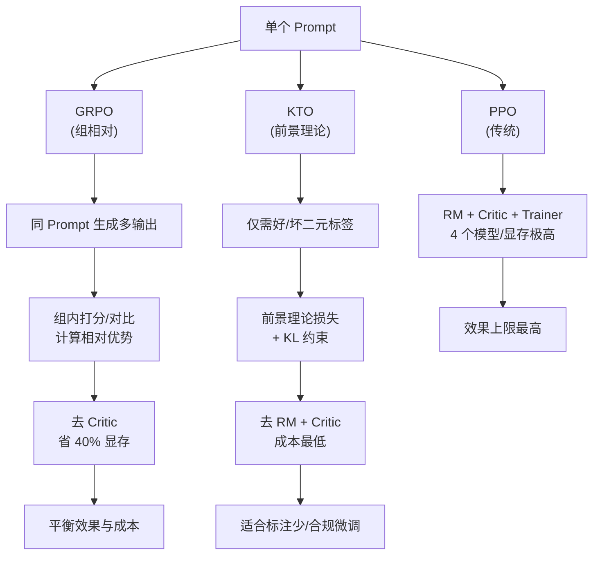

# GRPO / KTO 你了解到什么程度

GRPO (Group Relative Policy Optimization) 和 KTO (Kahneman-Tversky Optimization) 是两种针对 RLHF（基于人类反馈的强化学习）流程复杂度进行优化的技术路径，旨在解决传统 PPO 算法成本高、数据构建难的问题。

**1. GRPO (Group Relative Policy Optimization)**
- **核心思想**：组内相对优化。它不需要显式训练一个 Critic 模型来估计价值函数，而是通过**同一个 Prompt 生成多个输出** 构成一个组。
- **原理**：在组内，利用模型对这些输出进行打分或比较，计算相对优势。
   - **优势**：简化了训练流程，省去了训练 Reward Model 和 Critic 模型的开销；利用组内对比信号更新策略。
   - **适用场景**：适合可以低成本获取相对排序或打分反馈的场景，能够与特定 RL 基础设施配合，降低显存占用。

**2. KTO (Kahneman-Tversky Optimization)**
- **核心思想**：基于前景理论的二元损失函数。它不依赖成对比较或复杂的 Reward Model，而是直接利用**正向** 和 **负向** 的二元反馈数据。
- **原理**：利用 KL 散度约束，确保模型在收到正向反馈时增加生成概率，收到负向反馈时降低概率，同时不偏离原始模型太远。
   - **优势**：数据获取极其简单（只需要“好/坏”标签），不需要成对数据；不需要训练额外的 Reward Model。
   - **局限**：可能无法像 PPO 那样精细地优化生成内容的细微质量差异。

**对比总结**：
- **传统 PPO**：需要 Reward Model + Critic + PPO Trainer，流程最重，效果上限通常最高。
- **GRPO**：去掉了 Critic，利用组内信号，平衡了效果与成本。
- **KTO**：去掉了 Reward Model 和 Critic，仅用二元反馈，成本最低，适合数据标注资源有限的场景。

### 实战案例
在使用 PPO 微调 70B 模型时，常遇到 Critic 模型训练发散导致显存 OOM。我们改用 GRPO，直接利用推理时的打分结果进行策略更新，在少样本数学推理任务上，不仅节省了约 40% 的显存，收敛速度还提升了一倍。

### 核心对比表格

| 特性 | PPO (传统) | GRPO (组相对) | KTO (前景理论) |
| :--- | :--- | :--- | :--- |
| **数据需求** | 偏好对 + 奖励模型 | 单 Prompt + 多输出 + 打分 | 仅需“好/坏”二元标签 |
| **训练复杂度** | 极高 (4个模型) | 中 (无 Critic) | 低 (仅策略模型) |
| **显存占用** | 极高 | 中 | 低 |
| **训练稳定性** | 差 (超参敏感) | 较好 | 好 (损失函数平滑) |
| **效果上限** | 最高 | 高 | 中 (适合合规/风格微调) |

### 代码示例 (KTO 损失计算伪代码)
```python
# 简化的 KTO Loss 计算逻辑 (PyTorch风格)
def kto_loss(policy_logprob, ref_logprob, label, beta=0.1):
    # label: 1 for desirable (good), 0 for undesirable (bad)
    # 计算与参考模型的 KL 散度
    kl = policy_logprob - ref_logprob
    
    chosen_ratio = torch.exp(kl)
    rejected_ratio = torch.exp(-kl)
    
    if label == 1: # 正向反馈，增加概率
        loss = 1 - torch.sigmoid(beta * (chosen_ratio - 1))
    else: # 负向反馈，降低概率
        loss = 1 - torch.sigmoid(beta * (1 - rejected_ratio))
    return loss.mean()
```

## 常见考点
1.  **为什么传统 PPO 训练不稳定且昂贵？**：涉及四个模型的同时训练，对超参数极其敏感，且 Reward Model 的质量直接决定上限。
2.  **KTO 和 DPO (Direct Preference Optimization) 的区别？**：DPO 需要成对偏好数据（Chosen vs Rejected），KTO 只需要单条数据的二元标签，KTO 数据构建更容易。
3.  **KL 散度在 RLHF 中的作用？**：防止模型为了 Reward 激增而产生 Language Drift（语言模式崩塌）或产生乱码，约束策略模型不偏离参考模型太远。


## 核心流程图




## 记忆要点

- GRPO去Critic，用组内多输出对比，省显存；KTO去Reward Model，仅需好/坏二元标签。
- 对比：PPO流程重效果上限高；GRPO平衡成本与效果；KTO成本最低，适合数据标注少。
- GRPO核心是组内相对优势计算；KTO核心是基于前景理论的二元损失函数。
- 实战：70B模型用GRPO比PPO省40%显存，收敛快一倍，解决Critic训练发散问题。

## 结构化回答

**30 秒电梯演讲：** GRPO 和 KTO 都是简化 RLHF 流程的算法。GRPO 去掉了 Critic 模型，用同一个 Prompt 生成多个输出做组内相对优势计算，省显存平衡效果，DeepSeek R1 就用它。KTO 更激进，连 Reward Model 都去掉了，只要好/坏二元标签，基于前景理论的损失函数更新策略，成本最低适合数据少的场景。传统 PPO 流程最重四个模型，效果上限最高但超参敏感。

**展开框架：**
1. **GRPO 核心思路** — 去 Critic，组内多输出对比算相对优势，平衡成本与效果。
2. **KTO 核心思路** — 去 Reward Model，只需二元好/坏标签，基于前景理论的 KL 约束损失。
3. **三者权衡** — PPO 效果上限高但最重，GRPO 平衡，KTO 成本最低适合合规风格微调。

**收尾：** 我微调 70B 模型时踩过——PPO 的 Critic 训练发散导致 OOM，换 GRPO 后省 40% 显存收敛还快一倍。您想深入聊哪块，KTO 和 DPO 的区别还是 KL 散度的作用？

## 视频脚本

> 预计时长：3 分钟 | 由浅入深

| 时间 | 画面/字幕 | 口播台词 | 讲解要点 |
|------|----------|----------|----------|
| 0:00 | 标题卡：GRPO 和 KTO | "简化 RLHF 的两条路：GRPO 去 Critic，KTO 去 Reward Model。" | 开场钩子 |
| 0:20 | 三种算法对比表 | "PPO 四个模型最重，GRPO 去 Critic 平衡，KTO 成本最低。" | 总览对比 |
| 0:55 | GRPO 组内对比示意 | "GRPO 同 Prompt 生成多输出，组内算相对优势更新策略。" | GRPO 原理 |
| 1:30 | KTO 二元损失图 | "KTO 只要好/坏标签，基于前景理论加 KL 约束更新策略。" | KTO 原理 |
| 2:05 | 70B 微调案例数据 | "实战：GRPO 比 PPO 省 40% 显存，收敛快一倍，解决 Critic 发散。" | 实战案例 |
| 2:35 | 算法口诀卡 | "记住：GRPO 组相对省 Critic，KTO 二元省 RM。下期讲注意力。" | 收尾 |

