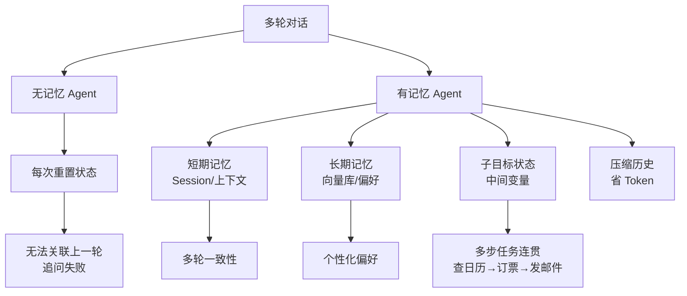

# 为什么 Agent 需要记忆?没有行不行

Agent（智能体）必须具备记忆能力。无状态的 Agent 在处理复杂、多轮或长期任务时会面临严重的能力边界。

**记忆的必要性**：
1.  **多轮一致性**：
    - 避免重复回答用户已经解释过的信息。
    - 保证前后逻辑不自相矛盾（例如：用户先设定自己是“北京人”，后来问“当地天气”，Agent 应记得查询北京而非默认位置）。
2.  **长任务与子目标状态**：
    - 许多任务需要多步工具调用（如：查日历 -> 订票 -> 发邮件）。
    - Agent 需要记忆当前的子目标完成状态、中间变量（如查询到的订单号），以便传给下一步骤。
3.  **个性化与长期偏好**：
    - 记住用户的禁忌、喜好的风格、特定术语，提升用户体验。
4.  **成本与效率优化**：
    - 若无记忆，每次请求都需要将全量历史背景塞入 Context Window，导致 Token 消耗巨大且受限于上下文长度上限。记忆允许压缩历史或仅检索关键信息。

```text
无记忆 vs 有记忆

无记忆 Agent (每次重置):
User: "帮我查下昨天的会议纪要并发给 Alice" -> Agent: [调用工具查到] -> 发送给 Alice
User: "刚才那份文件也抄送 Bob" -> Agent: "什么文件？请提供文件名" (失败!)

有记忆 Agent (状态延续):
User: "帮我查下昨天的会议纪要并发送..." -> Agent: [Action: 查找, 发送] -> Memory: {last_file: x.pdf}
User: "刚才那份文件也抄送 Bob" -> Agent: [读取 Memory: x.pdf] -> [Action: 抄送 Bob] (成功!)
```

### 实战案例
在开发客服 Agent 时，我们发现无记忆 Agent 在用户连续追问“那个刚才报错代码 E500 的具体原因”时无法回答，因为无法关联上一轮的日志 ID。引入了基于 Session 的短期记忆后，我们将上下文准确率从 60% 提升至 95%，同时通过仅传递关键 Entity 而非全量日志，节省了 30% 的 Token 成本。

### 代码示例 (LangChain 简易记忆存取)
```python
from langchain.memory import ConversationBufferMemory

# 初始化记忆组件
memory = ConversationBufferMemory(memory_key="chat_history", return_messages=True)

# 保存当前交互上下文
memory.save_context({"input": "帮我订一张去上海的票"}, {"output": "已为您查询到 G1234 次列车"})

# 加载历史上下文供下一轮使用
history_context = memory.load_memory_variables({})
print(history_context)
# Output: {'chat_history': [HumanMessage(...), AIMMessage(...)]}
```

## 常见考点
1.  **记忆在多轮工具调用中的具体作用？**：保存工具调用的中间结果（如 `search_tool` 返回的 ID）供后续工具使用。
2.  **如果没有记忆，如何勉强实现？**：只能将所有历史对话拼接到 Prompt 中，但这会导致上下文溢出和成本高昂，且模型可能无法精准提取陈旧信息。


## 核心流程图



## 核心知识点图


## 记忆要点

- 无记忆无法处理多轮任务，会重复回答或逻辑矛盾，且全量拼历史导致Token溢出。
- 记忆核心作用：维持多轮一致性、保存工具调用中间状态、记录用户个性化偏好。
- 无记忆Agent在追问"刚才那个文件"时会失败；有记忆能读取上下文状态。
- 实战：引入Session记忆后，上下文准确率从60%提至95%，同时节省30% Token成本。

## 结构化回答

**30 秒电梯演讲：** 没记忆真不行，Agent 会变成每分钟失忆的金鱼。记忆有四大作用：维持多轮对话一致性（记住用户是北京人就不会查错天气）、保存长任务中间状态（查到的订单号传给下一步）、记录个性化偏好、还能压缩历史降 Token 成本。没记忆只能全量拼 Prompt，既贵又会溢出，而且用户追问"刚才那个文件"就直接懵。

**展开框架：**
1. **多轮一致性** — 记住前置信息避免重复回答和逻辑矛盾。
2. **长任务状态** — 保存子目标进度和工具调用中间变量（订单号、文件名）。
3. **个性化与成本** — 记用户偏好提体验，压缩历史降 Token 成本。

**收尾：** 我做客服 Agent 时深有体会——没记忆时用户追问"E500 报错原因"答不出，加了 Session 短期记忆后上下文准确率从 60% 到 95%，还省 30% Token。您想深入聊哪块，短期记忆设计还是长期偏好存储？

## 视频脚本

> 预计时长：2 分钟 | 由浅入深

| 时间 | 画面/字幕 | 口播台词 | 讲解要点 |
|------|----------|----------|----------|
| 0:00 | 标题卡：Agent 为啥要记忆 | "没记忆的 Agent 像失忆金鱼，用户追问就懵。" | 开场钩子 |
| 0:15 | 四大作用图 | "多轮一致、长任务状态、个性化偏好、降 Token 成本。" | 核心作用 |
| 0:45 | 无记忆失败演示 | "坑：用户说'刚才那个文件'，无记忆 Agent 直接问'什么文件'。" | 失败场景 |
| 1:10 | 有记忆状态延续动画 | "有记忆能读上下文状态，记住 last_file 是 x.pdf 直接抄送。" | 成功对比 |
| 1:35 | 客服 Session 案例 | "实战：加 Session 记忆后，准确率 60% 到 95%，省 30% Token。" | 实战案例 |
| 1:50 | 作用口诀卡 | "记住：一致、状态、偏好、成本，缺一不可。下期讲短期长期区别。" | 收尾 |

