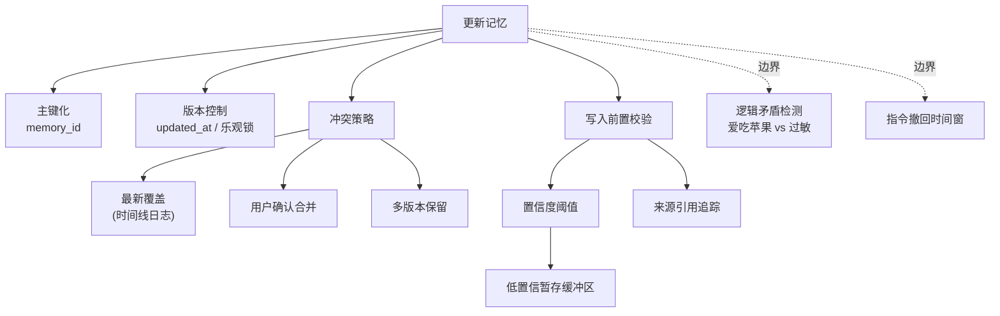

# 记忆的更新怎么做才不容易脏数据

推荐采用以下策略组合以避免脏数据：

1. **主键化**：为每条记忆分配全局唯一的 `memory_id`，避免基于内容模糊匹配导致的重复插入或错误覆盖。
2. **显式版本控制**：利用 `updated_at` 时间戳或乐观锁字段，确保更新操作基于最新状态，防止并发修改时的“后写覆盖”问题。
3. **冲突策略**：
   - **最新覆盖**：适用于时间线类的日志数据。
   - **用户确认合并**：检测到冲突时暂停写入，由用户介入决策。
   - **多版本保留**：保留历史版本供检索或审计，通过逻辑删除标记无效数据。
4. **写入前置校验**：在自动摘要写入长期记忆前，增加置信度阈值校验与来源引用追踪，低置信度内容暂存于“短期缓冲区”等待二次确认。
5. **边界情况处理**：
   - **指令撤回/反悔**：设计“时间窗口校验”机制。例如，在用户发出“取消订单”后的 N 秒内，若检测到“撤回”或反义指令，需触发回滚或标记旧指令为无效，而非直接覆盖。
   - **逻辑矛盾检测**：在写入前检查新记忆与现有记忆是否存在逻辑互斥（如“爱吃苹果”与“对苹果过敏”），若矛盾则挂起并请求人工仲裁，避免简单覆盖导致的人格分裂。
   - **多模态同步失败**：当更新文本记忆时，若关联的向量索引或元数据存储（如 Redis、S3）更新失败，必须回滚主事务，否则会导致“查得到 ID 但查不到内容”的不一致状态。
   - **极限并发写入**：在用户快速连续输入指令时（如短时间内连续修改偏好），需防抖或合并更新请求，避免因 I/O 延迟导致旧状态覆盖新状态。

### 实战案例
在构建客服 Agent 时，曾遇到用户先说“帮我取消订单”，10秒后系统处理并记录了“订单已取消”，但用户随即又撤回指令。由于缺乏基于窗口的“最终状态校验”，导致长期记忆中错误保留了“订单已取消”的脏数据，后续用户再次咨询时出现逻辑冲突。

### 代码示例
```python
# 伪代码：乐观锁防止并发覆盖导致的脏数据

def update_memory(memory_id, new_content):
    # 1. 先读取当前版本
    current = db.query("SELECT content, version FROM memories WHERE id = ?", memory_id)
    
    # 2. 执行更新并检查版本号
    rows_affected = db.execute(
        "UPDATE memories SET content = ?, version = version + 1 WHERE id = ? AND version = ?",
        (new_content, memory_id, current.version)
    )
    
    if rows_affected == 0:
        raise ConcurrentUpdateError("数据已被他人修改，请重读后重试")
```

### 对比表格
| 策略 | 适用场景 | 优缺点 |
| :--- | :--- | :--- |
| **乐观锁** | 读多写少，冲突概率低 | 性能好；但冲突重试成本高，用户体验可能受损 |
| **悲观锁** | 写操作频繁，强一致性要求 | 数据绝对一致；但并发吞吐能力差，容易死锁 |
| **Event Sourcing** | 审计要求高，需回溯历史 | 存储事件流而非状态，天然防脏数据；但开发复杂度高 |

## 常见考点
- 如何处理高并发下的记忆更新冲突（如乐观锁 vs 悲观锁）？
- 假如用户撤回了之前的指令，记忆回滚机制如何设计？
- 如何检测“逻辑冲突”（如先说“喜欢吃苹果”后说“对苹果过敏”）？

## 易错点
1.  **过度信任模型提取**：直接用 LLM 提取的结构化数据覆盖数据库，容易因模型幻觉导致脏数据。必须对关键字段（如金额、ID）增加正则校验层。
2.  **忽略最终一致性延迟**：在分布式环境下，即便写了 DB，向量索引可能存在几秒的延迟。此时查询可能读不到最新记忆，误判为需要新增，导致重复数据。
3.  **缺乏原子性保障**：在更新向量库和结构化数据库时，未使用分布式事务或补偿机制，导致两边数据不一致。

## 面试追问
1.  **关于软删除**：记忆数据是否支持物理删除？如果用户要求彻底遗忘（基于隐私法规），如何确保向量库和关联数据完全清除？（考察 GDPR 合规性与多组件数据清理）
2.  **关于实时性**：在多轮对话中，用户的最新偏好通常优先级最高。你会如何设计“时效性权重”，确保短期记忆的更新能即时覆盖长期的旧偏好？
3.  **关于数据源同步**：如果长期记忆依赖外部数据库（如 CRM），当外部数据发生批量变更时，如何设计高效的数据同步策略来更新记忆，而不是逐条重试？

## 核心流程图



## 记忆要点

- 防脏数据：主键化防重复，乐观锁/版本控制防并发覆盖，写入前置校验。
- 冲突策略：最新覆盖、用户确认合并或多版本保留。
- 边界：指令撤回需时间窗口校验；逻辑矛盾需挂起仲裁；多模态更新失败需回滚。
- 实战：缺乏“最终状态校验”导致用户撤回指令后长期记忆仍存错误数据。

## 结构化回答

**30 秒电梯演讲：** 防脏数据要像代码管理一样给记忆加版本控制——主键化防重复，乐观锁防并发覆盖，写入前做置信度校验。冲突时定三种策略：最新覆盖、用户确认合并、多版本保留。最关键的坑是用户撤回指令时要有时间窗口校验，否则会存下错误的"最终状态"。

**展开框架：**
1. **三层防脏机制** — 主键化（全局唯一 memory_id）、显式版本控制（updated_at + 乐观锁）、写入前置校验（置信度阈值 + 来源追踪）。
2. **冲突解决三策略** — 时间线日志用最新覆盖，价值数据用用户确认合并，审计场景用多版本保留（逻辑删除）。
3. **边界坑** — 指令撤回要时间窗口校验防误覆盖；逻辑矛盾（爱吃苹果 vs 苹果过敏）要挂起仲裁；多模态更新失败要回滚主事务。

**收尾：** 我做客服 Agent 时踩过坑——用户取消订单又撤回，缺最终状态校验，长期记忆一直存"订单已取消"。您想深入聊哪块，乐观锁实现还是逻辑矛盾检测？

## 视频脚本

> 预计时长：2 分钟 | 由浅入深

| 时间 | 画面/字幕 | 口播台词 | 讲解要点 |
|------|----------|----------|----------|
| 0:00 | 标题卡：记忆怎么更新不脏 | "记忆更新防脏数据，核心是给记忆加版本控制。" | 开场 |
| 0:15 | 三层防脏图 | "主键化防重复，乐观锁防并发覆盖，写入前做置信度校验。" | 三层防线 |
| 0:45 | 冲突策略三选一 | "冲突时三策略：最新覆盖、用户确认、多版本保留。" | 冲突解决 |
| 1:10 | 撤回指令警示 | "坑：用户撤回指令要有时间窗口校验，否则会存下错误状态。" | 边界情况 |
| 1:35 | 乐观锁代码示例 | "乐观锁：UPDATE 时带上 version 检查，影响行数为 0 就报冲突。" | 代码落地 |
| 1:50 | 总结卡 | "记住：主键、版本、校验三件套，撤回要有窗口。下期讲并发竞态。" | 收尾 |

### 视频流程图


