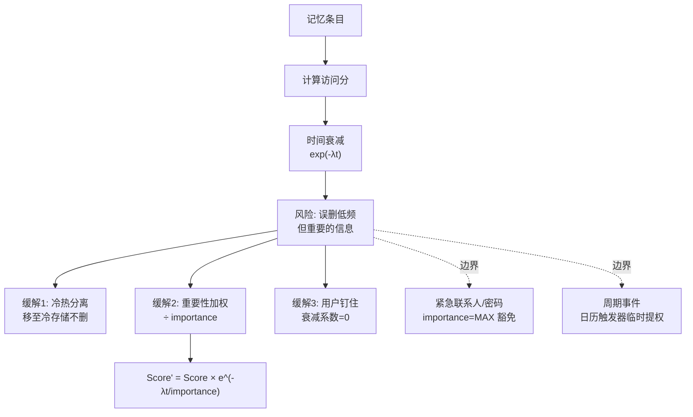

# 衰减会不会把重要但很久不用的信息删掉

会，这是时间衰减算法的特性，目的是模拟人类遗忘曲线以维持检索效率。但可以通过以下机制缓解重要信息的丢失：

1. **冷热数据分离**：将衰减后的数据从“热索引”（向量库/内存）移至“冷存储”（数据库/对象存储），降低计算成本但不彻底删除。
2. **重要性加权**：引入 `importance_score`（基于情感分析、用户显式打标或访问频率），对高重要记忆降低衰减速率，公式可调整为 $Score' = Score \times e^{-\lambda t / importance}$。
3. **用户干预**：提供“钉住”或“置顶”功能，强制设置特定记忆的衰减系数为 0。
4. **边界情况**：
    - **长尾低频关键事实**：如“紧急联系人”或“银行卡密码”，极少被访问但极度重要。这类数据应直接标记为 `importance = MAX`，完全豁免于时间衰减。
    - **周期性事件**：如“每月15号还房贷”，在非还款日得分会很低。需要引入“日历触发器”或周期性特征，在特定时间窗口前临时提升权重。
    - **突发性重要变更**：如用户偏好从“爱吃甜食”突变为“确诊糖尿病”。这种情况不能仅靠衰减，需要基于情感强度检测立即覆盖旧记忆的权重。
    - **系统性故障**：若访问记录丢失（如日志服务挂掉），可能导致所有记忆被视为长期未访问而误删。需在计算衰减前增加兜底检查。

### 实战案例
在某陪伴型 Agent 中，简单的 LRU（最近最少使用）衰减机制导致用户设定的“长期目标：年底前减肥20斤”因为一周没被提及而被自动降权遗忘。随后用户问“我最近在忙什么”，Agent 回复了最近的琐事，完全忽略了最重要的减肥目标，导致用户流失。

### 代码示例
```python
# 伪代码：重要性加权的时间衰减计算
import time
import math

def calculate_access_score(memory):
    # lambda: 衰减系数, t: 距上次访问天数
    t = (time.time() - memory.last_access_at) / 86400 
    importance = memory.importance # 1-10，由 LLM 或 用户打分
    
    # 重要度越高，衰减越慢（分母变大）
    decay_factor = math.exp(-0.1 * t / importance)
    return memory.base_score * decay_factor
```

### 对比表格
| 策略 | 优点 | 缺点 |
| :--- | :--- | :--- |
| **纯时间衰减 (LRU)** | 实现简单，自动清理噪音 | 容易误删低频但重要的长尾信息 |
| **重要性加权** | 保护关键信息，更符合人类记忆 | 需要额外的打标机制，增加了计算开销 |
| **冷热分离** | 平衡检索性能与存储成本 | 架构复杂度增加，“回温”机制难设计 |

## 常见考点
- 衰减系数 $\lambda$ 如何设定或动态调整？
- 当冷存储数据量级极大时，如何实现高效的“回温”机制？
- 如何平衡“遗忘噪声”与“保持长尾能力”？

## 易错点
1.  **机械套用 LRU**：把内存缓存淘汰策略直接用于 Agent 记忆。Agent 的记忆不仅关乎性能，更关乎“人格一致性”，遗忘关键信息会破坏用户体验。
2.  **忽视“重要性”的动态性**：用户认为重要的信息是会变的。固定的 `importance_score` 可能会导致过时的旧重要信息（如去年的项目）长期占据检索高位，需要结合时间窗口进行动态衰减。
3.  **混淆“访问”与“有效使用”**：仅仅被检索到不等于用户认可。如果 Agent 检索了某记忆但用户反驳了，不应提升其重要性，反而应降低。

## 面试追问
1.  **关于权重来源**：除了用户显式“钉住”，你会设计哪些启发式规则来自动判断一条信息的重要性？（考察对情感强度、重复提及次数、用户反应等特征的理解）
2.  **关于召回策略**：在计算最终相关性分数时，如何平衡“语义相似度”和“时间衰减分数”？是相乘还是加权求和？（考察 Score Fusion 策略）
3.  **关于灾难性遗忘**：如果 Agent 需要学习新领域的知识（如从客服转售前），如何防止旧的记忆完全干扰新的角色设定，而不是单纯地衰减旧数据？

## 核心流程图



## 记忆要点

- 衰减会删掉重要但久用信息，需引入重要性加权或冷热数据分离缓解。
- 策略：长尾关键事实（如密码）豁免衰减；周期性事件用日历触发器临时提权。
- 公式：Score = Base * exp(-λt / importance)，重要度越高衰减越慢。
- 易错：机械套用LRU会遗忘用户长期目标，导致人格不一致和用户流失。

## 结构化回答

**30 秒电梯演讲：** 会衰减掉重要信息——这是纯时间衰减的硬伤。解法是给衰减加重要性权重：公式是 Score = Base × exp(-λt / importance)，重要度越高衰减越慢。关键事实（密码、紧急联系人）直接豁免，周期性事件（每月还房贷）用日历触发器临时提权。千万别机械套 LRU，会遗忘用户长期目标。

**展开框架：**
1. **为什么会误删** — 纯时间衰减（LRU）只看访问时间，不管重要性；长尾低频关键信息会被当成噪声清掉。
2. **重要性加权衰减** — 公式 Score = Base × exp(-λt / importance)，重要度进分母，越重要衰减越慢。
3. **冷热分离 + 用户钉住** — 衰减后从热索引移到冷存储不彻底删；用户可"钉住"设衰减系数为 0；周期事件靠日历临时提权。

**收尾：** 做陪伴 Agent 时踩过坑——用户"年底减肥 20 斤"的目标一周没提就被降权，再问"最近忙啥"完全忘了。您想聊哪块，重要性评分怎么自动算还是冷热回温机制？

## 视频脚本

> 预计时长：2 分钟 | 由浅入深

| 时间 | 画面/字幕 | 口播台词 | 讲解要点 |
|------|----------|----------|----------|
| 0:00 | 标题卡：衰减会不会删重要信息 | "时间衰减会误删重要但久用的信息，怎么破？" | 开场钩子 |
| 0:15 | LRU 误删示意图 | "纯 LRU 只看访问时间，长尾关键信息会被当噪声清掉。" | 问题根源 |
| 0:45 | 加权衰减公式 | "公式：Score = Base × exp(-λt / importance)，重要度越高衰减越慢。" | 核心解法 |
| 1:10 | 冷热分离架构 | "衰减后移到冷存储不彻底删，热索引管高频，冷存储兜底。" | 分层存储 |
| 1:35 | 减肥目标案例 | "实战：陪伴 Agent 用 LRU 把用户减肥目标遗忘，用户流失。" | 实战教训 |
| 1:50 | 总结卡 | "记住：加权衰减 + 冷热分离 + 关键事实豁免。下期讲重要性评分。" | 收尾 |

### 视频流程图


