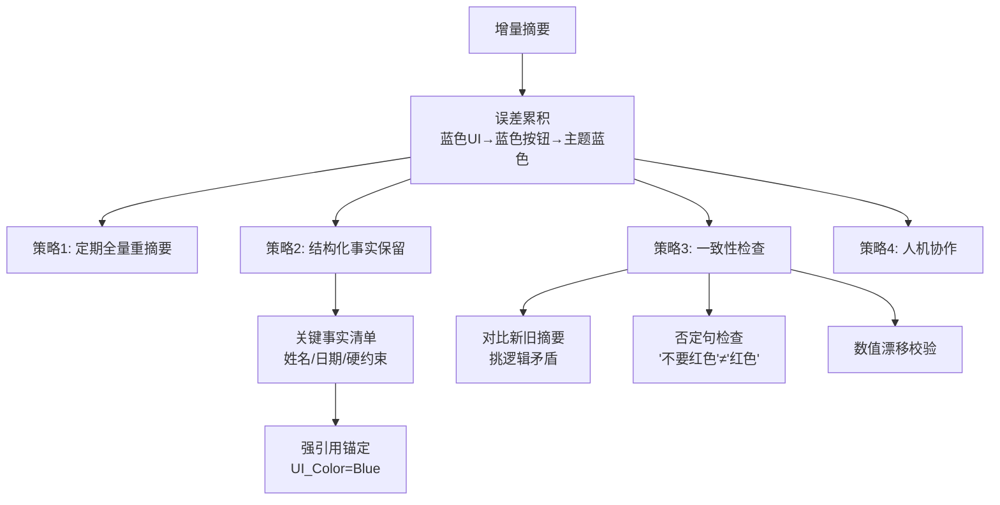

# 增量摘要误差累积怎么缓解

增量摘要容易导致“信息滚雪球”式的误差累积或细节丢失。缓解方法如下：

1. **定期全量重摘要**：设置窗口期（如每 N 轮或每天），基于原始记录重新生成摘要，消除累积误差。
2. **结构化事实保留**：在摘要之外，维护一份结构化的“关键事实清单”（姓名、日期、硬约束），不参与自然语言压缩，作为强引用挂载。
3. **一致性检查**：使用另一个轻量级模型或提示词，对比新旧摘要，挑出逻辑矛盾或事实变更。
4. **人机协作**：允许用户在关键节点（如任务完成时）手动编辑或确认“长期事实”库。

**边界情况**：
- **信息密度突变**：如果长时间闲聊后突然插入一条关键指令，增量摘要可能因为之前的权重过大而将新指令稀释为“等一下”。需要在检测到“强意图/高情感”句子时，强制触发局部重写或赋予高权重。
- **上下文窗口极限**：当对话长度超过模型的 Context Window，导致无法进行全量重摘要时，必须依赖“摘要链”或分层摘要，否则会出现硬截断导致的语义崩塌。
- **数值漂移**：对于数值类信息（如“预算5000”），增量摘要容易出现误差累积变成“预算500”或“50000”。必须通过结构化字段强制校验。
- **否定句处理**：增量更新时容易忽略否定词，导致将“不要使用红色”错误更新为“使用红色”。需在 Prompt 中显式要求 Check 逻辑反转。

### 实战案例
在长周期项目跟踪 Agent 中，初始需求是“蓝色UI”，增量摘要过程中逐渐变成了“蓝色按钮”，最后变成了“主题色为蓝色”。由于缺乏关键事实库的锚定，最终开发文档与需求严重偏离。引入结构化字段存储 `UI_Color=Blue` 后，类似问题彻底解决。

### 代码示例
```python
# 伪代码：增量摘要 + 结构化事实挂载

def update_summary(new_messages, current_summary, structured_facts):
    # 1. 尝试提取新消息中的结构化事实
    new_facts = extract_structured_data(new_messages)
    updated_facts = merge_structured_facts(structured_facts, new_facts)
    
    # 2. 将结构化事实作为上下文输入，防止 LLM 编造或遗忘事实
    prompt = f"""
    Old Summary: {current_summary}
    New Messages: {new_messages}
    Ground Truth Facts: {updated_facts}  # 强约束：必须包含这些事实
    Generate updated summary.
    """
    
    new_summary = llm.generate(prompt)
    return new_summary, updated_facts
```

### 对比表格
| 方法 | 准确性 | 成本 | 实现难度 |
| :--- | :--- | :--- | :--- |
| **滑动窗口增量** | 低（误差累积快） | 低 | 简单 |
| **定期全量重写** | 高（重置误差） | 高（随消息量线性增长） | 中等 |
| **结构化事实链** | 极高（关键点不丢失） | 中（需增加提取步骤） | 复杂（需定义Schema） |

## 常见考点
- 全量重摘要的成本较高，如何触发（基于误差检测还是定时）？
- 结构化数据和非结构化摘要在检索时如何融合？
- 如果用户对摘要进行了错误的修正，系统如何回滚？

## 易错点
1.  **盲目信任增量**：认为只要一直往里加内容就行。实际上，增量摘要如果不配合“遗忘机制”（去掉不再重要的细节），最终会变成一篇毫无重点的长文，失去摘要的意义。
2.  **忽略事实冲突**：新消息修正了旧事实（如“明天下午3点”改为“明天上午10点”）。简单的增量摘要可能会变成“明天下午3点和上午10点”，导致逻辑冲突，必须显式识别并执行“替换”操作而非“追加”。
3.  **丢失“未决状态”**：摘要往往侧重于已发生的事实，容易忽略“待办”状态（如“答应发邮件但还没发”）。需专门维护 Open Intents 列表，防止任务遗漏。

## 面试追问
1.  **关于触发机制**：如何智能判断何时需要进行全量重摘要，而不是简单的固定轮数？（考察基于语义变化度、摘要长度或冲突检测的触发策略）
2.  **关于滚动摘要**：如果对话极长，你会设计什么样的“滚动摘要”结构（如金字塔结构：最新摘要 + 历史摘要归档），以兼顾最新热点和长期记忆？
3.  **关于多模态**：如果记忆中包含图片或表格，增量摘要会面临很大挑战。你会如何处理这类非文本数据的摘要更新？（考察多模态理解与描述能力）


## 核心流程图



## 记忆要点

- 缓解增量误差：定期全量重摘要、维护结构化事实清单、一致性检查。
- 结构化事实（如JSON）作为强约束挂载，防止自然语言压缩导致数值漂移或否定丢失。
- 边界：信息密度突变需强制重写；数值类信息必须正则校验；否定句需显式Check。
- 实战：缺乏结构化锚定，导致“蓝色UI”增量摘要逐渐漂移为“主题色为蓝色”。


## 结构化回答

**30 秒电梯演讲：** 增量摘要是"传话游戏"，久了必然走样。缓解三招：定期全量重摘要重置误差、维护结构化事实清单（JSON）作为强约束防止数值漂移、用一致性检查对比新旧摘要挑矛盾。最关键的坑是数值类信息必须正则校验，否定句要显式 Check 逻辑反转。

**展开框架：**
1. **误差来源** — 增量压缩是滚雪球，每轮丢失一点细节、漂移一点数值；否定词容易被忽略导致语义反转。
2. **三大缓解** — 定期全量重摘要（按窗口或冲突检测触发）、结构化事实清单挂载（强约束 LLM 不能编造）、一致性检查（轻量模型对比新旧摘要）。
3. **边界强约束** — 数值字段必须正则校验；信息密度突变要强制局部重写；上下文窗口极限时用分层摘要链。

**收尾：** 做项目跟踪 Agent 时踩过坑——"蓝色 UI"经过几轮增量摘要漂移成"主题色为蓝色"，引入结构化字段 UI_Color=Blue 后解决。您想聊哪块，全量重摘要的触发策略还是结构化事实的 Schema 设计？

## 视频脚本

> 预计时长：2 分钟 | 由浅入深

| 时间 | 画面/字幕 | 口播台词 | 讲解要点 |
|------|----------|----------|----------|
| 0:00 | 标题卡：增量摘要误差怎么破 | "增量摘要是传话游戏，久了必然走样。" | 类比开场 |
| 0:15 | 误差累积示意图 | "每轮压缩丢一点细节，数值漂移，否定词容易被忽略。" | 问题根源 |
| 0:45 | 三招缓解 | "全量重摘要重置误差，结构化事实强约束，一致性检查挑矛盾。" | 核心解法 |
| 1:10 | 结构化字段示例 | "数值必须正则校验，否定句要显式 Check 逻辑反转。" | 边界强约束 |
| 1:35 | 蓝色 UI 漂移案例 | "实战：蓝色 UI 漂移成主题色为蓝色，加结构化字段解决。" | 实战教训 |
| 1:50 | 总结卡 | "记住：全量重置 + 结构化锚定 + 一致性检查。下期讲触发策略。" | 收尾 |
