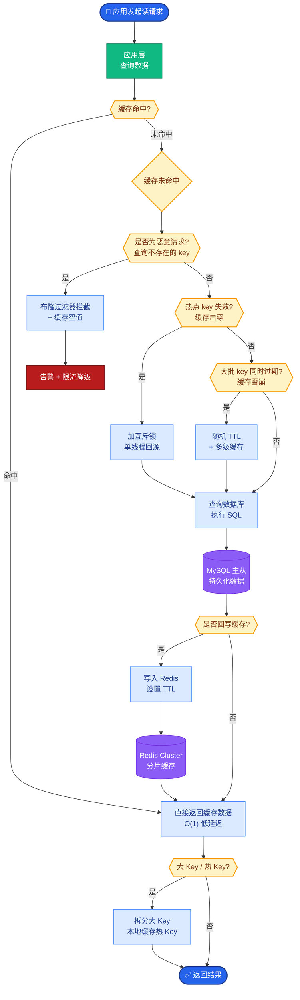

# 情景记忆和语义记忆为什么要区分存储

因为两者的**更新频率、隐私级别、检索特征**完全不同，区分存储能极大优化性能与安全：

- **情景记忆**：个人化、强时间敏感性（“昨天吃了什么”）。采用高衰减策略，权限控制严格（用户隔离）。
- **语义记忆**：共享、稳定（“水的沸点是100度”）。采用长期保留策略，可作为跨用户的通用知识库。

区分后可减少将“一次性事件”误当“长期规则”的概率，并实施针对性的索引策略。

**边界情况**：
- **时间模糊性**：处理“刚才”或“最近”等相对时间词汇时，情景记忆库需根据查询触发时间的上下文动态计算时间窗口。
- **隐私边界**：当用户指令涉及“将项目会议纪要分享给全员”时，系统需具备将情景记忆“提权”转化为语义记忆的能力与审批流程。
- **极端冷启动**：新用户或新租户在没有情景记忆时，如何避免过度依赖通用的语义记忆导致回复缺乏个性（需引入Fallback机制）。

**实战案例**：
在构建企业级 Copilot 时，我们发现将“项目特定的临时会议纪要”存入共享向量库会导致其他用户收到幻觉指引。引入区分存储后，情景库采用 TTL 自动过期，而“项目周报规则”通过异步任务沉淀到语义库，解决了知识污染问题。

**代码示例（伪代码）**：
```python
def store_memory(content, user_id, mem_type):
    if mem_type == 'episodic':
        # 情景记忆：带TTL，强隔离索引
        redis_client.setex(f"mem:{user_id}:{uuid}", TTL_7_DAYS, content)
        vector_store.upsert(content, metadata={"user": user_id, "type": "chat"})
    elif mem_type == 'semantic':
        # 语义记忆：去重，全局索引
        if not semantic_db.exists(content):
            vector_store.upsert(content, metadata={"type": "knowledge", "global": True})
```

**架构流转图**：
```text
┌─────────────┐      提取/反思      ┌──────────────┐
│ 情景记忆库  │ ──────────────────> │ 语义记忆库   │
│ (高频写入)  │   (归纳共性事实)    │ (低频更新)   │
└─────────────┘                     └──────────────┘
       │                                    │
       │ (检索近期/个人细节)                 │ (检索通用/长期规则)
       └──────────┬─────────────────────────┘
                  v
           ┌──────────────┐
           │  混合检索层  │
           └──────────────┘
```

**## 面试追问**
1. 如果情景记忆和语义记忆检索出冲突信息（例如语义库说“流程A必须3步”，用户情景库说“上次我只做了2步”），以谁为准？如何设计冲突解决策略？
2. 反思模块将情景记忆转化为语义记忆时，如何防止错误的幻觉被固化为长期事实？
3. 在高并发场景下，情景记忆的高频写入和 TTL 过期删除如何保证性能不抖动？（如 Redis 的 AOF 重写或 Keyspace 通知影响）

**## 易错点**
- **认知误区**：认为情景记忆就是短期记忆，语义记忆就是长期记忆。实际上，情景记忆也可以长期存储（如人生重大时刻），区别在于“共有性”和“抽象性”而非单纯的时间长短。
- **实施陷阱**：在语义记忆去重时仅使用精确匹配，导致用户用不同表述描述同一事实时产生重复记录，增加检索噪声。应采用语义聚类去重。

**## 常见考点**
- 从情景记忆归纳成语义记忆的“反思模块”如何设计触发条件？
- 如果情景记忆和语义记忆检索出冲突信息，以谁为准？
- 语义记忆是否支持多租户间的共享与隔离？


## 核心流程图



## 记忆要点

- 核心差异：情景记忆是个人化、高衰减的临时事件；语义记忆是共享、稳定的通用知识。
- 区分原因：两者更新频率、隐私级别和检索特征不同，区分存储可优化性能与安全。
- 架构流转：情景库通过“反思模块”将有价值的信息归纳沉淀到语义库。
- 实战陷阱：防止将临时会议纪要误当长期规则，情景库需设TTL自动过期。


## 结构化回答

**30 秒电梯演讲：** 因为两者的更新频率、隐私级别、检索特征完全不同。情景记忆是个人化、高衰减的临时事件（昨天吃了啥），语义记忆是共享、稳定的通用知识（水的沸点）。区分后能避免把偶发事件误当长期规则，情景库设 TTL 自动过期，有价值的信息通过反思模块沉淀到语义库。

**展开框架：**
1. **核心差异** — 情景记忆高频更新、强用户隔离、带 TTL；语义记忆低频更新、可全局共享、长期稳定。
2. **区分收益** — 针对性索引策略（情景库 Redis 短期、语义库向量库长期）；减少一次性事件误当长期规则的概率。
3. **架构流转** — 情景库通过反思模块归纳共性事实沉淀到语义库；隐私边界处支持情景记忆提权转语义记忆但需审批。

**收尾：** 做企业 Copilot 时踩过坑——临时会议纪要存共享向量库，其他用户收到幻觉指引。引入区分存储后情景库 TTL 自动过期解决。您想聊哪块，反思模块设计还是冲突时以谁为准？

## 视频脚本

> 预计时长：2 分钟 | 由浅入深

| 时间 | 画面/字幕 | 口播台词 | 讲解要点 |
|------|----------|----------|----------|
| 0:00 | 标题卡：情景记忆 vs 语义记忆 | "为什么要区分存储？因为更新频率、隐私、检索特征全不同。" | 开场 |
| 0:15 | 朋友圈 vs 百科全书 | "情景像朋友圈个人动态，语义像百科全书通用知识。" | 类比 |
| 0:45 | 核心差异表 | "情景高频高隐私带 TTL，语义低频共享长期稳定。" | 关键差异 |
| 1:10 | 反思模块流转图 | "情景库通过反思模块把有价值信息归纳沉淀到语义库。" | 架构流转 |
| 1:35 | 会议纪要污染案例 | "实战：临时会议纪要存共享库导致幻觉，TTL 过期解决。" | 实战教训 |
| 1:50 | 总结卡 | "记住：情景个人化易过期，语义共享稳定，反思模块桥接。" | 收尾 |
