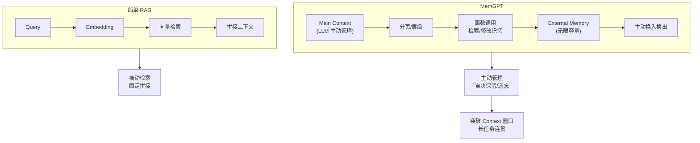

# MemGPT 和简单 RAG 的本质区别是什么

本质区别在于**内存管理的主动性**：
- **简单 RAG**：被动检索。系统仅在用户提问或 Prompt 模板要求时查询向量库，无法感知上下文窗口的拥挤程度。
- **MemGPT**：主动内存管理。引入 OS 级别的分页机制，模型或控制器作为“调度器”，根据当前上下文压力和任务需求，自主决定：
  1. 何时将外部记忆“换入”上下文；
  2. 何时将当前上下文“写出”到外部存储；
  3. 如何对记忆进行分页和淘汰。

**控制流实现**：通常通过 **Function Calling / Tool Use** 实现，让 LLM 具备调用 `read_memory`、`write_memory` 等工具的能力。

**边界情况**：
- **递归调用死循环**：LLM 可能陷入“读不到信息 -> 尝试读 -> 读不到 -> 再尝试”的死循环，或者反复写入相同的冗余信息（记忆震荡）。需设定最大步数或写入去重机制。
- **中间状态丢失**：在长对话中，如果 MemGPT 错误地将“关键中间推理结果”换出了内存，后续推理会基于不完整信息产生幻觉。需要设计“内存锁”或“Pin”机制。
- **工具调用延迟累积**：每次换页都需要一次 LLM 推理来决定，导致长任务的总耗时线性增长。需引入“非 LLM 调度器”或批量操作策略。

**实战案例**：
开发长文档分析 Agent 时，简单 RAG 在处理第 50 页引用第 5 页内容时失效（因 Token 限制，第 5 页已被挤出）。采用 MemGPT 架构后，Agent 能主动识别“缺失信息”信号，触发 `search_memory(page_5_context)` 动态回填，解决了长链任务的上下文断层。

**代码示例**：
```python
class MemGPTAgent:
    def run(self, user_query):
        context = self.ctx_window
        while not self.is_task_done(user_query, context):
            # 决策：是否需要内存交换
            action = llm_decide(context, "pause_and_swap")
            if action == "swap_out":
                self.external_store.write(context.important_parts)
                context.purge()
            elif action == "recall":
                new_mem = self.external_store.read(action.params)
                context.append(new_mem)
            # 继续推理...
```

| 特性 | 简单 RAG | MemGPT |
| :--- | :--- | :--- |
| **检索时机** | 仅在 Query 时 | 需要时随时触发（Function Call） |
| **上下文感知** | 无（盲目检索） | 强（感知 Window 状态） |
| **状态管理** | 无状态 | 有状态（支持读写/淘汰） |
| **适用场景** | 问答系统 | 复杂任务代理、长文档处理 |

**## 面试追问**
1. MemGPT 依赖 LLM 来决定何时进行 I/O 操作，如果 LLM 产生了“我还有空间，不需要换页”的错误判断，导致 Context 溢出报错，系统如何兜底？
2. 相比于让 LLM 自主管理内存，使用启发式规则（如 FIFO 满了自动覆盖）在工程实现上更简单，MemGPT 引入的复杂性收益比（ROI）在哪里？
3. 在多轮对话中，如何评估 MemGPT 的“遗忘策略”是否合理？（即是否错误地删除了有用的短期记忆）

**## 易错点**
- **概念混淆**：认为 MemGPT 仅仅是增加了向量检索的频率。实际上 MemGPT 的核心是“操作系统化”，即具备了进程控制块（PCB）、中断处理和虚拟内存管理的能力。
- **忽视成本**：MemGPT 需要频繁调用 LLM 进行决策，这会显著增加 Token 消耗和 API 延迟。在低延时要求的场景下，必须限制 LLM 的决策频率。

**## 常见考点**
- MemGPT 的“中断”机制是如何实现的，会不会打断用户体验？
- 相比 RAG，MemGPT 增加的 Token 消耗（控制指令）是否值得？
- 在 MemGPT 架构下，如何处理 Agent 的“无限循环”或“记忆震荡”问题？


## 核心流程图



## 记忆要点

- 本质区别：RAG是被动检索，MemGPT是主动内存管理（OS级分页机制）。
- 核心能力：MemGPT能感知上下文压力，自主决定何时换入/换出内存。
- 实现方式：通过Function Calling让LLM具备read/write/purge内存的工具能力。
- 适用场景：简单RAG适合问答，MemGPT适合长文档处理和复杂任务代理。


## 结构化回答

**30 秒电梯演讲：** RAG 是被动检索，像查字典——只在用户提问时查向量库，感知不到上下文窗口挤不挤。MemGPT 是主动内存管理，像操作系统管内存条——模型或控制器当调度器，自主决定何时换入换出。通过 Function Calling 让 LLM 有 read/write/purge 工具能力。简单问答用 RAG，长文档和复杂任务用 MemGPT。

**展开框架：**
1. **本质区别** — RAG 被动检索无状态；MemGPT 主动管理有状态，引入 OS 级分页机制（page in/out）。
2. **控制流实现** — 通过 Function Calling 让 LLM 具备 read_memory/write_memory 工具，根据上下文压力自主决策换页。
3. **三大边界** — 递归调用死循环要设最大步数和写入去重；中间状态误换出要内存锁 Pin 机制；工具调用延迟累积要用非 LLM 调度器或批量操作。

**收尾：** 做长文档分析 Agent 时踩过坑——简单 RAG 处理第 50 页引用第 5 页内容时失效，MemGPT 能主动识别缺失信息触发 search_memory 回填。您想聊哪块，分页调度策略还是工具调用延迟优化？

## 视频脚本

> 预计时长：2 分钟 | 由浅入深

| 时间 | 画面/字幕 | 口播台词 | 讲解要点 |
|------|----------|----------|----------|
| 0:00 | 标题卡：MemGPT vs 简单 RAG | "RAG 像查字典，MemGPT 像操作系统管内存条。" | 类比开场 |
| 0:15 | 被动 vs 主动对比 | "RAG 被动检索无状态，MemGPT 主动管理有状态。" | 本质区别 |
| 0:45 | OS 分页机制图 | "引入分页换入换出，模型自主决策何时调内存工具。" | 核心机制 |
| 1:10 | Function Calling 示例 | "通过工具调用让 LLM 有 read/write/purge 能力。" | 实现方式 |
| 1:35 | 长文档案例 | "实战：RAG 处理 50 页引用 5 页失效，MemGPT 主动回填。" | 实战对比 |
| 1:50 | 总结卡 | "记住：RAG 被动查，MemGPT 主动管。下期讲分页调度。" | 收尾 |
