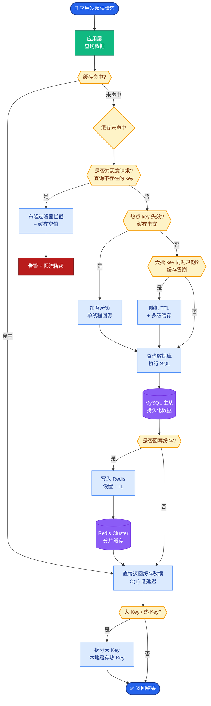

# 记忆和 Tool Use 的边界是什么

工具解决「当下获取外部世界状态」；记忆解决「跨时间保留与回忆」。

### 边界定义详解
| 维度 | Tool Use (工具) | Memory (记忆) |
| :--- | :--- | :--- |
| **数据时效性** | 高频变化、实时（秒/分级） | 相对静态、累积（日/年级） |
| **数据来源** | 外部系统 | 系统内部交互历史 |
| **更新机制** | 覆盖式 | 追加/压缩式 |
| **典型示例** | 查库存、天气、API 搜索 | 用户画像、长期目标、历史摘要 |

### 决策流程图
```text
请求到来
  │
  ├─ 需要获取系统外部实时状态？ ─是─> [使用 Tool Use]
  │   (如: 数据库查询, HTTP API)
  │
  ├─ 是关于用户的长期偏好/习惯？ ─是─> [查询 Memory]
  │   (如: 用户喜欢Python多于Java)
  │
  ├─ 是之前的上下文/对话内容？ ─是─> [查询 Memory]
  │   (如: 刚才提到的那个项目ID)
  │
  └─ 否 ─> [推理或报错]
```

### 追问应对
- **库存算哪边？**
  - **实时库存**：必须走 Tool（查数据库/WMS）。因为库存是高并发、强一致性的外部状态，存入 Memory 会瞬间过期导致幻觉。
  - **用户常买类目**：走 Memory。这是经过时间沉淀的用户偏好特征。
- **搜索引擎结果算记忆吗？**
  - 搜索动作本身是 Tool。搜索到的有用信息经过筛选和摘要后，**写入**长期记忆，供未来直接调用，避免重复搜索。

### 实战案例
某电商客服 Agent 曾将“优惠券剩余数量”存入长期记忆，导致活动爆发时，用户拿到的过时记忆显示还有券，但实际已抢光，引发大量客诉。改为直接调用库存 Tool 后解决。

### 代码示例 (Python)
```python
def get_or_check_stock(item_id: str, use_cache: bool = False):
    # 错误做法：将库存存入 Memory/Cache 且无 TTL
    # stock = memory.get(f"stock_{item_id}") 
    # if stock: return stock

    # 正确做法：每次都视为“易变状态”，走工具查询
    if use_cache:  # 仅允许极短时间（秒级）的缓存，而非长期记忆
        stock = redis.get(item_id)
        if stock: return stock
    
    # 强制查询外部实时状态
    return db.query("SELECT quantity FROM inventory WHERE id=?", item_id)
```

### ## 常见考点
- 用户的“当前地址”应该放哪？（答案：Tool。因为人可能移动，属于易变状态，但“常用/常住地址”放 Memory）
- 如果工具调用很慢，能否缓存结果到记忆？（答案：可以，但必须设置 TTL 过期时间，属于“短期记忆”或“缓存层”）
- 为什么不要把实时数据存入向量库？（答案：向量库更新成本高，且有延迟，不适合高并发的读写场景）

### ## 边界情况
1.  **状态快照**：对于“历史快照”数据（如“昨天的收盘价”），虽涉及外部世界，但属于过去式且不再变更，应存入 Memory 而非实时 Tool。
2.  **长会话 Token 优化**：当对话历史极长时，常将早期的对话摘要存入 Memory。此时需注意：摘要可能丢失细微的情绪或否定词，导致 Agent 误解“事实”，需在写入时增加“情绪/否定校验”。
3.  **Tool 调用失败**：当外部 Tool 不可用时（如 API Down），系统是否有降级策略？例如，是否能读取记忆中的“缓存值”并明确告知用户“数据可能已过期”？

### ## 面试追问
1.  如果用户明确表示“记住我现在的位置”以便后续导航，但用户实际上是移动的，这种矛盾场景如何处理？
2.  对于“三天前用户修改过的订单状态”，应该查 Tool 还是 Memory？为什么？
3.  Memory 中的“用户画像”多久更新一次合适？如何平衡画像的稳定性（泛化）与实时性（近期偏好）？

### ## 易错点
1.  **混淆“短期缓存”与“长期记忆”**：为了减少 API 调用成本，将高频但易变的数据（如积分余额）直接写入 VectorDB 作为长期记忆，未设置 TTL，导致数据过时。
2.  **将“工具的说明书”放入工具而非记忆**：Tool 的描述（如 API 参数定义）虽然属于外部概念，但通常应作为静态文档存入 Memory 或知识库，供 Agent *学习如何调用工具*，而不是每次都去调一个 Tool 来获取“如何使用 Tool”。


## 核心流程图



## 记忆要点

- 边界定义：Tool解决“当下获取外部实时状态”；Memory解决“跨时间保留与回忆”。
- 数据特征：Tool数据高频变化、覆盖式更新；Memory数据相对静态、追加式。
- 典型误区：库存等实时数据严禁存入长期记忆，必须走Tool查询。
- 缓存策略：Tool结果可缓存但必须设TTL（秒级），不可混入长期记忆。

## 结构化回答

**30 秒电梯演讲：** 工具管"当下获取外部实时状态"，记忆管"跨时间保留与回忆"。分界线看数据特征：高频变化、覆盖式更新的走 Tool（库存、天气）；相对静态、追加式的走 Memory（用户画像、历史目标）。最关键的坑是实时数据严禁存长期记忆——优惠券剩余数量存记忆会瞬间过期导致幻觉，Tool 结果可缓存但必须设秒级 TTL。

**展开框架：**
1. **边界定义** — Tool 数据时效秒分级、来自外部系统、覆盖式更新；Memory 数据相对静态、来自交互历史、追加压缩式。
2. **决策流程** — 需要外部实时状态走 Tool；长期偏好或之前上下文走 Memory；历史快照（昨天收盘价）虽涉外部但已不变走 Memory。
3. **缓存与降级** — Tool 慢可缓存但必须 TTL 秒级，不能混入长期记忆；Tool 挂了可读缓存但明确告知用户"数据可能过期"。

**收尾：** 做电商客服时踩过坑——优惠券剩余数量存长期记忆，活动爆发时显示还有券实际抢光引发客诉，改走库存 Tool 后解决。您想聊哪块，画像缓存策略还是 Tool 失败降级？

## 视频脚本

> 预计时长：2 分钟 | 由浅入深

| 时间 | 画面/字幕 | 口播台词 | 讲解要点 |
|------|----------|----------|----------|
| 0:00 | 标题卡：记忆和 Tool 的边界 | "工具是眼睛看现在，记忆是脑子记过去。" | 类比开场 |
| 0:15 | 边界定义对比表 | "Tool 管实时外部状态覆盖更新，Memory 管历史交互追加更新。" | 核心区别 |
| 0:45 | 决策流程图 | "需要外部实时走 Tool，长期偏好或上下文走 Memory。" | 决策规则 |
| 1:10 | 库存警示 | "坑：库存等实时数据严禁存长期记忆，会瞬间过期。" | 典型误区 |
| 1:35 | 优惠券案例 | "实战：优惠券余量存记忆导致客诉，改走 Tool 解决。" | 实战教训 |
| 1:50 | 总结卡 | "记住：实时走 Tool，静态走 Memory，缓存必须 TTL。下期讲降级。" | 收尾 |
