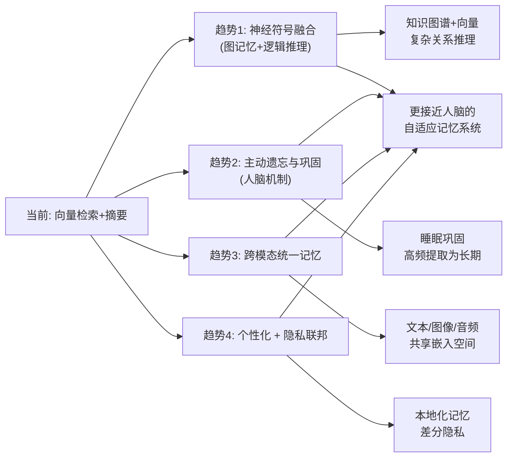

# 未来记忆系统趋势你怎么看待

更强调分层 + 可学习检索 + 用户可控；合规与可删除性成为默认需求；与世界模型/仿真结合用于更强规划（开放题，言之成理即可）。

### 趋势对比表格
| 维度 | 传统 RAG/记忆架构 | 未来记忆系统趋势 |
| :--- | :--- | :--- |
| **数据组织** | 扁平化/向量堆叠 | **分层架构** (Episodic, Semantic, Procedural) |
| **检索方式** | 静态向量相似度搜索 | **可学习检索** (RLHF 优化 Retriever 端到端) |
| **数据治理** | 黑盒存储，难以删除 | **可解释/可控** (用户可视、可编辑、一键遗忘) |
| **应用模式** | 被动问答 | **主动规划** (结合 World Model 预判所需记忆) |

### 实战案例
未来记忆系统将不仅存储“用户说了什么”，还能结合“世界模型”预测用户意图。例如，用户查询“明天天气”，系统不仅返回天气数据，还会主动检索用户记忆中的“明天是否有出行计划”，并提前在记忆中标记“需要提醒带伞”，实现从被动响应到主动服务的转变。

### ## 边界情况
1.  **数据主权**：在多租户或跨应用场景下，记忆的“归属权”界限模糊。未来趋势是实现便携式记忆（如类似 Apple 的“私有云计算”），用户能携带记忆在不同 AI 服务间迁移，这对当前的孤岛式架构是挑战。
2.  **对抗性记忆攻击**：随着记忆系统更智能，恶意用户可能通过特定 Prompt 注入错误记忆来“毒化” Agent 行为，未来的系统需具备记忆免疫或对抗性检测能力。
3.  **记忆遗忘机制**：目前大多数系统“只进不出”，未来必须实现智能遗忘（如重要性衰退机制），以防止上下文爆炸和认知老化。

### ## 面试追问
1.  你提到的“分层架构”，具体如何实现数据在不同层级（如 Episodic 到 Semantic）间的流动和转换？
2.  如何平衡“用户可控性”与“系统自动化”？如果用户删除了某些关键记忆导致 Agent 变笨，如何处理？
3.  “可学习检索”需要大量反馈数据，在冷启动阶段如何构建训练信号？

### ## 易错点
1.  **混淆“长期记忆”与“世界知识”**：认为记忆系统应该存储 Wikipedia 级别的通用知识。实际上，通用知识应通过预训练或外挂知识库解决，记忆系统应专注于“个性化、交互性、动态性”的信息。
2.  **忽视非结构化记忆的价值**：只关注文本记忆，忽视了行为模式、点击流、情绪状态等隐式记忆在未来系统中的价值。

## 技术原理

记忆系统的分层架构借鉴认知科学中的 Atkinson-Shiffrin 记忆模型，并将其工程化为可检索的三层存储：

- **情景记忆（Episodic）**：记录"何时发生了什么"，存储带时间戳的原始交互轨迹（对话日志、事件流），检索时按时间邻近度 + 语义相似度联合排序。典型实现是带时间衰减加权的向量索引。
- **语义记忆（Semantic）**：从情景记忆中抽取并固化的"事实/偏好"，如"用户喜欢 Python"、"用户在金融行业"。通过实体抽取 + 知识图谱沉淀，解决情景记忆冗余膨胀问题。
- **程序性记忆（Procedural）**：固化"怎么做"的技能与 SOP，如"调用工具的标准流程"、"输出 JSON 的固定模板"。本质是可复用的 Prompt 片段或工具调用链，减少重复推理成本。

可学习检索的演进路径：传统 RAG 用固定的 Embedding + 余弦相似度，新趋势是用 RLHF 信号端到端优化 Retriever——把"检索结果是否提升了最终回答质量"作为奖励，反向训练检索模型，让检索器学会"什么对下游任务有用"而非"什么文本相似"。

## 代码示例

分层记忆的最小骨架（伪代码）：

```python
from dataclasses import dataclass, field
from typing import List
import time

@dataclass
class EpisodicMemory:
    """情景记忆：原始交互轨迹，带时间戳"""
    timestamp: float
    content: str
    embedding: List[float] = field(default_factory=list)

@dataclass
class SemanticMemory:
    """语义记忆：抽取的事实/偏好"""
    subject: str      # 如 "user.preference.language"
    value: str        # 如 "python"
    confidence: float
    source_episode_ids: List[str] = field(default_factory=list)  # 可溯源

class LayeredMemory:
    def __init__(self):
        self.episodic: List[EpisodicMemory] = []
        self.semantic: List[SemanticMemory] = []

    def add_interaction(self, content: str, embedding: List[float]):
        """写入情景记忆，并触发抽取沉淀到语义层"""
        ep = EpisodicMemory(time.time(), content, embedding)
        self.episodic.append(ep)
        self._consolidate(ep)   # 后台抽取事实写入语义层

    def recall(self, query_emb, top_k=5, time_decay=0.99):
        """检索：情景(带时间衰减) + 语义(高置信度) 联合返回"""
        scored = [
            (self._sim(query_emb, e.embedding) * (time_decay ** self._age(e)), e)
            for e in self.episodic
        ]
        scored.sort(reverse=True, key=lambda x: x[0])
        return [e for _, e in scored[:top_k]]
```

## 注意事项

- **遗忘机制不可省**：只增不减的记忆会导致上下文爆炸和检索精度衰减。需引入重要性评分 + 时间衰减，低分记忆定期归档或删除（参考人脑的"睡眠整理"机制）。
- **分层不是物理分层而是逻辑分层**：三层可以共享同一个向量库，用 metadata 字段（`type=episodic|semantic|procedural`）区分，避免运维三套存储。
- **可学习检索的冷启动**：RLHF 优化检索器需要大量反馈数据，冷启动阶段可先用"用户是否采纳回答"作为弱监督信号，积累足够样本后再切换端到端训练。
- **数据主权与便携性**：GDPR/个保法要求"一键遗忘"，存储设计必须支持按用户 ID 物理删除（而非逻辑删除），且要级联删除向量索引中的对应条目，否则会"删了文本但向量还在"导致泄露。


## 核心流程图




## 记忆要点

- 架构趋势：从扁平向量堆叠转向分层架构（情景/语义/程序性记忆）。
- 检索趋势：从静态相似度转向可学习检索（RLHF端到端优化）。
- 治理趋势：默认支持可解释、可编辑、一键遗忘（合规与数据主权）。
- 应用模式：结合世界模型，从被动响应转向主动规划（预判所需记忆）。


## 结构化回答

**30 秒电梯演讲：** 未来记忆系统四大趋势：架构上从扁平向量堆叠转向分层（情景/语义/程序性记忆）；检索上从静态相似度转向可学习检索（RLHF 端到端优化）；治理上默认支持可解释、可编辑、一键遗忘（合规与数据主权）；应用上结合世界模型从被动响应转向主动规划。开放题，言之成理即可。

**展开框架：**
1. **架构趋势** — 扁平向量堆叠转向分层架构，情景记忆、语义记忆、程序性记忆分工明确。
2. **检索与治理** — 静态相似度转向可学习检索（RLHF 优化 Retriever）；黑盒存储转向可解释、可编辑、一键遗忘。
3. **应用与边界** — 结合世界模型从被动问答转向主动规划（预判所需记忆）；面临数据主权、对抗性记忆攻击、智能遗忘三大挑战。

**收尾：** 未来系统不只存"用户说了什么"，还能结合世界模型预判意图——查"明天天气"时主动检索出行计划并标记"需要提醒带伞"。您想聊哪块，分层架构的数据流转还是可学习检索的冷启动？

## 视频脚本

> 预计时长：2 分钟 | 由浅入深

| 时间 | 画面/字幕 | 口播台词 | 讲解要点 |
|------|----------|----------|----------|
| 0:00 | 标题卡：未来记忆系统趋势 | "从简单记事本进化为有权限管理的智能图书馆。" | 类比开场 |
| 0:15 | 四大趋势总览 | "分层架构、可学习检索、用户可控、结合世界模型。" | 趋势总览 |
| 0:45 | 架构演进图 | "从扁平向量堆叠转向情景/语义/程序性分层架构。" | 架构趋势 |
| 1:10 | 治理趋势 | "默认支持可解释、可编辑、一键遗忘，合规成标配。" | 治理趋势 |
| 1:35 | 主动规划案例 | "查明天天气时主动检索出行计划，标记提醒带伞。" | 应用模式 |
| 1:50 | 总结卡 | "记住：分层 + 可学习 + 可控 + 主动规划。下期讲世界模型融合。" | 收尾 |
