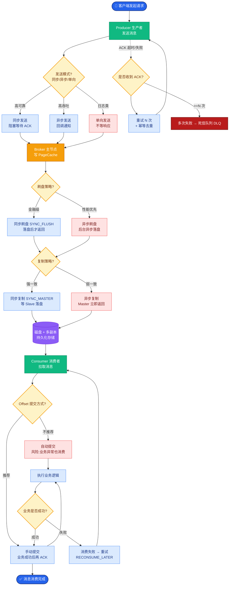

# 多 Agent 共享记忆要注意什么

需区分共享语义知识（多 Agent 可读）与私有工作记忆（单 Agent 独占）；写权限需要审计；避免一个 Agent 写入污染全局记忆——可使用命名空间、审批流、置信度门槛机制。

### 架构设计：命名空间隔离
```text
全局记忆空间
│
├─ Namespace: Public_Knowledge (只读/需审核写入)
│   └─ [公司政策, 常见文档, API定义]
│
├─ Namespace: Agent_A_Private (仅 Agent A 读写)
│   └─ [A的工作草稿, A的中间推理, A的短期状态]
│
└─ Namespace: Agent_B_Private (仅 Agent B 读写)
    └─ [B的工作草稿, B的中间推理, B的临时变量]

写入权限控制:
Agent A ──写入─> [Namespace: Agent_A_Private] ──OK
Agent A ──写入─> [Namespace: Public_Knowledge] ──[拦截]─> 人工/主Agent审核
```

### 对比表格：共享 vs 私有记忆
| 维度 | 共享记忆 | 私有记忆 |
| :--- | :--- | :--- |
| **可见性** | 全局 Agent 可见 (Read-Only/Write-Audit) | 仅 Agent 自身可见 (Read/Write) |
| **典型内容** | 团队目标、共享知识库、全局状态 | Agent 内部推理链、草稿、临时变量 |
| **一致性要求** | 强一致性，需加锁/版本控制 | 最终一致性即可，无需复杂同步 |
| **风险点** | 污染传播、幻觉扩散 | 隔离导致重复劳动、信息孤岛 |

### 关键细节
1.  **数据污染防护**：共享记忆应设置严格的置信度阈值或“白名单”机制。Agent 写入共享记忆前，需先在私有记忆中验证或通过 Reviewer Agent 检查。
2.  **语义冲突**：若 Agent A 更新了“项目截止日期”，Agent B 可能不知道。需引入“事件通知”机制或使用类似 Redis Pub/Sub 的机制广播关键状态变更。
3.  **审计日志**：所有写入共享记忆的操作必须记录 `agent_id`, `timestamp`, `operation`, `diff`，以便回滚事故。

### 实战案例
在 Code Copilot 多 Agent 编排场景中，“测试 Agent”误将一次因环境偶发导致的“模块 A 失败”写入了共享知识库。导致后续“修复 Agent”每次启动都错误地认为模块 A 有 Bug，疯狂修复正确的代码。解决策略：共享写入必须经过“高置信度验证”或“人工确认”，且明确标记“观测事实”与“Agent 推测”的区别。

### 代码示例 (Python - 写入权限模拟)
```python
class MemoryStore:
    def write(self, agent_id: str, namespace: str, content: str):
        if namespace == "Public":
            # 权限校验：不是所有 Agent 都能写公共区
            if not self.is_allowed_to_write_public(agent_id):
                raise PermissionDenied(f"Agent {agent_id} cannot write to Public")
            # 污染防护：通过 LLM 审查内容真实性
            if not self.verify_content_confidence(content):
                logger.warn(f"Low confidence content rejected from {agent_id}")
                return
        
        # 实际写入
        db.save(namespace, content, author=agent_id)
```

### ## 常见考点
- 如何解决多 Agent 记忆中的“脏读”问题？（答案：使用版本号或乐观锁，检测到并发修改时提示冲突）
- 多 Agent 共享记忆是否会导致隐私泄露？（答案：会，必须在 Prompt 中强调 Agent 不得将共享记忆中的敏感信息透传给无权限用户）

### ## 边界情况
1.  **循环依赖与死锁**：Agent A 等待 Agent B 写入共享记忆的状态更新，而 Agent B 也在等待 A 的某个信号。需设计超时机制或异步消息队列解耦。
2.  **记忆容量爆炸**：如果是成百上千个 Agent 的系统，每个 Agent 的私有记忆体量巨大，如何管理？（答案：引入分层记忆，只有高频使用的私有数据进 RAM，低频数据落盘；定期清理私有记忆中的临时草稿）。
3.  **跨模态共享**：当 Agent A 处理图片信息（如像素数据），Agent B 处理文本信息时，共享记忆中如何存储以便双方理解？（答案：存储多模态 Embedding 或经过 LLM 转义后的通用描述文本）。

### ## 面试追问
1.  在多 Agent 系统中，如果两个 Agent 对同一个共享事实产生了冲突的认知并都试图写入，如何解决这种“认知冲突”？
2.  如何设计“事件通知”机制，使得 Agent 能感知到共享记忆的变更而不用轮询？（答案：WebSocket 长连接、发布订阅模式、或基于 Watch API 的监听机制）
3.  私有记忆和共享记忆的数据流转规则是什么？什么情况下应该将私有记忆提升为共享记忆？

### ## 易错点
1.  **过度共享导致混沌**：为了“信息透明”，让所有 Agent 都能读写所有记忆，导致系统迅速发散，难以 Debug。正确的做法是“最小权限原则”和“按需订阅”。
2.  **忽视记忆的时间戳同步**：在分布式多 Agent 环境下，各个 Agent 的系统时间可能不同步。处理共享记忆冲突时，单纯依赖 `timestamp` 可能出错，需使用逻辑时钟或向量化时钟。

## 核心流程图



## 记忆要点

- 隔离原则：区分共享语义知识（需审核）与私有工作记忆（Agent独占）。
- 防污染机制：共享写入需设置信度门槛或白名单，避免单Agent幻觉污染全局。
- 冲突解决：引入版本控制或乐观锁解决并发写入冲突，关键变更需事件通知。
- 审计要求：所有共享写入操作必须记录Agent ID、时间戳和操作Diff以便回滚。

## 结构化回答

**30 秒电梯演讲：** 多 Agent 共享记忆核心是区分共享语义知识（需审核写入）和私有工作记忆（Agent 独占）。用命名空间隔离，共享写入设置信度门槛或白名单防单 Agent 幻觉污染全局。冲突用版本控制或乐观锁解决，关键变更要事件通知广播。所有共享写入必须记 Agent ID、时间戳、操作 Diff 以便回滚。

**展开框架：**
1. **隔离原则** — 共享记忆全局可见但写需审计，私有记忆仅 Agent 自身读写；用命名空间（Public_Knowledge、Agent_A_Private）物理隔离。
2. **防污染机制** — 共享写入设置信度阈值或白名单，Agent 写入前先在私有记忆验证或过 Reviewer Agent；区分"观测事实"与"Agent 推测"。
3. **冲突与审计** — 版本控制或乐观锁解决并发写入冲突；事件通知（Redis Pub/Sub）广播关键变更；审计日志记 agent_id/timestamp/diff。

**收尾：** 做 Code Copilot 多 Agent 时踩过坑——测试 Agent 把偶发失败写入共享库，修复 Agent 每次都误判模块有 Bug 疯狂修复，加高置信度验证和人工确认后解决。您想聊哪块，认知冲突解决还是事件通知设计？

## 视频脚本

> 预计时长：2 分钟 | 由浅入深

| 时间 | 画面/字幕 | 口播台词 | 讲解要点 |
|------|----------|----------|----------|
| 0:00 | 标题卡：多 Agent 共享记忆 | "像公司公告板和个人笔记本要分开，写公告得审批。" | 类比开场 |
| 0:15 | 命名空间隔离图 | "Public_Knowledge 需审核，Agent_X_Private 独占读写。" | 隔离原则 |
| 0:45 | 防污染机制 | "共享写入设信度门槛或白名单，防单 Agent 幻觉污染全局。" | 防污染 |
| 1:10 | 冲突解决 | "版本控制或乐观锁解决并发冲突，关键变更事件通知。" | 冲突与同步 |
| 1:35 | 测试 Agent 案例 | "实战：偶发失败写共享库，修复 Agent 误判疯狂修复。" | 实战教训 |
| 1:50 | 总结卡 | "记住：命名空间隔离 + 写审计 + 信度门槛。下期讲认知冲突。" | 收尾 |

### 视频流程图


