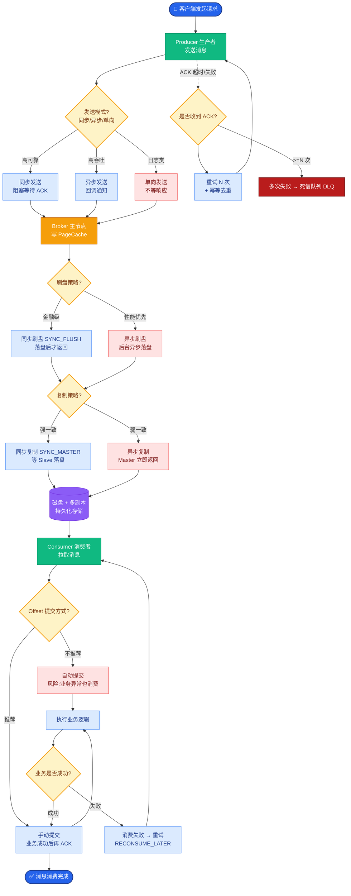

# 单 Agent 和多 Agent 的本质区别是什么?什么时候该上多 Agent

本质区别不在「调几次模型」，而在是否显式建模角色、通信与治理。

### 本质区别详解
| 特性 | 单 Agent | 多 Agent |
| :--- | :--- | :--- |
| **思维模式** | 涌现式（依赖 Prompt 指导思维链） | 模块化（分而治之，结构化思维） |
| **调试难度** | 黑盒，难定位错误 | 白盒，易于定位是哪个 Agent 出错 |
| **并发能力** | 串行逻辑为主 | 易于实现并行分支 |
| **适用复杂度** | 简单到中等任务 | 长跨度、多角色协作任务 |

### 决策流程
```text
任务复杂度分析
      │
      ├─ 任务是否需要多种截然不同的专业视角？
│  (如: 一位需要写代码, 一位需要写文案)
│  └─ 是 ─> [多 Agent]
│
      ├─ 任务是否需要严格的步骤审批与权限控制？
│  (如: 代码Agent写完后, Reviewer Agent审核, 最后发布)
│  └─ 是 ─> [多 Agent]
│
      ├─ 任务是否可以拆分为独立的子任务并行执行以提速？
│  └─ 是 ─> [多 Agent]
│
      └─ 否 ─> [单 Agent (利用 Tool/Function Calling)]
```

### 多 Agent 架构示意
```text
┌──────────┐
│ Manager  │ (规划/分发/汇总)
│ Agent    │
└─────┬────┘
      │
      ├────────────┬────────────┐
      ▼            ▼            ▼
┌──────────┐  ┌──────────┐  ┌──────────┐
│ Coder    │  │ Researcher│  │ Reviewer │
│ Agent    │  │ Agent    │  │ Agent    │
└──────────┘  └──────────┘  └──────────┘
     │            │            │
     └────────────┴────────────┘
                  │
           (共享记忆/黑板机制)
```

### 成本与收益
- **成本**：多 Agent 确实会增加 Token 消耗（尤其是 Agent 间的对话上下文）和 API 调用开销。
- **收益**：
  1.  **精准度**：专用 Agent (Prompt 特化) 比通用 Agent 表现更好。
  2.  **鲁棒性**：单个 Agent 失败不影响全局，可重试特定步骤。
  3.  **可解释性**：可以清楚看到“Reviewer Agent 拒绝了 Coder Agent 的提交”。

### 深化实战
- **实战案例**：在构建自动周报生成系统时，单 Agent 容易混淆数据分析和文案润色。拆分为 DataAnalyst（只输出 JSON 数据）和 Writer（只读 JSON 写文案）后，代码调试时间减少 60%。
- **代码示例**：
```python
def research_team(topic):
    # 并行执行：搜索与汇总
    searcher = Agent(role="Searcher", task=topic)
    summarizer = Agent(role="Summarizer", input=searcher.output)
    # 单 Agent 逻辑很难并行化
    return run_parallel([searcher, summarizer]) 
```

### 边界情况补充
1.  **循环死锁**：多 Agent 协作中，可能出现两个 Agent 在一个低级错误上无限循环（例如 Coder 一直报错，Reviewer 一直打回）。必须设置全局最大步数，或者引入“人机协同”机制，当陷入死循环时暂停并请求人工介入。
2.  **状态一致性**：当多个 Agent 并发修改共享状态（如同一个文件或数据库记录）时，可能产生竞态条件。需要引入分布式锁或乐观并发控制机制，或者采用 **Central State (中心化状态)** 管理，确保状态变更是可追溯且有序的。
3.  **局部最优**：单个 Agent 可能为了完成自己的子任务而生成看似正确但对整体目标有害的结果（例如 SEO Agent 为了堆砌关键词牺牲了可读性）。需要顶层 Manager Agent 具备全局评估能力，或者引入 **Critic Agent** 进行整体约束。

### ## 面试追问
1. 在多 Agent 架构中，如果不同 Agent 使用的底层模型能力不同（例如一个用 GPT-4，一个用 3.5-Turbo），你会如何分配任务？这种异构架构会有什么潜在风险？
2. 当网络抖动导致某个 Agent 的 API 调用超时或失败时，你的系统如何保证整个工作流的稳定性？是否有自动重试或降级策略（如切换到备用模型）？
3. 除了 Manager 模式，你了解或实践过哪些其他的多 Agent 协作模式（如网络模式、层级模式）？它们分别适用于什么场景？

### ## 易错点
1. **过度设计**：并不是所有复杂的任务都需要多 Agent。很多时候，一个强大的单 Agent + 高质量的 System Prompt + Few-shot Examples 就能解决，且维护成本更低、响应更快。多 Agent 引入的通信开销和调试复杂度往往被低估。
2. **通信噪音**：Agent 之间传递的自然语言对话如果不做结构化约束，很容易包含大量“废话”或无效信息，不仅浪费 Token，还可能导致下游 Agent 误解。应强制使用结构化数据（如 JSON Schema）进行 Agent 间的主要信息传递。


## 核心流程图



## 记忆要点

- 本质区别：单 Agent 依赖涌现思维，多 Agent 依赖显式角色与结构化治理。
- 决策树：需多视角协作、严格审批或并行提速时，必须上多 Agent。
- 架构优势：多 Agent 易调试（白盒）、可并行、容错性高，但 Token 成本增加。
- 避坑指南：简单任务勿过度设计，通信需用结构化约束减少噪音。


## 结构化回答

**30 秒电梯演讲：** 本质区别不在调几次模型，而在是否显式建模角色、通信和治理。单 Agent 是全能打杂工靠涌现思维，多 Agent 是有分工的项目组靠结构化治理。该上多 Agent 的三个信号：需要多种专业视角、需要严格审批权限、可拆分子任务并行提速。优势是白盒易调试、可并行、容错高，但 Token 成本增加。

**展开框架：**
1. **本质区别** — 单 Agent 依赖涌现思维是黑盒难定位错误，多 Agent 依赖显式角色与结构化治理是白盒易定位哪个 Agent 出错。
2. **决策三信号** — 需多种专业视角（写代码 vs 写文案）、需严格审批权限（Coder 写完 Reviewer 审）、可拆分子任务并行提速。
3. **避坑指南** — 简单任务别过度设计（强单 Agent + 好 Prompt 就够）；Agent 间通信用 JSON Schema 结构化约束减少噪音和误解。

**收尾：** 做自动周报系统时，单 Agent 混淆数据分析和文案润色，拆成 DataAnalyst 只输出 JSON 和 Writer 只读 JSON 写文案，调试时间减少 60%。您想聊哪块，异构模型分配还是协作模式选型？

## 视频脚本

> 预计时长：2 分钟 | 由浅入深

| 时间 | 画面/字幕 | 口播台词 | 讲解要点 |
|------|----------|----------|----------|
| 0:00 | 标题卡：单 Agent vs 多 Agent | "单 Agent 是全能打杂工，多 Agent 是有分工的项目组。" | 类比开场 |
| 0:15 | 本质区别对比表 | "区别不在调几次模型，在是否显式建模角色、通信和治理。" | 核心区别 |
| 0:45 | 决策三信号图 | "需多视角、需审批、可并行——三个信号该上多 Agent。" | 决策规则 |
| 1:10 | 架构优势 | "白盒易调试、可并行、容错高，但 Token 成本增加。" | 优劣势 |
| 1:35 | 周报系统案例 | "实战：拆成 DataAnalyst 和 Writer，调试时间降 60%。" | 实战收益 |
| 1:50 | 总结卡 | "记住：简单任务别过度设计，通信要结构化。下期讲注意力漂移。" | 收尾 |
