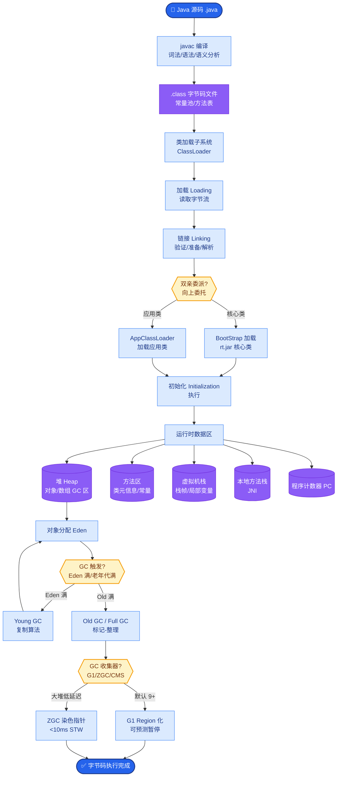

# 民主讨论模式如何避免永远开不完会

### 民主讨论模式如何避免永远开不完会

**问题核心**：
多 Agent 讨论若无约束，容易陷入死循环或无意义的废话堆砌，导致 Token 耗尽且无产出。

**硬终止条件**：
1. **最大轮数限制**：如限制讨论不超过 5 轮。
2. **Token 预算**：设置总消耗上限或单轮上限。
3. **收敛阈值**：检测 Agent 观点的相似度（如 Embedding Cosine Similarity > 0.95）或连续两轮无实质变更。
4. **主席/裁决机制**：引入 Moderator Agent，根据规则强制结束。

**软优化策略**：
- **结构化发言**：强制 Agent 输出格式为 `{观点, 证据, 反对意见}`，减少自然语言废话。
- **沉默机制**：如果某 Agent 无新观点，允许输出 `PASS`。

**边界情况**：
- **全票通过但答案错误**：可能出现所有 Agent 陷入相同的幻觉，此时需引入外部真值校验（如代码执行、工具调用结果）而非仅依赖讨论收敛。
- **数学逻辑死锁**：在涉及数学或代码推理时，Agent A 和 Agent B 可能轮流纠正对方的微小笔误但始终无法得到完全正确的版本，需配合符号执行工具或断言测试来中断。
- **单 Agent 异常**：某个 Agent 的 Prompt 泄漏或系统指令失效导致输出乱码，触发异常处理机制直接剔除该 Agent 或终止会议。

**实战案例**：
在某代码审查系统中，两个 Agent 对代码风格陷入无限争论，导致上下文膨胀。引入「投票+Token预算」双重熔断后，若 3 轮内无法达成一致且消耗超过 5000 tokens，系统自动强制调用更高级别的 LLM 进行仲裁，避免资源空耗。

**代码示例**：
```python
# Python: 检查讨论是否陷入死循环
import numpy as np

def is_stagnating(current_summary, history, threshold=0.95):
    if not history: return False
    last_vec = np.array(history[-1]['embedding'])
    curr_vec = np.array(current_summary['embedding'])
    # 计算余弦相似度，若过高则视为无新观点
    similarity = np.dot(last_vec, curr_vec) / (np.linalg.norm(last_vec) * np.linalg.norm(curr_vec))
    return similarity > threshold
```

**流程图**：
```
Start Discussion
      │
      ▼
┌─────────────┐
│ Agents Speak│◀─────────────┐
└──────┬──────┘              │
       │                     │
       ▼                     │
┌─────────────┐    No        │
│ Consensus? │───────────────┤ (Max Rounds & Budget)
└──────┬──────┘              │
  Yes   │                     │
       │                     │
       ▼                     │
   Output Result            │
       │                     │
       └─────────────────────┘ (Stop/Terminate)
```

**追问应对**：
若问「讨论适合生产吗？」——答：适合低风险创意类（头脑风暴）或人类在环辅助决策；纯自动高风险决策通常不建议直接用讨论，需配合仲裁机制 + 确定性规则引擎。

## 常见考点
1. **如何判定“无新信息”？**
   答：对比当前轮次与上一轮次的摘要向量，或计算新增信息熵，若低于阈值则判定为停滞。
2. ** Moderator Agent 的职责是什么？**
   答：控场（不跑题）、计时（防止超时）、总结（归纳分歧点）和最终拍板。

## 面试追问
1. 如果讨论收敛了，但结果是一个**集体错误（Groupthink）**，如何通过机制设计来打破这种一致？
2. 在多轮对话中，如何处理**上下文窗口溢出**导致的早期关键信息丢失，是全量压缩还是选择性摘要？
3. 除了停止条件，如何设计机制确保讨论的**质量和深度**，而不是仅仅为了凑够轮数或满足收敛阈值？

## 易错点
1. **误区：认为只要多轮讨论结果就会变好**。实际上，若基础模型能力不足或 Prompt 有偏差，讨论只会放大错误。
2. **误区：依赖 Embedding 相似度作为唯一收敛指标**。在某些场景下，两个完全相反的观点向量相似度也可能很高，需结合语义一致性校验。


## 核心流程图



## 记忆要点

- 硬终止：设置最大轮数、Token 预算、收敛阈值（观点相似度）。
- 软优化：强制结构化发言（观点/证据），允许无新观点时 PASS。
- 防死锁：引入 Moderator 仲裁，或设置外部真值校验打破集体幻觉。
- 避坑指南：讨论适合创意类，高风险决策需配合确定性规则引擎。


## 结构化回答

**30 秒电梯演讲：** 民主讨论模式容易死循环或废话堆砌，必须有议程表和超时闹钟。硬终止四招：最大轮数限制、Token 预算、收敛阈值（观点相似度 >0.95）、Moderator 仲裁。软优化是强制结构化发言（观点+证据+反对意见）允许 PASS。防死锁要引入外部真值校验打破集体幻觉，讨论适合创意类不适合高风险决策。

**展开框架：**
1. **硬终止四招** — 最大轮数（如 5 轮）、Token 预算上限、收敛阈值（Embedding 相似度）、Moderator 强制结束。
2. **软优化策略** — 强制结构化发言 `{观点, 证据, 反对意见}` 减少废话；无新观点允许 PASS；沉默机制。
3. **边界与避坑** — 全票通过但答案错误要外部真值校验（代码执行）；数学逻辑死锁要符号执行；讨论适合创意类，高风险决策需确定性规则引擎。

**收尾：** 做代码审查系统时踩过坑——两个 Agent 对代码风格无限争论，引入投票+Token 预算双重熔断，3 轮内无共识且超 5000 tokens 自动调高级 LLM 仲裁。您想聊哪块，Groupthink 检测还是 Moderator 职责设计？

## 视频脚本

> 预计时长：2 分钟 | 由浅入深

| 时间 | 画面/字幕 | 口播台词 | 讲解要点 |
|------|----------|----------|----------|
| 0:00 | 标题卡：民主讨论怎么不开长会 | "会议必须有议程表和超时闹钟。" | 类比开场 |
| 0:15 | 硬终止四招 | "最大轮数、Token 预算、收敛阈值、Moderator 仲裁。" | 硬终止 |
| 0:45 | 结构化发言示例 | "强制输出观点+证据+反对意见，无新观点可 PASS。" | 软优化 |
| 1:10 | 集体幻觉警示 | "坑：全票通过但答案错，要外部真值校验打破。" | 边界情况 |
| 1:35 | 代码风格争论案例 | "实战：两 Agent 无限争论，投票+Token 熔断调高级 LLM。" | 实战教训 |
| 1:50 | 总结卡 | "记住：硬终止 + 结构化发言 + 真值校验。下期讲黑板模式。" | 收尾 |
