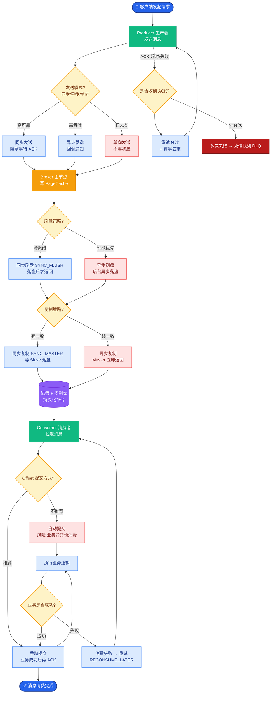
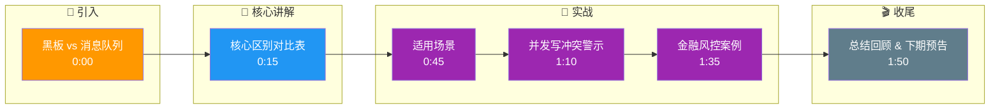

# 黑板模式和消息队列有什么相似与不同

### 黑板模式和消息队列有什么相似与不同

**相似点**：
- **解耦**：都解耦了发送方（生产者/专家）和接收方（消费者/专家）。
- **异步**：允许参与者在不同时间点处理数据。

**不同点**：
| 维度 | 黑板模式 | 消息队列 |
| :--- | :--- | :--- |
| **核心概念** | **共享状态** | **事件流/任务** |
| **数据读写** | 读写**最新快照**，通常覆盖更新 | **追加/消费**，强调顺序和历史记录 |
| **关注点** | 协作求解、状态变更 | 可靠投递、削峰填谷、异步处理 |
| **触发机制** | 通常是触发式（状态变了谁感兴趣谁来处理） | 推或拉（消费者主动获取或被动推送） |
| **适用场景** | 复杂问题求解、部分解组合 | 任务分发、日志流处理、解耦服务 |

**边界情况**：
- **高并发写冲突**：在黑板模式中，若多个专家同时修改共享状态的同一个 Key，必须处理「写覆盖」或「并发冲突」问题，需引入乐观锁（CAS）或悲观锁。
- **状态无限膨胀**：黑板状态若包含完整的推理历史，可能会无限增长，需设计状态快照与清理策略（GC）。
- **消费者掉线与状态一致**：MQ 有 ACK 机制保证消息不丢失；黑板模式下，如果某个消费者在处理状态变更时崩溃，需要通过状态重试或补偿事务来修复数据。

**实战案例**：
在构建金融风控系统时，若用 MQ 传递用户画像数据，由于 MQ 顺序消费的特性，某个步骤卡顿会导致后续计算全部延迟；改用黑板模式（Redis 存储），所有风控 Agent 直接读写最新画像，任一 Agent 更新后立即触发其他 Agent 并行检测，将整体延迟降低了 80%。

**形象比喻**：
- **黑板**更像「会议室白板」：所有人看着同一个白板，谁都可以上来写写画画，其他人看到变化了就上去补充。
- **队列**更像「工单系统」：前台接单扔进队列，后台按顺序一个个处理，处理完就归档。

**代码示例**：
```python
# Python: 黑板模式简化实现
class Blackboard:
    def __init__(self):
        self.state = {}
        self.listeners = []

    def update(self, key, value, agent_id):
        self.state[key] = value
        # 状态变更触发相关专家执行
        for expert in self.listeners:
            if expert.is_interested(key):
                expert.run(self.state)
```

**架构示意图**：
```
Blackboard Mode:           Message Queue:
+-----------------+        +----+      +----+
|  [Shared State] |        | MQ |----▶| C1 |
|  (Blackboard)   |        |    |----▶| C2 |
+--------▲--------+        +----+      +----+
         │                            ▲
    Read/Write                         │
    +------+-----+-----+              +--+
    |      |     |     |              |  |
   KS1    KS2   KS3   KS4            P1 P2
( Knowledge Sources )          (Producers)
```

**追问应对**：
若问「能结合吗？」——答：可以。常见做法是：MQ 传输事件触发 Agent，Agent 读取/更新共享的黑板状态。这样既保证了事件的可靠投递，又实现了复杂的协作状态管理。

## 常见考点
1. **黑板模式的数据一致性怎么保证？**
   答：黑板通常对应中心化存储，需处理并发读写冲突，可以使用乐观锁、版本号或分布式锁。在 AI 场景下，有时允许最终一致性。
2. **什么场景优先选黑板？**
   答：当多个 Agent 需要对同一个复杂数据对象（如一份正在编辑的代码文件、一张设计图）进行分段、互补性质的操作时。

## 面试追问
1. 如果黑板模式的中心化存储挂了，如何设计**高可用方案**？是做主从复制还是分片？
2. 在分布式环境下，如何保证所有 Agent 看到的**黑板视图时序**是一致的？
3. 黑板模式中的「触发机制」如果实现为轮询，会有什么性能瓶颈？如何改进为事件驱动（Pub/Sub）？

## 易错点
1. **误区：认为黑板模式就是共享数据库**。黑板模式强调的是“知识源对中心状态变化的被动响应”，而不仅仅是存储数据，缺少控制逻辑的共享数据库不是黑板模式。
2. **误区：忽视读写分离的复杂性**。黑板模式中，专家既要读状态又要写状态，容易产生竞态条件，不同于 MQ 的单向流动，工程上处理难度更大。

## 核心流程图



## 记忆要点

- 核心区别：黑板是共享状态（读写最新快照），MQ 是事件流（追加消费）。
- 黑板模式：适合多 Agent 协作求解同一对象，状态变更触发专家响应。
- MQ 模式：适合任务分发、削峰填谷，强调顺序和可靠投递。
- 避坑指南：黑板需处理并发写冲突，MQ 顺序消费可能导致积压。

## 结构化回答

**30 秒电梯演讲：** 黑板是共享状态协作求解（读写最新快照），队列是异步消息传输（追加消费强调顺序）。黑板像会议室白板大家看同一张图谁感兴趣谁响应，队列像工单系统前台接单后台按序处理。黑板适合多 Agent 协作同一对象，MQ 适合任务分发削峰填谷。坑是黑板要处理并发写冲突，MQ 顺序消费可能积压。两者常结合：MQ 触发 Agent 更新黑板状态。

**展开框架：**
1. **核心区别** — 黑板读写最新快照覆盖更新，MQ 追加消费强调顺序和历史；黑板触发式（状态变谁感兴趣谁处理），MQ 推或拉。
2. **适用场景** — 黑板适合复杂问题求解、部分解组合（多 Agent 协作同一代码文件）；MQ 适合任务分发、日志流处理、解耦服务。
3. **边界与结合** — 黑板高并发写冲突用乐观锁或悲观锁，状态无限膨胀要 GC；两者常结合 MQ 传输事件触发 Agent 读写黑板。

**收尾：** 做金融风控时踩过坑——用 MQ 传用户画像某步卡顿后续全延迟，改黑板模式（Redis 存储）任一 Agent 更新立即触发并行检测，整体延迟降 80%。您想聊哪块，黑板高可用方案还是触发机制改进？

## 视频脚本

> 预计时长：2 分钟 | 由浅入深

| 时间 | 画面/字幕 | 口播台词 | 讲解要点 |
|------|----------|----------|----------|
| 0:00 | 标题卡：黑板 vs 消息队列 | "黑板是大家看同一张图，队列是依次传小纸条。" | 类比开场 |
| 0:15 | 核心区别对比表 | "黑板读写最新快照，MQ 追加消费强调顺序。" | 核心区别 |
| 0:45 | 适用场景 | "黑板适合协作求解同一对象，MQ 适合任务分发削峰。" | 场景适配 |
| 1:10 | 并发写冲突警示 | "坑：黑板要处理并发写冲突，MQ 顺序消费可能积压。" | 边界情况 |
| 1:35 | 金融风控案例 | "实战：MQ 卡顿全延迟，改黑板并行检测降 80% 延迟。" | 实战收益 |
| 1:50 | 总结卡 | "记住：黑板共享状态，MQ 异步传输，常结合用。下期讲动态分配。" | 收尾 |

### 视频流程图




