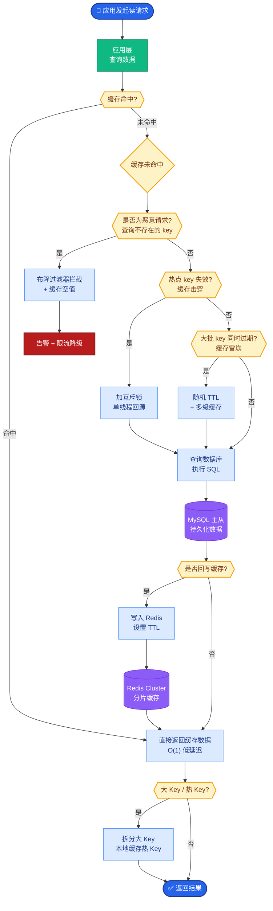
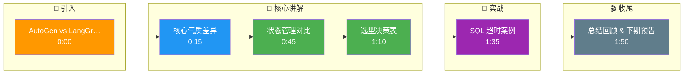

# AutoGen 和 LangGraph 多 Agent 有什么气质差异

**核心气质差异**：
AutoGen 偏重于「对话式」与「多角色社交」的快速组合，采用类似聊天的消息传递机制，Agent 之间通过自然语言或结构化消息进行「回合制」交互，适合模拟人类协作、谈判或人机混合探索。
LangGraph 偏重于「确定性」与「状态机」的显式定义，采用图结构将节点和边代码化，内置 Checkpointer（检查点）支持时间旅行和状态回滚，适合需要严格流程控制、长链路恢复和审计的生产环境。

**架构与交互对比图**：
```text
[ AutoGen 模式 ]           [ LangGraph 模式 ]

  User ─┐                    ┌─────┐
       │                    │Start│
  ┌────▼────┐ Msg1         └──┬──┘
  │ Agent A ├──────────┐      │ (Graph Edges)
  └────┬────┘          │      ▼
       │ Msg2          │   ┌───────┐     Transition
  ┌────▼────┐          └──▶│ Node A├──────────────▶
  │ Agent B │◀─────────────┤(LLM)  │     (Next Step)
  └────┬────┘  Msg3        └───┬───┘
       │                      │   (State Update)
       │                      ▼
  Result?                ┌────────┐
                         │ Check  │ (Persist State)
                         │ Point  │
                         └────────┘
```

**细节补充**：
- **AutoGen**：核心是 `ConversableAgent`，支持 `human_input_mode` 中断。状态通常隐含在对话历史中，恢复较难，天然适合 RAG 问答、代码助手等探索场景。
- **LangGraph**：核心是 `StateGraph`，必须有明确的 `TypedDict` 定义状态。每个节点是一个纯函数 `(state) -> new_state`，边可以包含条件分支。其 checkpoint 机制（基于 Redis/Postgres/S3）允许流程中断后从任意节点恢复。

**实战案例**：在做长周期数据分析任务时，LangGraph 的 Checkpointer 机制曾救过急：当 Agent 调用 SQL 工具查询超时导致进程崩溃后，系统能自动从断点前一步恢复，无需重跑之前昂贵的 LLM 推理；而早期用 AutoGen 实现类似功能时，一旦连接中断，整个对话上下文丢失，只能手动重置。

**代码示例**：
```python
# LangGraph: 显式状态流转与 Checkpoint 定义
from typing import TypedDict, Annotated
import operator

class GraphState(TypedDict):
    messages: Annotated[list, operator.add]  # 状态自动合并
    current_user: str

workflow = StateGraph(GraphState)
workflow.add_node("agent", agent_node)
workflow.add_edge(START, "agent")

# 关键：挂载持久化存储（支持断点续传）
memory = PostgresSaver.from_conn_string(DB_URL)
app = workflow.compile(checkpointer=memory)
```

**选型对比**：

| 特性 | AutoGen | LangGraph |
| :--- | :--- | :--- |
| **核心交互** | 对话式/回合制 | 图状态机 (State Machine) |
| **状态管理** | 隐式 (历史记录) | 显式 (TypedDict / Shared State) |
| **容错能力** | 较弱 (依赖长上下文) | 强 (内置 Checkpointer/时间旅行) |
| **可控性** | 低 (概率性对话) | 高 (确定性边/条件分支) |
| **适用场景** | 脑暴、模拟谈判、代码辅助 | 复杂业务流、长链路任务、SOP |

**追问应对**：若问「能混用吗？」——答：可以，例如 LangGraph 节点内嵌 AutoGen 会话，利用 AutoGen 处理复杂的角色对话，利用 LangGraph 控制总体流程和状态持久化，但要统一 trace id 与成本核算。

## 常见考点
1. **状态管理**：LangGraph 的状态如何在节点间流转？（答：通过共享的 `State` 对象，每次节点返回更新部分，Graph 会合并）。
2. **循环控制**：AutoGen 如何防止无限对话？（答：通常通过设置 `max_consecutive_auto_reply` 参数）。
3. **人机协作**：两者如何介入人工审核？（答：AutoGen 通过中断机制，LangGraph 通过特定的 interrupt 节点或边）。

## 核心流程图



## 记忆要点

- AutoGen 重对话社交，LangGraph 重状态机与确定性。
- AutoGen 状态隐式难恢复，LangGraph 显式 Checkpoint 支持断点续传。
- AutoGen 适合脑暴探索，LangGraph 适合长链路生产任务。

## 结构化回答

**30 秒电梯演讲：** AutoGen 像聊天群组重对话社交，LangGraph 像工作流引擎重状态机确定性。AutoGen 状态隐式在对话历史中难恢复，适合脑暴探索；LangGraph 显式 Checkpoint 支持断点续传和时间旅行，适合长链路生产任务。选型看场景：探索用 AutoGen，生产用 LangGraph。两者可混用——LangGraph 节点内嵌 AutoGen 会话处理角色对话，统一 trace id 和成本核算。

**展开框架：**
1. **核心气质差异** — AutoGen 偏对话式多角色社交（回合制消息传递），LangGraph 偏确定性状态机（图结构节点边代码化）。
2. **状态与容错** — AutoGen 状态隐式难恢复依赖长上下文；LangGraph 显式 TypedDict + Checkpointer（Redis/Postgres/S3）支持断点续传时间旅行。
3. **选型与混用** — AutoGen 适合脑暴谈判代码辅助，LangGraph 适合复杂业务流长链路 SOP；混用时 LangGraph 节点嵌 AutoGen 会话统一 trace。

**收尾：** 做长周期数据分析时 LangGraph 救过急——SQL 工具超时崩溃后能从断点恢复无需重跑昂贵 LLM 推理，早期用 AutoGen 连接中断整个上下文丢失只能手动重置。您想聊哪块，Checkpointer 持久化方案还是混用的 trace 统一？

## 视频脚本

> 预计时长：2 分钟 | 由浅入深

| 时间 | 画面/字幕 | 口播台词 | 讲解要点 |
|------|----------|----------|----------|
| 0:00 | 标题卡：AutoGen vs LangGraph | "AutoGen 像聊天群组，LangGraph 像工作流引擎。" | 类比开场 |
| 0:15 | 核心气质差异 | "AutoGen 重对话社交，LangGraph 重状态机确定性。" | 核心区别 |
| 0:45 | 状态管理对比 | "AutoGen 状态隐式难恢复，LangGraph 显式 Checkpoint 可续传。" | 容错能力 |
| 1:10 | 选型决策表 | "探索用 AutoGen，生产用 LangGraph，看场景选。" | 选型建议 |
| 1:35 | SQL 超时案例 | "实战：LangGraph 断点恢复免重跑，AutoGen 中断全丢。" | 实战对比 |
| 1:50 | 总结卡 | "记住：AutoGen 重对话，LangGraph 重状态。下期讲混用。" | 收尾 |

### 视频流程图




