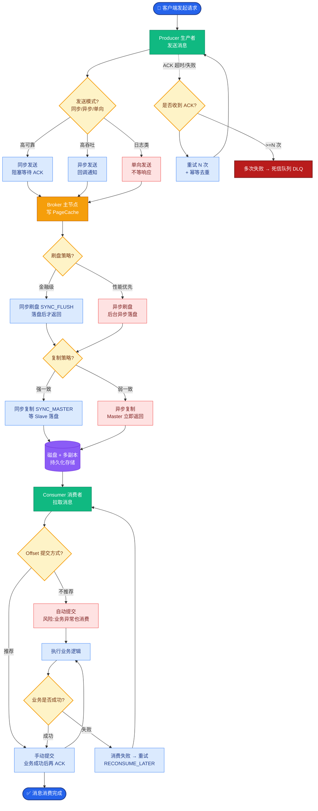
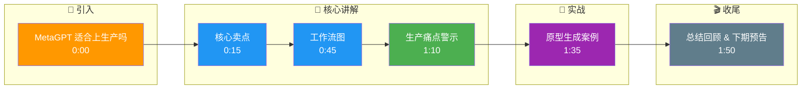

# MetaGPT 适合直接上生产吗

**视场景而定**：
MetaGPT 的核心卖点是引入了 **「SOP（标准作业程序）」** 和 **「多角色模拟公司」**（产品经理、架构师、工程师、测试员）。它擅长将结构化软件过程与多角色产出用于演示与研究；但若直接上生产，需补强测试、强权限、强监控、成本与延迟控制，框架本身不替你完成这些。

**MetaGPT 工作流图**：
```text
[ User Idea ]
      │
      ▼
┌──────────────────┐
│  Product Manager │ ──▶ PRD (Req Doc)
└────────┬─────────┘
         │
         ▼
┌──────────────────┐
│   Project Manager│ ──▶ Project Plan/Tech Design
└────────┬─────────┘
         │
         ▼
┌──────────────────┐
│     Engineer     │ ──▶ Source Code
└────────┬─────────┘
         │
         ▼
┌──────────────────┐
│      QA Agent    │ ──▶ Test Cases / Run Tests
└──────────────────┘
```

**关键细节补充**：
- **标准化输出**：MetaGPT 强调生成 **Markdown 格式** 的标准文档（如 PRD、API 设计），这保证了 Agent 之间传递的是结构化信息，而非自然语言闲聊，降低了语义失真。
- **Global Memory**：它通常维护一个共享的消息队列或文档仓库，所有 Agent 围绕这些文档增量工作。
- **生产痛点**：MetaGPT 往往会触发长链路 LLM 调用，导致耗时极长（几分钟到几十分钟）；且每个角色调用都会产生 Cost，缺乏细粒度的 Token 预算熔断机制。

**实战案例**：曾尝试用 MetaGPT 生成内部工具的原型代码，结果跑一次全流程耗时 15 分钟且消耗 $5+ 费用。更严重的是，生成的代码偶尔引用了公司内部不存在的包名，导致后续人工 Debug 时间比自己写还长。因此现在仅将其用于「技术预研」阶段的文档草拟，而不直接用于产出交付级代码。

**代码示例**：
```python
# MetaGPT: 启动公司角色进行开发
from metagpt.software_company import SoftwareCompany
import asyncio

async def main():
    company = SoftwareCompany()
    # 投资一个新项目，自动启动 PM -> Architect -> Engineer -> QA
    await company.invest("Develop a snake game using Python")
    
    # 结果会生成 docs/ (PRD/Design) 和 repo/ (Source Code/Test)
    # 生产环境需拦截 run() 或修改内部 Action 增加超时控制

asyncio.run(main())
```

**框架选型对比**：

| 维度 | MetaGPT | CrewAI | AutoGen |
| :--- | :--- | :--- | :--- |
| **核心理念** | 模拟软件公司 SOP | 角色任务组 | 对话式社交 |
| **输出产物** | 完整文档 + 代码文件 | 特定任务结果 | 对话内容 / 数据 |
| **结构化程度** | 极高 (固定文档格式) | 中 (Task 链) | 低 (自由对话) |
| **生产就绪度** | 低 (慢、贵、幻觉多) | 中 (可控但缺状态机) | 低 (难恢复) |
| **最佳场景** | Demo演示 / 原型验证 | 垂直业务自动化 | 研究探索 / 谈判模拟 |

**追问应对**：若问「和 CrewAI 选哪个？」——答：先看团队熟悉度与是否需要强图编排/检查点（偏 LangGraph）或快速角色任务叙事（偏 CrewAI）。MetaGPT 更适合「从0到1生成代码原型」，CrewAI 更适合「执行特定业务任务流」。

## 常见考点
1. **SOP 作用**：MetaGPT 中的 SOP 是如何实现的？（答：通过定义固定的 Prompt 模板和 Agent 执行顺序，强制每个角色只能输入/输出特定格式文档）。
2. **成本问题**：如何控制 MetaGPT 的成本？（答：通常通过限制生成内容的长度，或者替换更小的模型给非核心角色）。

## 核心流程图



## 记忆要点

- MetaGPT 模拟软件公司 SOP，产出标准文档与代码。
- 结构化程度高但链路长，成本高、耗时长，不适合直接上生产。
- 适合 Demo 演示与原型验证，CrewAI 更适合垂直业务流。

## 结构化回答

**30 秒电梯演讲：** MetaGPT 不适合直接上生产。它的卖点是引入 SOP 和多角色模拟公司（PM、架构师、工程师、QA），擅长生成标准 Markdown 文档和代码用于 Demo 和原型验证。但链路长、成本高、耗时长（跑一次 15 分钟 $5+），且缺乏细粒度 Token 预算熔断。适合技术预研文档草拟，垂直业务流用 CrewAI 更合适。

**展开框架：**
1. **核心卖点** — 引入 SOP 标准作业程序和多角色模拟公司；生成 PRD、API 设计、源码、测试用例等标准 Markdown 文档，结构化信息降低语义失真。
2. **生产痛点** — 长链路 LLM 调用耗时极长（几分钟到几十分钟）；每个角色调用产生 Cost 缺乏 Token 预算熔断；偶尔幻觉引用不存在的包名。
3. **选型建议** — 从 0 到 1 生成代码原型用 MetaGPT；执行特定业务任务流用 CrewAI；需要强图编排和检查点用 LangGraph。

**收尾：** 用 MetaGPT 生成内部工具原型，跑一次 15 分钟耗 $5+，生成的代码引用了不存在的包名，人工 Debug 比自己写还长，现在仅用于技术预研文档草拟。您想聊哪块，成本控制策略还是框架选型决策？

## 视频脚本

> 预计时长：2 分钟 | 由浅入深

| 时间 | 画面/字幕 | 口播台词 | 讲解要点 |
|------|----------|----------|----------|
| 0:00 | 标题卡：MetaGPT 适合上生产吗 | "像一辆概念车，设计先进，但要上路得加固安全件。" | 类比开场 |
| 0:15 | 核心卖点 | "引入 SOP 和多角色模拟公司，产出标准文档和代码。" | 核心优势 |
| 0:45 | 工作流图 | "PM 出 PRD，架构师出设计，工程师出代码，QA 出测试。" | 工作流程 |
| 1:10 | 生产痛点警示 | "坑：链路长成本高耗时长，缺乏 Token 预算熔断。" | 生产短板 |
| 1:35 | 原型生成案例 | "实战：跑一次 15 分钟 $5+，引用不存在包名 Debug 更长。" | 实战教训 |
| 1:50 | 总结卡 | "记住：适合 Demo 和预研，生产用 CrewAI 或 LangGraph。" | 收尾 |

### 视频流程图




