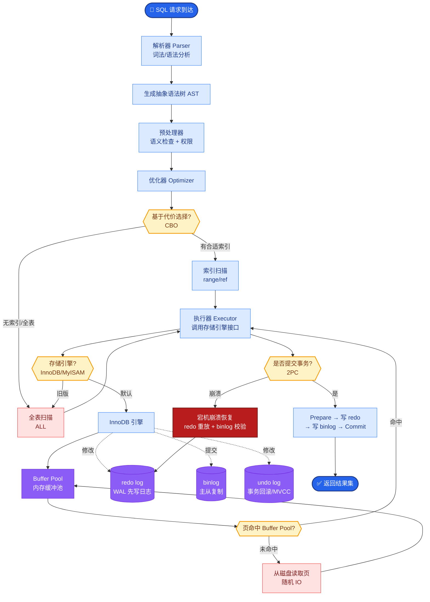

# 企业里多 Agent 与「传统工作流引擎(BPM)」关系是什么

企业里多 Agent 与「传统工作流引擎(BPM)」是 **互补而非替代** 的关系。
- **BPM (如 Camunda, Activiti)**：管理 **确定性** 流程（审批流、状态流转）与强一致性事务；适合规则固定、需审计留痕、涉及人工操作的系统。
- **Multi-Agent**：管理 **不确定性** 流程（意图识别、文档生成、非结构化数据处理）；适合需要语言推理、创意生成或开放工具调用的步骤。

**混合编排架构图**：
```text
┌─────────────────────────────────────────────────────┐
│           BPM Engine (Orchestrator)                 │
│  ┌──────┐    ┌──────┐    ┌──────┐    ┌──────┐       │
│  │Start │───▶│Task1 │───▶│Agent │───▶│Task2 │───▶End│
│  │Event │    │(DB)  │    │Node  │    │(Audit)│       │
│  └──────┘    └──────┘    └──┬───┘    └──────┘       │
│                            │                        │
│                     [ External Call ]               │
│                            │                        │
│                  ┌─────────▼──────────┐             │
│                  │  Multi-Agent System│             │
│                  │  (LangGraph/CrewAI) │             │
│                  │  1. LLM Reasoning   │             │
│                  │  2. Tool Usage      │             │
│                  └────────────────────┘             │
└─────────────────────────────────────────────────────┘
```

**关键细节补充**：
- **状态同步**：BPM 通常作为「外部控制器」或「父流程」，Agent 系统作为子服务被调用。BPM 等待 Agent 返回结构化结果（如 JSON 决策）后再继续。
- **落账与合规**：涉及资金变更、权限授予等操作，必须在 BPM 侧或传统代码中完成，不能仅依赖 Agent 的工具调用，以满足合规要求。
- **异常处理**：如果 Agent 超时或幻觉，BPM 需要有网关处理异常，转入人工审批节点。

**实战案例**：在构建「智能信贷审批」系统时，BPM 负责主流程，将用户提交的非结构化流水单据传给 Agent 系统。Agent 识别出异常交易后输出 JSON 标记风险。有一次 Agent 产生幻觉，将正常的工资薪金标记为洗钱风险。幸好 BPM 配置了「高风险强制人工复核」网关，拦截了该错误决策，避免了合规事故。

**代码示例**：
```python
# BPM (伪代码) 调用 Agent 服务接口
from flask import Flask, request, jsonify

app = Flask(__name__)

@app.route('/bpm/audit_risk', methods=['POST'])
def audit_risk():
    data = request.json
    docs = data['documents']
    
    # 调用外部 Agent 服务 (LangGraph 部署)
    agent_response = requests.post(
        "http://agent-service/invoke",
        json={"input": docs}
    ).json()
    
    risk_level = agent_response.get('output', {}).get('risk_level', 'LOW')
    
    # BPM 根据结构化结果进行网关路由，不信任 Agent 的自然语言解释
    return jsonify({"risk_level": risk_level})
```

**能力与职责对比**：

| 维度 | 传统工作流引擎 (BPM) | 多 Agent 系统 (MAS) |
| :--- | :--- | :--- |
| **核心职责** | 流程编排、事务状态、人工审批 | 意图理解、非结构化处理、工具调用 |
| **处理确定性** | 强 (硬编码逻辑/规则引擎) | 弱 (概率性生成) |
| **数据结构** | 结构化变量 (JSON/DB) | 半结构化 (自然语言 + JSON) |
| **审计追踪** | 天然支持 (Event Log) | 需额外设计 (Trace/Checkpoint) |
| **最佳位置** | 系统骨架 / 控制层 | 特定任务的感知与决策层 |

**追问应对**：若问「谁主谁辅？」——答：强合规流程 BPM 主；强探索任务 Agent 主，但要有护栏（Guardrails）。

## 常见考点
1. **集成方式**：BPM 如何调用 Agent？（答：通常通过 HTTP/REST 调用 Agent 服务，解析其结构化输出作为流程变量）。
2. **数据一致性**：Agent 产生的数据如何同步？（答：Agent 不直接写核心业务库，而是返回数据对象，由 BPM 服务层校验后写入）。


## 核心流程图



## 记忆要点

- BPM 管确定性流程与强一致性，Agent 管非结构化推理。
- 两者互补，BPM 常作为主控制器调用 Agent 子服务。
- 涉及资金与权限的落账操作必须在 BPM 侧完成。


## 结构化回答

**30 秒电梯演讲：** 企业里多 Agent 和 BPM 是互补而非替代。BPM（Camunda、Activiti）管确定性流程和强一致性事务，适合规则固定需审计的审批流；多 Agent 管不确定性流程，适合意图识别、文档生成、非结构化数据处理。混合编排是 BPM 作为主控制器调用 Agent 子服务，Agent 返回结构化 JSON 决策后 BPM 继续。涉及资金权限的落账操作必须在 BPM 侧完成。

**展开框架：**
1. **职责分工** — BPM 管流程编排、事务状态、人工审批（强确定性）；多 Agent 管意图理解、非结构化处理、工具调用（弱确定性概率生成）。
2. **混合编排** — BPM 作为父流程外部控制器，Agent 系统作为子服务被调用；BPM 等待 Agent 返回结构化结果（JSON 决策）后继续；Agent 超时幻觉转人工审批节点。
3. **合规底线** — 资金变更、权限授予等落账操作必须在 BPM 侧或传统代码完成，不能仅依赖 Agent 工具调用满足合规。

**收尾：** 做智能信贷审批时踩过坑——Agent 幻觉把正常工资薪金标记为洗钱风险，幸好 BPM 配了"高风险强制人工复核"网关拦截，避免合规事故。您想聊哪块，BPM 调用 Agent 的接口设计还是异常处理网关？

## 视频脚本

> 预计时长：2 分钟 | 由浅入深

| 时间 | 画面/字幕 | 口播台词 | 讲解要点 |
|------|----------|----------|----------|
| 0:00 | 标题卡：多 Agent 与 BPM 的关系 | "BPM 是红绿灯和道路，Agent 是司机。" | 类比开场 |
| 0:15 | 职责分工表 | "BPM 管确定性流程强一致性，Agent 管非结构化推理。" | 核心区别 |
| 0:45 | 混合编排架构 | "BPM 作主控制器调用 Agent 子服务，返回 JSON 决策继续。" | 混合模式 |
| 1:10 | 合规底线警示 | "资金权限落账必须在 BPM 侧，不能仅靠 Agent 工具调用。" | 合规要求 |
| 1:35 | 信贷幻觉案例 | "实战：Agent 误标工资为洗钱，BPM 高风险网关拦截。" | 实战教训 |
| 1:50 | 总结卡 | "记住：BPM 主控，Agent 辅助，落账走 BPM。下期讲死循环检测。" | 收尾 |
