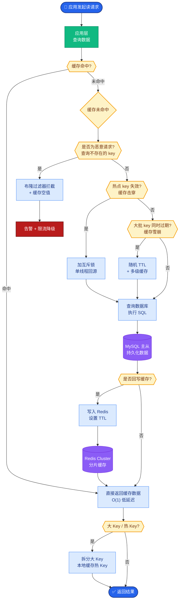

# 如何检测多 Agent 系统的「死循环」

检测多 Agent 系统的「死循环」需要 **组合策略**，单一方法往往会有漏网之鱼。
1. **全局步数上限**：最简单粗暴的硬熔断，设置 Agent 交互的最大轮次（如 50 步）。
2. **状态哈希去重**：若连续重复同一计划、同一工具入参或产生完全相同的输出，则判定为死循环。
3. **无进展检测**：监控关键指标（如 `tokens_spent` 增加，但 `task_completion_score` 不变，或者 `error_count` 未降）。
4. **预算熔断**：基于 Token/费用/时间的绝对阈值。

**死循环检测流程图**：
```text
[ Start Loop ]
      │
      ├─▶ Check: Step Count > Max? ──Yes──▶ [ Abort: Max Steps ]
      │
      ├─▶ Check: Hash(Current State) in History?
      │      │                               │
      │     Yes                              No
      │      │                               │
      ▼      ▼                               ▼
[ Abort: Repeated State ]           Check: Progress Delta < Threshold?
                                          │            │
                                         Yes           No
                                          │            │
                                          ▼            ▼
                                 [ Abort: No Progress ]   [ Continue ]
```

**关键细节补充**：
- **哈希粒度**：不要对整个 Context 窗口做哈希，只对「Action Plan」或「Tool Call Arguments」做哈希，避免因长对话日志微小差异导致哈希失效。
- **滑动窗口**：有些循环是周期性的（A->B->C->A），需要维护一个固定大小的历史状态窗口（如最近 5 步）进行比对。
- **人为介入**：在触发熔断前，可以尝试插入一个「人类审核」节点，确认是否真的陷入死循环。

**实战案例**：在一次实现 Agent 自动纠错代码的迭代中，遇到模型在「修复报错」和「回滚修改」之间来回拉锯的死循环。因为每次生成的代码略有不同，简单的字符串对比失效。后来改用对「工具调用的 JSON 参数」做 MD5 哈希去重，成功检测到了该无限循环并自动触发中断，节省了大量 API 费用。

**代码示例**：
```python
import hashlib

class LoopGuard:
    def __init__(self, max_steps=20, history_len=5):
        self.max_steps = max_steps
        self.state_history = []  # 滑动窗口
        self.step_count = 0

    def check_break(self, current_action: dict) -> bool:
        self.step_count += 1
        
        # 1. 全局步数熔断
        if self.step_count > self.max_steps:
            return True
        
        # 2. 状态哈希去重 (只比对关键参数)
        action_sig = hashlib.md5(str(current_action).encode()).hexdigest()
        if action_sig in self.state_history:
            return True
            
        # 维护滑动窗口
        self.state_history.append(action_sig)
        if len(self.state_history) > self.history_len:
            self.state_history.pop(0)
            
        return False
```

**检测策略对比**：

| 策略 | 优点 | 缺点 | 适用场景 |
| :--- | :--- | :--- | :--- |
| **步数上限** | 实现简单，零漏报 | 可能误杀正常长流程 | 所有流程的兜底防线 |
| **状态哈希** | 精准识别重复逻辑 | 对微小差异不敏感 (需规范化) | 代码纠错、工具调用循环 |
| **无进展检测** | 更符合业务逻辑 | 定义“进展”指标困难 | 创作类、分析类任务 |
| **预算熔断** | 直接保护成本 | 无法区分正常与异常消耗 | 严格控制预算的场合 |

**追问应对**：若问「误杀怎么办？」——答：提高进展定义粒度、允许人类确认继续，或者增加恢复策略（如切换 Prompt 模板重试）。

## 常见考点
1. **状态哈希**：如何实现高效的状态去重？（答：使用布隆过滤器或 Redis Set 存储 Hash，注意设置过期时间）。
2. **无进展定义**：如何量化「进展」？（答：基于特定 Token 的出现（如 [DONE]）、任务状态位的变化，或者使用 Critic Agent 评分）。

## 核心流程图



## 记忆要点

- 检测死循环需组合策略：步数上限、状态哈希去重、无进展检测。
- 哈希粒度选关键参数，避免微小差异导致失效。
- 预算熔断是保护成本的最后一道防线。

## 结构化回答

**30 秒电梯演讲：** 检测多 Agent 死循环要组合策略，单一方法有漏网之鱼。四招：全局步数上限（最粗暴的硬熔断）、状态哈希去重（连续重复同一计划或工具入参判定死循环）、无进展检测（tokens_spent 增但 task_completion_score 不变）、预算熔断（Token/费用/时间阈值）。关键是哈希粒度选关键参数（Action Plan 或 Tool Call Arguments）不做整个 Context 哈希，避免微小差异失效。

**展开框架：**
1. **四招组合** — 步数上限（兜底零漏报但可能误杀）、状态哈希去重（精准识别重复逻辑）、无进展检测（符合业务逻辑但定义进展困难）、预算熔断（直接保护成本）。
2. **哈希与窗口** — 只对 Action Plan 或 Tool Call Arguments 做哈希不做整个 Context；周期性循环（A→B→C→A）维护固定大小滑动窗口比对。
3. **误杀处理** — 提高进展定义粒度、允许人类确认继续、增加恢复策略（切换 Prompt 模板重试）。

**收尾：** 做 Agent 自动纠错代码时踩过坑——模型在"修复报错"和"回滚修改"间拉锯，字符串对比失效，改用工具调用 JSON 参数做 MD5 哈希去重成功检测并节省大量 API 费用。您想聊哪块，哈希粒度选择还是无进展指标定义？

## 视频脚本

> 预计时长：2 分钟 | 由浅入深

| 时间 | 画面/字幕 | 口播台词 | 讲解要点 |
|------|----------|----------|----------|
| 0:00 | 标题卡：怎么检测多 Agent 死循环 | "给机器人设死线、防重复记忆和超时自动断电。" | 类比开场 |
| 0:15 | 四招组合策略 | "步数上限、状态哈希、无进展检测、预算熔断四招组合。" | 检测策略 |
| 0:45 | 哈希粒度警示 | "坑：哈希只对关键参数不做整个 Context，避免微小差异失效。" | 关键细节 |
| 1:10 | 滑动窗口示意 | "周期性循环 A→B→C→A 要滑动窗口比对最近 N 步。" | 周期检测 |
| 1:35 | 代码纠错案例 | "实战：修复/回滚拉锯，JSON 参数 MD5 哈希检测省费用。" | 实战教训 |
| 1:50 | 总结卡 | "记住：组合四招 + 关键参数哈希 + 滑动窗口。下期讲错误隔离。" | 收尾 |

### 视频流程图


