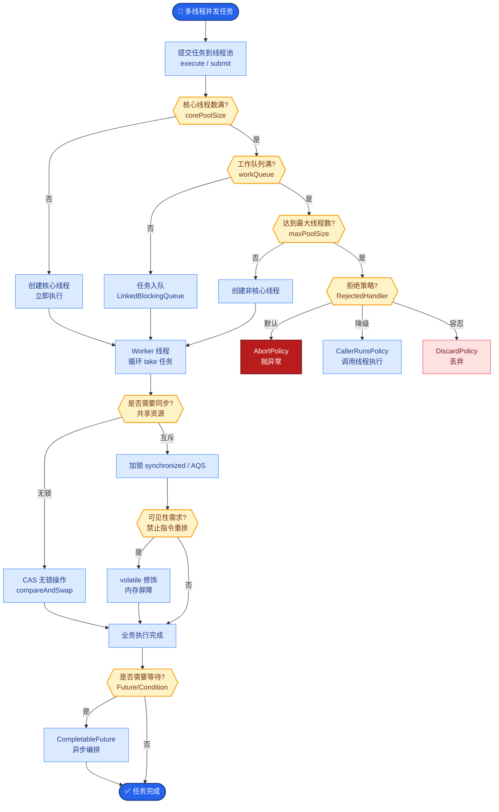

# 错误隔离在多 Agent 里如何实现

多 Agent 系统的错误隔离需层层设防，防止一个 Agent 的错误（或恶意攻击）导致整个系统崩溃或数据泄露。
1. **沙箱执行与最小权限**：Agent 使用的工具必须遵循最小权限原则，且最好在容器沙箱中运行。
2. **校验 Agent 作为门禁**：Agent 的输出不能直接执行，需经过 Validator Agent（或 Pydantic 模型）校验。
3. **检查点机制**：通过关键节点后持久化状态，失败时从上一个安全检查点重试，而不是从头开始。
4. **参数清洗**：绝不把未经校验的自然语言直接当 API 参数，必须强制转换为结构化数据。

**错误隔离与恢复架构图**：
```text
[ Agent A ] 
      │
      ▼ (Raw Plan/Action)
┌─────────────────┐
│  Guard/Validate │ (Type Check / Safety Check)
│    Agent        │
└────────┬────────┘
         │ Pass?
         │
    No   │   Yes
    ┌────┴────┐
    ▼         ▼
[ Reject]  ┌──────────┐
            │   Tool   │ (Sandboxed Execution)
            │ Executor │
            └─────┬────┘
                  │
                  ▼ (Result)
            ┌──────────┐
            │ Checkpoint│ (Save State to DB)
            └──────────┘
```

**实战案例**：
在构建数据分析 Agent 时，曾出现 Agent 生成 `DELETE FROM table` 的恶意指令。实战中我们在 Docker 容器内挂载只读文件系统，并在 Pydantic 校验层直接拦截包含 `DROP`、`DELETE` 等高危关键词的 SQL 语句，确保即使 Agent 幻觉也无法破坏数据。

**代码示例**：
```python
from pydantic import BaseModel, validator

class SqlQuery(BaseModel):
    query: str

    @validator('query')
    def forbid_destructive_ops(cls, v):
        forbidden = {'DROP', 'DELETE', 'TRUNCATE', 'ALTER'}
        if any(word in v.upper() for word in forbidden):
            raise ValueError("Dangerous SQL operation detected")
        return v

# Mock execution guard
def execute_tool(agent_output: dict):
    try:
        validated = SqlQuery(**agent_output) # 1. 强制校验
        # 2. 沙箱执行 (实际调用 docker exec 或受限 DB cursor)
        return run_in_sandbox(validated.query) 
    except ValueError as e:
        return {"error": str(e), "action": "blocked"}
```

**技术选型对比**：

| 特性 | 虚拟机/裸机 | Docker 容器 | gVisor/Firecracker |
| :--- | :--- | :--- | :--- |
| **隔离强度** | 高 (硬件级) | 中 (内核共享) | 高 (用户态内核/微VM) |
| **启动速度** | 慢 (分钟级) | 快 (秒级) | 极快 (毫秒级) |
| **性能损耗** | 无 | 低 (~1-2%) | 中 (~5-10%) |
| **适用场景** | 物理隔离核心库 | 通用任务沙箱 | 不可信代码执行 (AI生成代码) |

**关键细节补充**：
- **沙箱技术**：对于代码执行类 Agent，可使用 Docker 容器或 gVisor，限制网络。
- **资源熔断**：必须限制 Agent 的 CPU 和内存使用，防止因死循环或死递归耗尽宿主机资源（如设置 `docker run --cpus="0.5" --memory="512m"`）。
- **网络隔离**：禁止沙箱访问公网或内网敏感网段，仅允许通过预定义的 Proxy 出站，防止 SSRF 攻击。

## 易错点
1. **过度依赖格式校验**：仅校验 JSON 格式或字段类型是不够的，Agent 可能输出格式正确但语义恶意的参数（如 SQL 注入绕过关键字检测），需配合语义层校验。
2. **共享状态污染**：如果多个 Agent 共享同一个内存对象或全局变量，一个 Agent 的崩溃或脏数据可能直接传染给其他 Agent，应采用 Immutable（不可变）消息传递。

## 面试追问
1. 如果 Agent 陷入死循环，不断重试同一个失败的 Tool Call，你的隔离架构如何检测并中断？
2. 对于不可信代码（如用户上传的 Python 脚本），Docker 的隔离性可能不够（如内核漏洞），你会如何进一步增强安全性？
3. 如何处理 Agent 产生的“隐性错误”？即函数返回了 HTTP 200 但内容是错误的，如何感知并隔离？


## 核心流程图



## 记忆要点

- 错误隔离靠沙箱执行、最小权限和 Validator 门禁。
- 输出需经 Pydantic 校验，禁止直接执行自然语言指令。
- 检查点机制确保失败后从安全节点重试而非从头开始。


## 结构化回答

**30 秒电梯演讲：** 错误隔离层层设防防止一个 Agent 的错误或恶意攻击导致系统崩溃。四道防线：沙箱执行与最小权限（容器内只读文件系统）、Validator 门禁（Pydantic 校验输出禁止直接执行）、检查点机制（失败从安全节点重试而非从头）、参数清洗（自然语言强制转结构化数据）。坑是仅校验 JSON 格式不够，要配合语义层校验防 SQL 注入绕过。

**展开框架：**
1. **沙箱与最小权限** — 工具遵循最小权限原则在 Docker 容器或 gVisor 沙箱运行；限制 CPU 内存防死循环耗尽宿主机；网络隔离仅允许预定义 Proxy 出站防 SSRF。
2. **Validator 门禁** — Agent 输出经 Pydantic 模型或 Validator Agent 校验；禁止 DROP/DELETE/TRUNCATE/ALTER 等高危关键词；格式校验不够要语义层校验。
3. **检查点与参数清洗** — 关键节点持久化状态失败从安全检查点重试；自然语言指令强制转结构化数据不当 API 参数；不可变消息传递防共享状态污染。

**收尾：** 做数据分析 Agent 时踩过坑——Agent 生成 DELETE FROM table 恶意指令，Docker 只读文件系统加 Pydantic 校验拦截高危 SQL 后解决。您想聊哪块，沙箱技术选型还是隐性错误检测？

## 视频脚本

> 预计时长：2 分钟 | 由浅入深

| 时间 | 画面/字幕 | 口播台词 | 讲解要点 |
|------|----------|----------|----------|
| 0:00 | 标题卡：多 Agent 错误隔离怎么做 | "危险操作在隔离室做，出门过安检，坏了回退存档点。" | 类比开场 |
| 0:15 | 四道防线图 | "沙箱执行、Validator 门禁、检查点、参数清洗四道防线。" | 核心防线 |
| 0:45 | 沙箱技术对比 | "Docker 通用任务，gVisor/Firecracker 不可信代码执行。" | 沙箱选型 |
| 1:10 | 格式校验警示 | "坑：仅校验 JSON 格式不够，要语义层校验防 SQL 注入绕过。" | 关键细节 |
| 1:35 | DELETE 恶意指令案例 | "实战：Agent 生成 DELETE，只读文件系统+Pydantic 拦截解决。" | 实战教训 |
| 1:50 | 总结卡 | "记住：沙箱+门禁+检查点+参数清洗。下期讲一致性。" | 收尾 |
